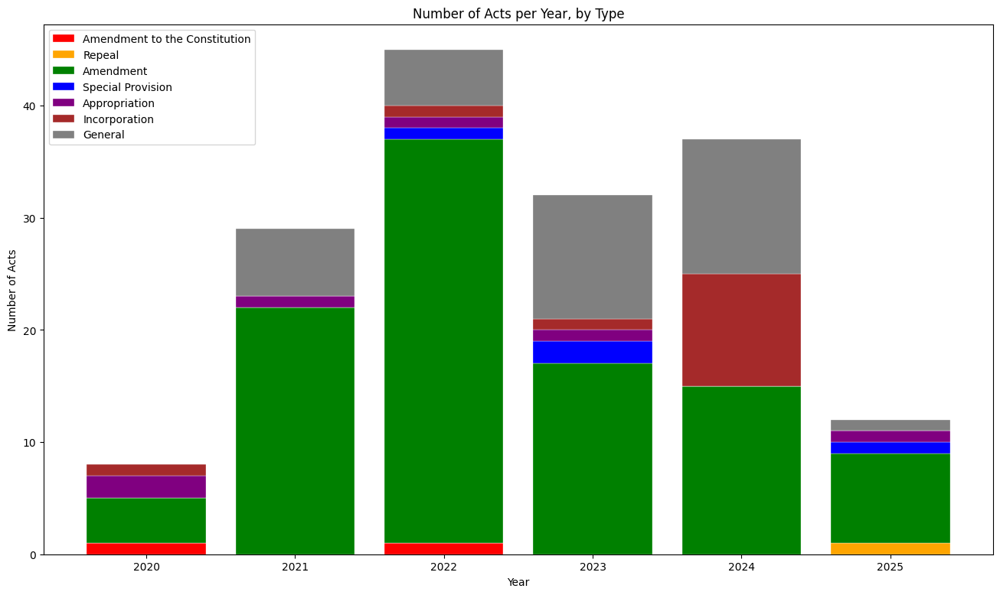

# 🇱🇰 Acts from the Sri Lankan Parliament ([lk_parliament_docs](https://github.com/nuuuwan/lk_parliament_docs))

Scraped  **2,213** acts (0.81 MB) from [www.parliament.lk](https://www.parliament.lk/en) as of **2025-08-16 18:07:44**.

## Acts (2,213)

### 2025 (13)

- ✏️ `13/2025` [Bills of Exchange (Amendment)](data/acts/2020s/2025/2025-013) (2025-08-15)
- ✏️ `12/2025` [Companies (Amendment)](data/acts/2020s/2025/2025-012) (2025-08-04)
- ✏️ `11/2025` [National Minimum Wage of Workers (Amendment)](data/acts/2020s/2025/2025-011) (2025-07-22)
- ✏️ `10/2025` [Budgetary Relief Allowance of Workers (Amendment)](data/acts/2020s/2025/2025-010) (2025-07-23)
- ✏️ `9/2025` [Budgetary Relief Allowance Of Workers (Amendment)](data/acts/2020s/2025/2025-009) (2025-07-23)
- ✏️ `8/2025` [National Transport Commission (Amendment)](data/acts/2020s/2025/2025-008) (2025-06-19)
- ✏️ `7/2025` [CODE OF CRIMINAL PROCEDURE (AMENDMENT)](data/acts/2020s/2025/2025-007) (2025-06-18)
- ❌ `6/2025` [FOREIGN LOANS (REPEAL)](data/acts/2020s/2025/2025-006) (2025-05-23)
- 🏛️ `5/2025` [Proceeds of Crime](data/acts/2020s/2025/2025-005) (2025-04-30)
- ✏️ `4/2025` [Value Added Tax (Amendment)](data/acts/2020s/2025/2025-004) (2025-04-11)
- 💰 `3/2025` [Appropriation](data/acts/2020s/2025/2025-003) (2025-03-21)
- ✏️ `2/2025` [Inland Revenue (Amendment)](data/acts/2020s/2025/2025-002) (2025-03-20)
- 📜 `1/2025` [Local Authorities Elections (Special Provisions)](data/acts/2020s/2025/2025-001) (2025-02-17)

### 2024 (46)

- ✏️ `50/2024` [Code of Criminal Procedure (Amendment)](data/acts/2020s/2024/2024-050) (2024-09-13)
- 🏛️ `49/2024` [Reciprocal Recognition, Registration and Enforcement of Foreign Judgments](data/acts/2020s/2024/2024-049) (2024-09-12)
- ✏️ `46/2024` [Medical (Amendment)](data/acts/2020s/2024/2024-046) (2024-08-15)
- 🏛️ `45/2024` [Economic Transformation](data/acts/2020s/2024/2024-045) (2024-08-09)
- 🏛️ `44/2024` [Public Financial Management](data/acts/2020s/2024/2024-044) (2024-08-08)
- ✏️ `43/2024` [Civil Procedure Code (Amendment)](data/acts/2020s/2024/2024-043) (2024-08-02)
- 🏢 `41/2024` [Samadhi Maditation and Yoga Centre (Incorporation)](data/acts/2020s/2024/2024-041) (2024-07-26)
- 🏢 `40/2024` [Shaili Educational Foundation (Incorporation)](data/acts/2020s/2024/2024-040) (2024-07-19)
- ✏️ `39/2024` [SRI LANKA TELECOMMUNICATIONS (AMENDMENT)](data/acts/2020s/2024/2024-039) (2024-07-17)
- 🏛️ `38/2024` [Sri Lanka National Commission for the UNESCO](data/acts/2020s/2024/2024-038) (2024-07-02)
- 🏛️ `37/2024` [Women Empowerment](data/acts/2020s/2024/2024-037) (2024-07-02)
- 🏛️ `36/2024` [Sri Lanka Electricity](data/acts/2020s/2024/2024-036) (2024-06-27)
- 🏢 `35/2024` [Dedigama Sri Maithri Pragnartha Bouddha Educational Daham Sabhawa (Incorporation)](data/acts/2020s/2024/2024-035) (2024-06-19)
- 🏢 `34/2024` [Institute of Chartered Shipbrokers of Sri Lanka (Incorporation)](data/acts/2020s/2024/2024-034) (2024-06-19)
- 🏛️ `33/2024` [Public Debt Management](data/acts/2020s/2024/2024-033) (2024-06-18)
- 🏢 `32/2024` [International Institute of Theravadha (Incorporation)](data/acts/2020s/2024/2024-032) (2024-06-18)
- 🏢 `31/2024` [Pavithra Wanniarachchi Sahurda Foundation (Incorporation)](data/acts/2020s/2024/2024-031) (2024-06-18)
- 🏢 `30/2024` [Kelaniya Buddhist Women's Charitable Society (Incorporation) Bill](data/acts/2020s/2024/2024-030) (2024-06-12)
- 🏢 `29/2024` [Saweera Foundation (Incorporation)](data/acts/2020s/2024/2024-029) (2024-06-12)
- ✏️ `28/2024` [Shop and Office Employees (Regulation of Employment and Remuneration) (Amendment)](data/acts/2020s/2024/2024-028) (2024-05-13)
- ✏️ `27/2024` [Partition (Amendment)](data/acts/2020s/2024/2024-027) (2024-05-13)
- ✏️ `26/2024` [Recovery of Loans by Banks (Special Provisions) (Amendment)](data/acts/2020s/2024/2024-026) (2024-05-08)
- ✏️ `25/2024` [Code of Criminal Procedure (Amendment)](data/acts/2020s/2024/2024-025) (2024-05-03)
- ✏️ `24/2024` [Banking (Amendment)](data/acts/2020s/2024/2024-024) (2024-04-10)
- ✏️ `23/2024` [Companies (Amendment)](data/acts/2020s/2024/2024-023) (2024-04-01)
- ✏️ `22/2024` [Inland Trust Receipts (Amendment)](data/acts/2020s/2024/2024-022) (2024-04-01)
- ✏️ `21/2024` [Finance Leasing (Amendment)](data/acts/2020s/2024/2024-021) (2024-04-01)
- ✏️ `20/2024` [Mortgage (Amendment)](data/acts/2020s/2024/2024-020) (2024-04-01)
- ✏️ `19/2024` [Trust Receipts (Amendment)](data/acts/2020s/2024/2024-019) (2024-04-01)
- ✏️ `18/2024` [Registration of Documents (Amendment)](data/acts/2020s/2024/2024-018) (2024-04-01)
- 🏛️ `17/2024` [Secured Transactions](data/acts/2020s/2024/2024-017) (2024-04-01)
- ✏️ `16/2024` [Value Added Tax (Amendment)](data/acts/2020s/2024/2024-016) (2024-03-20)
- ✏️ `15/2024` [Social Security Contribution Levy (Amendment)](data/acts/2020s/2024/2024-015) (2024-03-20)
- 🏢 `14/2024` [Dassana Bauddha Sanvidhanaya (Incorporation)](data/acts/2020s/2024/2024-014) (2024-02-19)
- 🏢 `13/2024` [Samadhi Community Development Foundation (Incorporation)](data/acts/2020s/2024/2024-013) (2024-02-19)
- 🏢 `12/2024` [Sri Balabhivurdhi Wardana Samithiya (Incorporation)](data/acts/2020s/2024/2024-012) (2024-02-19)
- ✏️ `11/2024` [Sri Lanka Baptist Sangamaya (Incorporation) (Amendment)](data/acts/2020s/2024/2024-011) (2024-02-19)
- 🏛️ `9/2024` [Online Safety](data/acts/2020s/2024/2024-009) (2024-02-01)
- 🏛️ `8/2024` [Contempt of a Court, Tribunal or Institution](data/acts/2020s/2024/2024-008) (2024-02-01)
- 🏛️ `7/2024` [National Hydrographic Act](data/acts/2020s/2024/2024-007) (2024-02-01)
- ✏️ `6/2024` [Notaries (Amendment)](data/acts/2020s/2024/2024-006) (2024-01-31)
- 🏛️ `5/2024` [The Recognition and Enforcement of International Settlement Agreements Resulting From Mediation](data/acts/2020s/2024/2024-005) (2024-01-31)
- ✏️ `4/2024` [Prevention of Frauds (Amendment)](data/acts/2020s/2024/2024-004) (2024-01-23)
- ✏️ `3/2024` [Powers of Attorney (Amendment)](data/acts/2020s/2024/2024-003) (2024-01-23)
- ✏️ `2/2024` [Mediation Board (Amendment) Act](data/acts/2020s/2024/2024-002) (2024-01-23)
- 🏛️ `1/2024` [Office for National Unity and Reconciliation](data/acts/2020s/2024/2024-001) (2024-01-23)

### 2023 (34)

- 💰 `34/2023` [Appropriation](data/acts/2020s/2023/2023-034) (2023-12-13)
- 🏛️ `33/2023` [Finance](data/acts/2020s/2023/2023-033) (2023-12-13)
- ✏️ `32/2023` [Value Added Tax (Amendment) Act, No. 32 of 2023](data/acts/2020s/2023/2023-032) (2023-12-13)
- 🏛️ `31/2023` [Galaha Bhaddrawathie National Bhikku Care Centre Trust](data/acts/2020s/2023/2023-031) (2023-11-24)
- ✏️ `30/2023` [Local Authorities Elections (Amendment)](data/acts/2020s/2023/2023-030) (2023-11-17)
- ✏️ `29/2023` [Civil Procedure Code (Amendment)](data/acts/2020s/2023/2023-029) (2023-11-17)
- ✏️ `28/2023` [Anti-Corruption (Amendment)](data/acts/2020s/2023/2023-028) (2023-11-17)
- ✏️ `27/2023` [Fisheries and Aquatic Resources (Amendment)](data/acts/2020s/2023/2023-027) (2023-11-17)
- 🏛️ `26/2023` [Conferring the Honour of Senior Instructing Attorneys - at- Law](data/acts/2020s/2023/2023-026) (2023-11-01)
- 🏛️ `25/2023` [Balapitiya Sri Rahularama Purana Viharastha Samanera Akalpa Sangwardena Bikshu Vidyalaya (Incorporat](data/acts/2020s/2023/2023-025) (2023-11-01)
- ✏️ `24/2023` [Civil Aviation (Amendment)](data/acts/2020s/2023/2023-024) (2023-10-17)
- ✏️ `23/2023` [Sri Lanka Ports Authority (Amendment)](data/acts/2020s/2023/2023-023) (2023-10-17)
- 🏛️ `22/2023` [National Eye Bank Trust of Sri Lanka](data/acts/2020s/2023/2023-022) (2023-10-17)
- 📜 `21/2023` [Elections (Special Provisions)](data/acts/2020s/2023/2023-021) (2023-10-17)
- ✏️ `20/2023` [Civil Procedure Code (Amendment)](data/acts/2020s/2023/2023-020) (2023-10-17)
- ✏️ `19/2023` [Ayurveda (Amendment)](data/acts/2020s/2023/2023-019) (2023-10-09)
- ✏️ `18/2023` [Chartered Institute of Transport of Sri Lanka (Incorporation)(Amendment)](data/acts/2020s/2023/2023-018) (2023-09-19)
- 📜 `17/2023` [BANKING (SPECIAL PROVISIONS)](data/acts/2020s/2023/2023-017) (2023-09-14)
- 🏛️ `16/2023` [Central Bank of Sri Lanka](data/acts/2020s/2023/2023-016) (2023-09-14)
- ✏️ `15/2023` [Social Security Contribution Levy (Amendment)](data/acts/2020s/2023/2023-015) (2023-09-08)
- ✏️ `14/2023` [Inland Revenue (Amendment)](data/acts/2020s/2023/2023-014) (2023-09-08)
- ✏️ `13/2023` [Sri Lanka Institute of Taxation (Incorporation) (Amendment)](data/acts/2020s/2023/2023-013) (2023-08-21)
- ✏️ `12/2023` [Appropriation (Amendment)](data/acts/2020s/2023/2023-012) (2023-08-21)
- ✏️ `11/2023` [Betting and Gaming Levy (Amendment)](data/acts/2020s/2023/2023-011) (2023-08-21)
- 🏛️ `10/2023` [Assistance to and Protection of Victims of Crime and Witnesses](data/acts/2020s/2023/2023-010) (2023-08-08)
- 🏛️ `9/2023` [ANTI-CORRUPTION](data/acts/2020s/2023/2023-009) (2023-08-08)
- ✏️ `8/2023` [Carriage by Air (Amendment)](data/acts/2020s/2023/2023-008) (2023-07-14)
- ✏️ `7/2023` [Civil Procedure Code (Amendment)](data/acts/2020s/2023/2023-007) (2023-06-27)
- 🏛️ `6/2023` [Parliamentary Budget Office](data/acts/2020s/2023/2023-006) (2023-06-27)
- 🏢 `5/2023` [Rathanatissa Peace Foundation ( Incorporation)](data/acts/2020s/2023/2023-005) (2023-05-23)
- ✏️ `4/2023` [Inland Revenue (Amendment)](data/acts/2020s/2023/2023-004) (2023-05-08)
- 🏛️ `3/2023` [Regulation of Election Expenditure](data/acts/2020s/2023/2023-003) (2023-01-24)
- 🏛️ `2/2023` [Bureau of Rehabilitation](data/acts/2020s/2023/2023-002) (2023-01-24)
- 🏛️ `1/2023` [Recovery of Possession of Premises Given on Lease](data/acts/2020s/2023/2023-001) (2023-01-17)

### 2022 (45)

- ✏️ `0000` [Twenty First Amendment to the Constitution](data/acts/2020s/2022/2022-twenty-first-amendment-to-the-constitution) (2022-10-31)
- ✏️ `45/2022` [Inland Revenue (Amendment)](data/acts/2020s/2022/2022-045) (2022-12-19)
- ✏️ `44/2022` [Value Added Tax (Amendment)](data/acts/2020s/2022/2022-044) (2022-12-14)
- 💰 `43/2022` [Appropriation](data/acts/2020s/2022/2022-043) (2022-12-08)
- ✏️ `42/2023` [Appropriation (Amendment)](data/acts/2020s/2022/2022-042) (2022-11-30)
- ✏️ `41/2022` [Poisons, Opium and Dangerous Drugs (Amendment)](data/acts/2020s/2022/2022-041) (2022-11-23)
- ✏️ `40/2022` [Dangerous Animals (Amendment)](data/acts/2020s/2022/2022-040) (2022-11-17)
- ✏️ `39/2022` [Children and Young Persons (Amendment)](data/acts/2020s/2022/2022-039) (2022-11-17)
- ✏️ `38/2022` [Code of Criminal Procedure (Amendment)](data/acts/2020s/2022/2022-038) (2022-11-17)
- ✏️ `37/2022` [Kandyan Marriage and Divorce (Amendment)](data/acts/2020s/2022/2022-037) (2022-11-17)
- ✏️ `36/2022` [Civil Procedure Code (Amendment)](data/acts/2020s/2022/2022-036) (2022-11-17)
- ✏️ `35/2022` [High Court of the Provinces (Special Provisions) (Amendment)](data/acts/2020s/2022/2022-035) (2022-11-17)
- ✏️ `34/2022` [Judicature (Amendment)](data/acts/2020s/2022/2022-034) (2022-11-17)
- 🏛️ `33/2022` [Small Claims Courts' Procedure](data/acts/2020s/2022/2022-033) (2022-11-17)
- ✏️ `32/2022` [Registration of Documents (Amendment)](data/acts/2020s/2022/2022-032) (2022-10-31)
- ✏️ `31/2022` [Notaries (Amendment)](data/acts/2020s/2022/2022-031) (2022-10-31)
- ✏️ `30/2022` [Prevention of Frauds ( Amendment)](data/acts/2020s/2022/2022-030) (2022-10-25)
- ✏️ `29/2022` [Wills (Amendment)](data/acts/2020s/2022/2022-029) (2022-10-25)
- ✏️ `28/2022` [Powers of Attorney (Amendment)](data/acts/2020s/2022/2022-028) (2022-10-25)
- ✏️ `27/2022` [Petroleum Products (Special Provisions) (Amendment)](data/acts/2020s/2022/2022-027) (2022-10-21)
- ✏️ `26/2022` [Sri Lanka Rupavahini Corporation (Amendment)](data/acts/2020s/2022/2022-026) (2022-09-26)
- 🏛️ `25/2022` [Social Security Contribution levy](data/acts/2020s/2022/2022-025) (2022-09-20)
- ✏️ `24/2022` [Industrial Disputes (Amendment)](data/acts/2020s/2022/2022-024) (2022-09-16)
- ✏️ `23/2022` [Termination of Employment of Workmen  (Special Provisions) (Amendment)](data/acts/2020s/2022/2022-023) (2022-09-16)
- ✏️ `22/2022` [Industrial Disputes (Amendment)](data/acts/2020s/2022/2022-022) (2022-09-16)
- ✏️ `21/2022` [Appropriation (Amendment)](data/acts/2020s/2022/2022-021) (2022-09-09)
- 📜 `19/2022` [Industrial Disputes (Special Provisions)](data/acts/2020s/2022/2022-019) (2022-06-23)
- ✏️ `18/2022` [Code of Criminal Procedure (Amendment)](data/acts/2020s/2022/2022-018) (2022-06-23)
- ✏️ `17/2022` [Civil Procedure Code (Amendment)](data/acts/2020s/2022/2022-017) (2022-06-23)
- ✏️ `16/2022` [Sri Lanka Electricity (Amendment)](data/acts/2020s/2022/2022-016) (2022-06-15)
- 🏢 `15/2022` [Sri Shakyasinharama Viharastha Karyasadhaka Sanvidanaya (Incorporation)](data/acts/2020s/2022/2022-015) (2022-05-18)
- 🏛️ `14/2022` [Surcharge Tax](data/acts/2020s/2022/2022-014) (2022-04-08)
- ✏️ `13/2022` [Value Added Tax (Amendment)](data/acts/2020s/2022/2022-013) (2022-03-31)
- ✏️ `12/2022` [Prevention of Terrorism (Temporary Provisions) (Amendment)](data/acts/2020s/2022/2022-012) (2022-03-29)
- ✏️ `11/2022` [Land Development (Amendment)](data/acts/2020s/2022/2022-011) (2022-03-19)
- ✏️ `10/2022` [Workmen's Compensation (Amendment)](data/acts/2020s/2022/2022-010) (2022-03-19)
- 🏛️ `9/2022` [Personal Data Protection](data/acts/2020s/2022/2022-009) (2022-03-19)
- ✏️ `8/2022` [INTELLECTUAL PROPERTY (AMENDMENT)](data/acts/2020s/2022/2022-008) (2022-03-16)
- ✏️ `7/2022` [Fauna and Flora Protection (Amendment)](data/acts/2020s/2022/2022-007) (2022-03-02)
- ✏️ `6/2022` [Provincial Councils (Transfer of Stamp Duty) (Amendment)](data/acts/2020s/2022/2022-006) (2022-02-17)
- ✏️ `5/2022` [Civil Procedure Code (Amendment)](data/acts/2020s/2022/2022-005) (2022-02-17)
- ✏️ `4/2022` [Judicature (Amendment)](data/acts/2020s/2022/2022-004) (2022-02-17)
- 🏛️ `3/2022` [PROHIBITION OF ANTI-PERSONNEL MINES](data/acts/2020s/2022/2022-003) (2022-02-17)
- ✏️ `2/2022` [Code of Criminal Procedure (Amendment)](data/acts/2020s/2022/2022-002) (2022-02-17)
- ✏️ `1/2022` [Mahapola Higher Education Scholarship Trust Fund (Amendment)](data/acts/2020s/2022/2022-001) (2022-02-14)

### 2021 (30)

- 💰 `30/2021` [Appropriation](data/acts/2020s/2021/2021-030) (2021-12-10)
- ✏️ `29/2021` [Termination of Employment of Workmen (Special Provisions) (Amendment)](data/acts/2020s/2021/2021-029) (2021-11-17)
- 🏛️ `28/2021` [Minimum Retirement Age of Workers](data/acts/2020s/2021/2021-028) (2021-11-17)
- ✏️ `27/2021` [Immigrants and Emigrants (Amendment)](data/acts/2020s/2021/2021-027) (2021-11-12)
- ✏️ `26/2021` [APPROPRIATION (AMENDMENT)](data/acts/2020s/2021/2021-026) (2021-11-12)
- ✏️ `25/2021` [Penal Code (Amendment)](data/acts/2020s/2021/2021-025) (2021-10-26)
- ✏️ `24/2021` [Youthful Offenders (Training Schools) (Amendment)](data/acts/2020s/2021/2021-024) (2021-10-26)
- ✏️ `23/2021` [Employees' Provident Fund (Amendment)](data/acts/2020s/2021/2021-023) (2021-10-13)
- ✏️ `22/2021` [Registration of Electors (Amendment)](data/acts/2020s/2021/2021-022) (2021-10-07)
- 🏛️ `21/2021` [Petroleum Resources](data/acts/2020s/2021/2021-021) (2021-10-08)
- ✏️ `20/2021` [Consumer Affairs Authority (Amendment)](data/acts/2020s/2021/2021-020) (2021-09-22)
- 🏛️ `19/2021` [Securities and Exchange Commission of Sri Lanka](data/acts/2020s/2021/2021-019) (2021-09-21)
- 🏛️ `18/2021` [Finance](data/acts/2020s/2021/2021-018) (2021-09-15)
- 🏛️ `17/2021` [Coronavirus Disease 2019 (Covid-19)(Temporary Provision)](data/acts/2020s/2021/2021-017) (2021-08-23)
- ✏️ `16/2021` [National Minimum Wage of Workers (Amendment)](data/acts/2020s/2021/2021-016) (2021-08-16)
- ✏️ `15/2021` [Convention Against Torture and Other Cruel, Inhuman or Degrading Treatment or Punishment (Amendment)](data/acts/2020s/2021/2021-015) (2021-07-15)
- ✏️ `14/2021` [Code of Criminal Procedure (Amendment)](data/acts/2020s/2021/2021-014) (2021-07-15)
- ✏️ `13/2021` [Sri Lanka Land Development Corporation (Amendment)](data/acts/2020s/2021/2021-013) (2021-06-30)
- ✏️ `12/2021` [Fiscal Management (Responsibility)(Amendment)](data/acts/2020s/2021/2021-012) (2021-06-14)
- 🏛️ `11/2021` [Colombo Port City Economic Commission](data/acts/2020s/2021/2021-011) (2021-05-27)
- ✏️ `10/2021` [Inland Revenue (Amendment)](data/acts/2020s/2021/2021-010) (2021-05-13)
- ✏️ `9/2021` [Value Added Tax (Amendment)](data/acts/2020s/2021/2021-009) (2021-05-13)
- ✏️ `8/2021` [Intellectual Property (Amendment)](data/acts/2020s/2021/2021-008) (2021-01-18)
- ✏️ `7/2021` [Bail (Amendment)](data/acts/2020s/2021/2021-007) (2021-01-18)
- ✏️ `6/2021` [Evidence (Amendment)](data/acts/2020s/2021/2021-006) (2021-01-18)
- ✏️ `5/2021` [Penal Code (Amendment)](data/acts/2020s/2021/2021-005) (2021-01-18)
- ✏️ `4/2021` [Factories (Amendment)](data/acts/2020s/2021/2021-004) (2021-01-18)
- ✏️ `3/2021` [Minimum Wages (Indian Labour) (Amendment)](data/acts/2020s/2021/2021-003) (2021-01-18)
- ✏️ `2/2021` [Employment of Women, Young Persons and Children (Amendment)](data/acts/2020s/2021/2021-002) (2021-01-18)
- ✏️ `1/2021` [Shop and Office Employees (Regulation of Employment and Remuneration)(Amendment)](data/acts/2020s/2021/2021-001) (2021-01-18)

### 2020 (8)

- ✏️ `0000` [Twentieth Amendment to the Constitution](data/acts/2020s/2020/2020-twentieth-amendment-to-the-constitution) (2020-10-29)
- 💰 `7/2020` [Appropriation](data/acts/2020s/2020/2020-007) (2020-12-10)
- 💰 `6/2020` [Appropriation](data/acts/2020s/2020/2020-006) (2020-11-20)
- ✏️ `5/2020` [Ports and Airports Development Levy (Amendment)](data/acts/2020s/2020/2020-005) (2020-10-12)
- ✏️ `4/2020` [Economic Service Charge (Amendment)](data/acts/2020s/2020/2020-004) (2020-10-12)
- ✏️ `3/2020` [Nation Building Tax (Amendment)](data/acts/2020s/2020/2020-003) (2020-10-12)
- ✏️ `2/2020` [Finance (Amendment)](data/acts/2020s/2020/2020-002) (2020-10-12)
- 🏢 `1/2020` [Institute of Environmental professionals, Sri Lanka (Incorporation)](data/acts/2020s/2020/2020-001) (2020-02-26)

### 2019 (24)

- 🏛️ `24/2019` [Prevention of Offences Relating to Sports](data/acts/2010s/2019/2019-024) (2019-11-18)
- 🏢 `23/2019` [Chamber of Construction Industry of Sri Lanka (Incorporation)](data/acts/2010s/2019/2019-023) (2019-11-18)
- 🏛️ `22/2019` [National Innovation Agency](data/acts/2010s/2019/2019-022) (2019-11-15)
- 🏛️ `21/2019` [Finance](data/acts/2010s/2019/2019-021) (2019-10-31)
- ✏️ `20/2019` [Nation Building Tax (Amendment)](data/acts/2010s/2019/2019-020) (2019-10-31)
- ✏️ `19/2019` [Value Added Tax (Amendment)](data/acts/2010s/2019/2019-019) (2019-10-31)
- ✏️ `18/2019` [Excise (Amendment)](data/acts/2010s/2019/2019-018) (2019-10-31)
- ✏️ `17/2019` [Merchant Shipping (Amendment)](data/acts/2010s/2019/2019-017) (2019-10-02)
- ✏️ `16/2019` [People's Bank (Amendment)](data/acts/2010s/2019/2019-016) (2019-09-30)
- ✏️ `15/2019` [Shrama Vasana Fund (Amendment)](data/acts/2010s/2019/2019-015) (2019-09-30)
- ✏️ `14/2019` [Wages Boards(Amendment)](data/acts/2010s/2019/2019-014) (2019-09-24)
- ✏️ `13/2019` [Companies (Amendment)](data/acts/2010s/2019/2019-013) (2019-08-06)
- ❌ `12/2019` [Revival of Underperforming Enterprises or Underutilized Assets (Repeal)](data/acts/2010s/2019/2019-012) (2019-06-28)
- ✏️ `11/2019` [Sri Lanka Land Reclamation and Development Corporation (Amendment)](data/acts/2010s/2019/2019-011) (2019-06-28)
- ✏️ `10/2019` [Motor Traffic (Amendment)](data/acts/2010s/2019/2019-010) (2019-06-20)
- ✏️ `9/2019` [Institute of Valuers of Sri Lanka (Amendment)](data/acts/2010s/2019/2019-009) (2019-06-18)
- ✏️ `8/2019` [Tea Research Board (Amendment)](data/acts/2010s/2019/2019-008) (2019-06-18)
- ✏️ `7/2019` [Coconut Development (Amendment)](data/acts/2010s/2019/2019-007) (2019-05-14)
- 💰 `6/2019` [Appropriation](data/acts/2010s/2019/2019-006) (2019-04-05)
- ✏️ `5/2019` [Judicature (Amendment)](data/acts/2010s/2019/2019-005) (2019-04-05)
- ✏️ `4/2019` [Debt Conciliation (Amendment)](data/acts/2010s/2019/2019-004) (2019-02-05)
- ✏️ `3/2019` [Commissions of Inquiry (Amendment)](data/acts/2010s/2019/2019-003) (2019-02-01)
- 🏛️ `2/2019` [Recovery of Damages for the Death of a Person](data/acts/2010s/2019/2019-002) (2019-01-17)
- ✏️ `1/2019` [Chemical Weapons Convention (Amendment)](data/acts/2010s/2019/2019-001) (2019-01-17)

### 2018 (35)

- 🏛️ `35/2018` [Finance](data/acts/2010s/2018/2018-035) (2018-11-01)
- 🏛️ `34/2018` [Office for Reparations](data/acts/2010s/2018/2018-034) (2018-10-22)
- ✏️ `33/2018` [Economic Service Charge (Amendment)](data/acts/2010s/2018/2018-033) (2018-10-04)
- 🏛️ `32/2018` [New Villages Development Authority for Plantation Region](data/acts/2010s/2018/2018-032) (2018-10-04)
- ✏️ `31/2018` [Institute of Personnel  Management, Sri Lanka (Amendment)](data/acts/2010s/2018/2018-031) (2018-09-28)
- ✏️ `30/2018` [Pradeshiya Sabhas (Amendment)](data/acts/2010s/2018/2018-030) (2018-09-28)
- 🏛️ `29/2018` [Carriage  By Air](data/acts/2010s/2018/2018-029) (2018-09-28)
- ✏️ `28/2018` [Medical (Amendment)](data/acts/2010s/2018/2018-028) (2018-09-19)
- 🏛️ `27/2018` [Amaradeva Aesthetic and Research Centre](data/acts/2010s/2018/2018-027) (2018-09-03)
- ✏️ `26/2018` [Excise (Amendment)](data/acts/2010s/2018/2018-026) (2018-09-03)
- ✏️ `25/2018` [Value Added Tax (Amendment)](data/acts/2010s/2018/2018-025) (2018-08-16)
- ✏️ `24/2018` [Mutual Assistance in Criminal Matters (Amendment)](data/acts/2010s/2018/2018-024) (2018-08-15)
- 📜 `23/2018` [Apartment Ownership (Special Provisions)](data/acts/2010s/2018/2018-023) (2018-08-15)
- ✏️ `22/2018` [Bribery (Amendment)](data/acts/2010s/2018/2018-022) (2018-07-30)
- ✏️ `21/2018` [Land (Restrictions on Alienation) (Amendment)](data/acts/2010s/2018/2018-021) (2018-07-30)
- ✏️ `20/2018` [Nation Building Tax (Amendment)](data/acts/2010s/2018/2018-020) (2018-07-30)
- 🏛️ `19/2018` [National Audit](data/acts/2010s/2018/2018-019) (2018-07-17)
- 🏛️ `18/2018` [1990 Suwaseriya Foundation](data/acts/2010s/2018/2018-018) (2018-07-04)
- 📜 `17/2018` [General Sir John Kotelawala Defence University (Special Provisions)](data/acts/2010s/2018/2018-017) (2018-06-28)
- ✏️ `16/2018` [National Defence Fund (Amendment)](data/acts/2010s/2018/2018-016) (2018-06-22)
- ✏️ `15/2018` [Maternity Benefits (Amendment)](data/acts/2010s/2018/2018-015) (2018-06-18)
- ✏️ `14/2018` [Shop and Office Employees (Regulation of Employment and Remuneration (Amendment)](data/acts/2010s/2018/2018-014) (2018-06-18)
- ✏️ `13/2018` [Sri Lanka  Tea Board (Amendment)](data/acts/2010s/2018/2018-013) (2018-06-05)
- ✏️ `12/2018` [Civil Aviation (Amendment)](data/acts/2010s/2018/2018-012) (2018-05-21)
- ✏️ `11/2018` [Code of Criminal Procedure (Amendment)](data/acts/2010s/2018/2018-011) (2018-05-21)
- ✏️ `10/2018` [Penal Code (Amendment)](data/acts/2010s/2018/2018-010) (2018-05-21)
- ✏️ `9/2018` [Judicature (Amendment)](data/acts/2010s/2018/2018-009) (2018-05-15)
- 🏛️ `8/2018` [Active Liability Management](data/acts/2010s/2018/2018-008) (2018-03-28)
- ✏️ `7/2018` [Intellectual Property (Amendment)](data/acts/2010s/2018/2018-007) (2018-03-28)
- ✏️ `6/ 2018` [Trusts (Amendment)](data/acts/2010s/2018/2018-006) (2018-03-28)
- 🏛️ `5/2018` [International Convention for the Protection of All Persons from Enforced  Disappearance Act](data/acts/2010s/2018/2018-005) (2018-03-21)
- ✏️ `4/2018` [Excise (Amendment)](data/acts/2010s/2018/2018-004) (2018-03-19)
- 🏛️ `3/2018` [Safeguard Measures](data/acts/2010s/2018/2018-003) (2018-03-19)
- 🏛️ `2/2018` [Anti-Dumping and Countervailing Duties](data/acts/2010s/2018/2018-002) (2018-03-19)
- ✏️ `1/2018` [Fisheries (Regulation of Foreign Fishing Boats) (Amendment)](data/acts/2010s/2018/2018-001) (2018-02-08)

### 2017 (32)

- ✏️ `32/2017` [Appropriation (Amendment)](data/acts/2010s/2017/2017-032) (2017-12-14)
- ✏️ `31/2017` [Local Authorities Elections (Amendment)](data/acts/2010s/2017/2017-031) (2017-12-14)
- 💰 `30/2017` [Appropriation](data/acts/2010s/2017/2017-030) (2017-12-09)
- ✏️ `29/2017` [Prevention of Crimes (Amendment)](data/acts/2010s/2017/2017-029) (2017-11-18)
- 📜 `28/2017` [Local Authorities (Special Provisions)](data/acts/2010s/2017/2017-028) (2017-11-17)
- ✏️ `27/2017` [Assistance to and Protection of Victims of Crime and Witnesses (Amendment)](data/acts/2010s/2017/2017-027) (2017-11-17)
- ✏️ `26/2017` [Judicature (Amendment)](data/acts/2010s/2017/2017-026) (2017-11-17)
- ✏️ `25/2017` [Electronic Transactions (Amendment)](data/acts/2010s/2017/2017-025) (2017-11-02)
- 🏛️ `24/2017` [Inland Revenue](data/acts/2010s/2017/2017-024) (2017-10-24)
- ✏️ `23/2017` [Regulation of Insurance Industry (Amendment)](data/acts/2010s/2017/2017-023) (2017-10-19)
- ✏️ `22/2017` [Pradeshiya Sabha (Amendment)](data/acts/2010s/2017/2017-022) (2017-10-12)
- ✏️ `21/2017` [Urban Councils (Amendment)](data/acts/2010s/2017/2017-021) (2017-10-12)
- ✏️ `20/2017` [Municipal Councils (Amendment)](data/acts/2010s/2017/2017-020) (2017-10-12)
- 🏛️ `19/2017` [Sri Lanka Sustainable Development](data/acts/2010s/2017/2017-019) (2017-10-03)
- ✏️ `18/2017` [Motor Traffic (Amendment)](data/acts/2010s/2017/2017-018) (2017-10-03)
- ✏️ `17/2017` [Provincial Councils Elections (Amendment)](data/acts/2010s/2017/2017-017) (2017-09-22)
- ✏️ `16/2017` [Local Authorities Elections (Amendment)](data/acts/2010s/2017/2017-016) (2017-08-31)
- 🏛️ `15/2017` [Ceylon German Technical Training Institute](data/acts/2010s/2017/2017-015) (2017-08-24)
- ✏️ `14/2017` [Sugathadasa National Sports Complex Authority (Amendment)](data/acts/2010s/2017/2017-014) (2017-08-17)
- ✏️ `13/2017` [Nation Building Tax (Amendment)](data/acts/2010s/2017/2017-013) (2017-08-09)
- 🏛️ `12/2017` [Foreign Exchange](data/acts/2010s/2017/2017-012) (2017-07-28)
- ✏️ `11/2017` [Fisheries and Aquatic Resources (Amendment)](data/acts/2010s/2017/2017-011) (2017-07-25)
- 📜 `10/2017` [Registration of Electors (Special Provisions)](data/acts/2010s/2017/2017-010) (2017-07-21)
- ✏️ `9/2017` [Office on Missing Persons (Establishment, Administration and Discharge of Functions) (Amendment)](data/acts/2010s/2017/2017-009) (2017-07-03)
- ✏️ `8/2017` [Civil Procedure Code (Amendment)](data/acts/2010s/2017/2017-008) (2017-06-07)
- ✏️ `7/2017` [Economic Service Charge (Amendment)](data/acts/2010s/2017/2017-007) (2017-05-17)
- ✏️ `6/2017` [National Transport Commission (Amendment)](data/acts/2010s/2017/2017-006) (2017-04-07)
- 🏛️ `5/2017` [Revocation of Irrevocable Deeds of Gift on the Ground of Gross Ingratitude](data/acts/2010s/2017/2017-005) (2017-04-04)
- 🏛️ `4/2017` [Engineering Council, Sri Lanka](data/acts/2010s/2017/2017-004) (2017-03-09)
- ✏️ `3/2017` [Land (Restriction on Alienation) (Amendment)](data/acts/2010s/2017/2017-003) (2017-02-22)
- ✏️ `2/2017` [Divineguma (Amendment)](data/acts/2010s/2017/2017-002) (2017-02-21)
- ✏️ `1/2017` [Medical (Amendment)](data/acts/2010s/2017/2017-001) (2017-02-21)

### 2016 (24)

- 💰 `24/2016` [Appropriation](data/acts/2010s/2016/2016-024) (2016-12-10)
- ✏️ `23/2016` [Appropriation (Amendment)](data/acts/2010s/2016/2016-023) (2016-11-07)
- ✏️ `22/2016` [Nation Building Tax (Amendment)](data/acts/2010s/2016/2016-022) (2016-11-07)
- ✏️ `21/2016` [Ports and Airport Development Levy (Amendment)](data/acts/2010s/2016/2016-021) (2016-11-07)
- ✏️ `20/2016` [Value Added Tax (Amendment)](data/acts/2010s/2016/2016-020) (2016-11-01)
- ✏️ `19/2016` [Law Commission (Amendment)](data/acts/2010s/2016/2016-019) (2016-10-17)
- ✏️ `18/2016` [Code of Criminal Procedure (Amendment)](data/acts/2010s/2016/2016-018) (2016-10-17)
- ✏️ `17/2016` [Universities (Amendment)](data/acts/2010s/2016/2016-017) (2016-10-05)
- ✏️ `16/2016` [Registration of Deaths (Temporary Provisions) (Amendment)](data/acts/2010s/2016/2016-016) (2016-09-07)
- ✏️ `15/2016` [Animal Feed (Amendment)](data/acts/2010s/2016/2016-015) (2016-09-05)
- 🏛️ `14/2016` [Office on Missing Persons (Establishment, Administration, and Discharge  of Functions)](data/acts/2010s/2016/2016-014) (2016-08-23)
- ✏️ `13/2016` [Fiscal Management (Responsibility) (Amendment)](data/acts/2010s/2016/2016-013) (2016-08-23)
- 🏛️ `12/2016` [Right to Information](data/acts/2010s/2016/2016-012) (2016-08-04)
- 🏛️ `11/2016` [National Research Council of Sri Lanka](data/acts/2010s/2016/2016-011) (2016-07-27)
- 🏛️ `10/2016` [Homoeopathy](data/acts/2010s/2016/2016-010) (2016-07-27)
- ✏️ `9/2016` [Mediation Board (Amendment)](data/acts/2010s/2016/2016-009) (2016-07-21)
- ✏️ `8/2016` [Registration of Persons (Amendment)](data/acts/2010s/2016/2016-008) (2016-07-07)
- 🏛️ `7/2016` [Asian Infrastructure Investment Bank Agreement (Ratification)](data/acts/2010s/2016/2016-007) (2016-05-30)
- 🏛️ `6/2016` [Microfinance](data/acts/2010s/2016/2016-006) (2016-05-20)
- 📜 `5/2016` [Prescription (Special Provisions)](data/acts/2010s/2016/2016-005) (2016-04-26)
- 🏛️ `4/2016` [Budgetary Relief Allowance of Workers](data/acts/2010s/2016/2016-004) (2016-03-23)
- 🏛️ `3/2016` [National Minimum Wage of Workers](data/acts/2010s/2016/2016-003) (2016-03-23)
- ✏️ `2/2016` [Fisheries and Aquatic Resources (Amendment)](data/acts/2010s/2016/2016-002) (2016-02-17)
- ✏️ `1/2016` [Local Authorities Elections (Amendments)](data/acts/2010s/2016/2016-001) (2016-02-17)

### 2015 (16)

- ✏️ `0000` [Nineteenth Amendment to the Constitution](data/acts/2010s/2015/2015-nineteenth-amendment-to-the-constitution) (2015-05-15)
- 💰 `16/2015` [Appropriation](data/acts/2010s/2015/2015-016) (2015-12-19)
- ✏️ `15/2015` [Appropriation (Amendment)](data/acts/2010s/2015/2015-015) (2015-12-03)
- ✏️ `14/2015` [Betting and Gaming Levy (Amendment)](data/acts/2010s/2015/2015-014) (2015-10-30)
- ✏️ `13/2015` [Economic Service Charge (Amendment)](data/acts/2010s/2015/2015-013) (2015-10-30)
- ✏️ `12/2015` [Nation Building Tax (Amendment)](data/acts/2010s/2015/2015-012) (2015-10-30)
- ✏️ `11/2015` [Value Added Tax (Amendment)](data/acts/2010s/2015/2015-011) (2015-10-30)
- 🏛️ `10/2015` [Finance](data/acts/2010s/2015/2015-010) (2015-10-30)
- ✏️ `9/2015` [Inland Revenue (Amendment)](data/acts/2010s/2015/2015-009) (2015-10-30)
- ❌ `8/2015` [National Authority on Teacher Education (Repeal)](data/acts/2010s/2015/2015-008) (2015-06-03)
- ✏️ `7/2015` [Immigrants and Emigrants (Amendment)](data/acts/2010s/2015/2015-007) (2015-06-03)
- 🏛️ `5/2015` [National Medicines Regulatory Authority](data/acts/2010s/2015/2015-005) (2015-03-19)
- 🏛️ `4/2015` [Assistance to and protection of victims of crime and witnesses](data/acts/2010s/2015/2015-004) (2015-03-07)
- ✏️ `3/2015` [National Authority on Tobacco and Alcohol (Amendment)](data/acts/2010s/2015/2015-003) (2015-03-03)
- ✏️ `2/2015` [Fisheries and Aquatic Resources (Amendment)](data/acts/2010s/2015/2015-002) (2015-03-02)
- ✏️ `1/2015` [Appropriation (Amendment)](data/acts/2010s/2015/2015-001) (2015-02-07)

### 2014 (31)

- ✏️ `47/2014` [Appropriation (Amendment)](data/acts/2010s/2014/2014-047) (2014-11-25)
- 🏢 `44/2014` [P. Harrison Community Development Foundation (Incorporation)](data/acts/2010s/2014/2014-044) (2014-11-24)
- 💰 `41/2014` [Appropriation](data/acts/2010s/2014/2014-041) (2014-11-24)
- 🏛️ `40/2014` [Sri Lanka Atomic Energy](data/acts/2010s/2014/2014-040) (2014-11-04)
- ❌ `39/2014` [DFCC Bank (Repeal and Consequential Provisions)](data/acts/2010s/2014/2014-039) (2014-11-01)
- 🏛️ `38/2014` [Land (Restrictions on Alienation)](data/acts/2010s/2014/2014-038) (2014-10-29)
- ✏️ `37/2014` [Local Authorities Filling of vacancies (Special Provisions) (Amendment)](data/acts/2010s/2014/2014-037) (2014-10-23)
- ✏️ `36/2014` [Pradeshiya Sabha (Amendment)](data/acts/2010s/2014/2014-036) (2014-10-23)
- ✏️ `35/2014` [Urban Councils (Amendment)](data/acts/2010s/2014/2014-035) (2014-10-23)
- ✏️ `34/2014` [Muncipal Councils (Amendment)](data/acts/2010s/2014/2014-034) (2014-10-23)
- 🏛️ `33/2014` [Construction Industry Development](data/acts/2010s/2014/2014-033) (2014-10-16)
- 🏛️ `31/2014` [Ocean University Of Sri Lanka](data/acts/2010s/2014/2014-031) (2014-09-07)
- ✏️ `26/2014` [Prescription (Amendment)](data/acts/2010s/2014/2014-026) (2014-08-08)
- ✏️ `25/2014` [Institute of Fundamental Studies, Sri Lanka (Amendment)](data/acts/2010s/2014/2014-025) (2014-08-08)
- 🏢 `20/2014` [Mohan Lal Grero Foundation(Incorporation)](data/acts/2010s/2014/2014-020) (2014-06-17)
- 🏛️ `18/2014` [National Enterprise Development Authority](data/acts/2010s/2014/2014-018) (2014-06-04)
- 🏢 `17/2014` [The Rehabilitation of Buddhist Temples Foundation (Incorporation)](data/acts/2010s/2014/2014-017) (2014-04-24)
- 🏢 `16/2014` [Samastha Lanka Shasanarakshaka Mandalaya (Incorporation)](data/acts/2010s/2014/2014-016) (2014-04-24)
- ✏️ `15/2014` [Monetary Law (Amendment)](data/acts/2010s/2014/2014-015) (2014-04-24)
- ✏️ `14/2014` [Default Taxes (Special Provisions) (Amendment)](data/acts/2010s/2014/2014-014) (2014-04-24)
- ✏️ `13/2014` [Companies (Amendment)](data/acts/2010s/2014/2014-013) (2014-04-24)
- ✏️ `12/2014` [Special Commodity Levy (Amendment)](data/acts/2010s/2014/2014-012) (2014-04-24)
- ✏️ `11/2014` [Telecommunication Levy (Amendment)](data/acts/2010s/2014/2014-011) (2014-04-24)
- ✏️ `10/2014` [Nation Building Tax (Amendment)](data/acts/2010s/2014/2014-010) (2014-04-24)
- ✏️ `9/2014` [Economic Service Charge (Amendment)](data/acts/2010s/2014/2014-009) (2014-04-24)
- ✏️ `8/2014` [Inland Revenue (Amendment)](data/acts/2010s/2014/2014-008) (2014-04-24)
- ✏️ `7/2014` [Value Added Tax (Amendment)](data/acts/2010s/2014/2014-007) (2014-04-24)
- ✏️ `6/2014` [Medical (Amendment)  Bill](data/acts/2010s/2014/2014-006) (2014-04-10)
- 🏢 `5/2014` [Chandima Weerakkody Foundation (Incorporation)](data/acts/2010s/2014/2014-005) (2014-03-04)
- ✏️ `2/2014` [National Institute of Business Management (Amendment)](data/acts/2010s/2014/2014-002) (2014-02-21)
- ✏️ `1/2014` [Institute of Policy Studies of Sri Lanka (Amendment)](data/acts/2010s/2014/2014-001) (2014-02-06)

### 2013 (34)

- 💰 `36/2013` [Appropriation](data/acts/2010s/2013/2013-036) (2013-12-20)
- ✏️ `35/2013` [Fisheries and Aquatic Resources (Amendment)](data/acts/2010s/2013/2013-035) (2013-11-22)
- ✏️ `34/2013` [Buddhist Temporalities (Amendment)](data/acts/2010s/2013/2013-034) (2013-11-11)
- 🏛️ `33/2013` [Convention Against Doping in Sport](data/acts/2010s/2013/2013-033) (2013-11-11)
- ✏️ `32/2013` [Science and Technology Development (Amendment)](data/acts/2010s/2013/2013-032) (2013-10-25)
- ✏️ `31/2013` [Sri Lanka Electricity (Amendment)](data/acts/2010s/2013/2013-031) (2013-08-07)
- 📜 `30/2013` [Local Authorities Filling of Vacancies (Special provisions)](data/acts/2010s/2013/2013-030) (2013-07-12)
- ✏️ `29/2013` [Defence Services Command and Staff College (Amendment)](data/acts/2010s/2013/2013-029) (2013-07-08)
- ❌ `28/2013` [Parliamentary Scholarship Board (Repeal)](data/acts/2010s/2013/2013-028) (2013-07-08)
- 📜 `27/2013` [Registration of Electors (Special Provisions)](data/acts/2010s/2013/2013-027) (2013-06-20)
- ✏️ `25/2013` [Birth and Deaths Registration (Amendment)](data/acts/2010s/2013/2013-025) (2013-04-30)
- ✏️ `24/2013` [Muslim Marriage and Divorce (Amendment)](data/acts/2010s/2013/2013-024) (2013-05-08)
- ✏️ `23/2013` [Kandyan Marriage and Divorce (Amendment)](data/acts/2010s/2013/2013-023) (2013-05-08)
- ✏️ `22/2013` [Marriage Registration (Amendment)](data/acts/2010s/2013/2013-022) (2013-05-08)
- ✏️ `21/2013` [Registration of Documents (Amendment)](data/acts/2010s/2013/2013-021) (2013-04-24)
- ✏️ `20/2013` [Tax Appeals Commission (Amendment)](data/acts/2010s/2013/2013-020) (2013-04-24)
- ✏️ `19/2013` [Betting and Gaming Levy (Amendment)](data/acts/2010s/2013/2013-019) (2013-04-24)
- ✏️ `18/2013` [Inland Revenue (Amendment)](data/acts/2010s/2013/2013-018) (2013-04-24)
- 🏛️ `17/2013` [Value Added Tax](data/acts/2010s/2013/2013-017) (2013-04-09)
- ✏️ `16/2013` [Strategic Development Projects (Amendment)](data/acts/2010s/2013/2013-016) (2013-04-23)
- ✏️ `15/2013` [Fiscal Management (Responsibility) (Amendment)](data/acts/2010s/2013/2013-015) (2013-04-23)
- ✏️ `14/2013` [Powers of Attorney (Amendment)](data/acts/2010s/2013/2013-014) (2013-04-23)
- ✏️ `13/2013` [Notaries (Amendment)](data/acts/2010s/2013/2013-013) (2013-04-23)
- 🏛️ `12/2013` [Finance](data/acts/2010s/2013/2013-012) (2013-04-23)
- ✏️ `11/2013` [Nation Building Tax (Amendment)](data/acts/2010s/2013/2013-011) (2013-04-23)
- ✏️ `10/2013` [Resettlement Authority (Amendment)](data/acts/2010s/2013/2013-010) (2013-03-28)
- ✏️ `9/2013` [Customs (Amendment)](data/acts/2010s/2013/2013-009) (2013-03-22)
- ✏️ `8/2013` [Telecommunication Levy (Amendment)](data/acts/2010s/2013/2013-008) (2013-03-22)
- ✏️ `7/2013` [Excise (Amendment)](data/acts/2010s/2013/2013-007) (2013-03-22)
- ✏️ `6/2013` [Economic Service Charge (Amendment)](data/acts/2010s/2013/2013-006) (2013-03-22)
- ✏️ `5/2013` [Ports and Airport Development Levy (Amendment)](data/acts/2010s/2013/2013-005) (2013-03-22)
- ✏️ `3/2013` [Convention on the Suppression of Terrorist Financing (Amendment)](data/acts/2010s/2013/2013-003) (2013-02-12)
- 📜 `2/2013` [Code of Criminal Procedure (Special Provisions)](data/acts/2010s/2013/2013-002) (2013-02-06)
- 🏛️ `1/2013` [Divineguma](data/acts/2010s/2013/2013-001) (2013-01-11)

### 2012 (15)

- 💰 `23/2012` [Appropriation](data/acts/2010s/2012/2012-023) (2012-12-08)
- ✏️ `22/2012` [Local Authorities Elections (Amendment)](data/acts/2010s/2012/2012-022) (2012-11-15)
- 📜 `21/2012` [Local Authorities (Special Provisions)](data/acts/2010s/2012/2012-021) (2012-11-15)
- ✏️ `20/2012` [Ranaviru Seva Authority (Amendment)](data/acts/2010s/2012/2012-020) (2012-10-08)
- ✏️ `15/2012` [Buddhasravaka Bhikku University (Amendment) Act](data/acts/2010s/2012/2012-015) (2012-07-11)
- ✏️ `13/2012` [Defence Services Command and Staff College (Amendment)](data/acts/2010s/2012/2012-013) (2012-05-04)
- 🏛️ `12/2012` [Finance](data/acts/2010s/2012/2012-012) (2012-03-30)
- ✏️ `11/2012` [Economic Service Charge (Amendment)](data/acts/2010s/2012/2012-011) (2012-03-30)
- ✏️ `10/2012` [Ports and Airports Development Levy (Amendment)](data/acts/2010s/2012/2012-010) (2012-03-30)
- ✏️ `9/2012` [Nation Building Tax (Amendment) Act, No. 9 of 2012.](data/acts/2010s/2012/2012-009) (2012-03-30)
- ✏️ `8/2012` [Inland Revenue (Amendment)](data/acts/2010s/2012/2012-008) (2012-03-30)
- ✏️ `7/2012` [Value Added Tax (Amendment)](data/acts/2010s/2012/2012-007) (2012-03-30)
- ✏️ `4/2012` [Tax Appeals Commission (Amendment)](data/acts/2010s/2012/2012-004) (2012-02-15)
- ✏️ `3/2012` [Board of Investment of Sri Lanka (Amendment)](data/acts/2010s/2012/2012-003) (2012-02-15)
- ✏️ `2/2012` [Employees' Provident Fund (Amendment) Act](data/acts/2010s/2012/2012-002) (2012-02-09)

### 2011 (38)

- 💰 `52/2011` [Appropriation](data/acts/2010s/2011/2011-052) (2011-12-21)
- ✏️ `49/2011` [Coast Conservation (Amendment)](data/acts/2010s/2011/2011-049) (2011-11-30)
- ✏️ `48/2011` [Registration of Documents (Amendment)](data/acts/2010s/2011/2011-048) (2011-11-24)
- ✏️ `47/2011` [Notaries (Amendment)](data/acts/2010s/2011/2011-047) (2011-11-24)
- ✏️ `46/2011` [Agrarian Development (Amendment)](data/acts/2010s/2011/2011-046) (2011-11-22)
- ✏️ `45/2011` [Housing Development Finance Corporation Bank of Sri Lanka (Amendment)](data/acts/2010s/2011/2011-045) (2011-11-21)
- 🏛️ `44/2011` [National Police Academy](data/acts/2010s/2011/2011-044) (2011-11-21)
- 🏛️ `43/2011` [Revival of Underperforming Enterprises or Underutilized Assets](data/acts/2010s/2011/2011-043) (2011-11-11)
- 🏛️ `42/2011` [Finance Business](data/acts/2010s/2011/2011-042) (2011-10-09)
- ✏️ `41/2011` [Convention on the Suppression of Terrorist Financing (Amendment)](data/acts/2010s/2011/2011-041) (2011-10-06)
- ✏️ `40/2011` [Prevention of Money Laundering (Amendment)](data/acts/2010s/2011/2011-040) (2011-10-06)
- ✏️ `39/2011` [Industrial Disputes (Amendment)](data/acts/2010s/2011/2011-039) (2011-10-06)
- ✏️ `32/2011` [Navy (Amendment)](data/acts/2010s/2011/2011-032) (2011-06-24)
- ✏️ `31/2011` [Control of Pesticides (Amendment)](data/acts/2010s/2011/2011-031) (2011-06-23)
- ✏️ `30/2011` [Pradeshiya Sanwardana Bank (Amendment)](data/acts/2010s/2011/2011-030) (2011-06-07)
- ✏️ `29/2011` [Food (Amendment)](data/acts/2010s/2011/2011-029) (2011-06-07)
- 📜 `28/2011` [Elections (Special Provisions)](data/acts/2010s/2011/2011-028) (2011-05-25)
- ✏️ `26/2011` [Census (Amendment)](data/acts/2010s/2011/2011-026) (2011-05-06)
- 🏛️ `23/2011` [Tax Appeals Commission](data/acts/2010s/2011/2011-023) (2011-03-31)
- ✏️ `22/2011` [Inland Revenue(Amendment)](data/acts/2010s/2011/2011-022) (2011-03-31)
- 🏛️ `21/2011` [Telecommunication Levy](data/acts/2010s/2011/2011-021) (2011-03-31)
- ✏️ `20/2011` [Excise (Amendment)](data/acts/2010s/2011/2011-020) (2011-03-31)
- ✏️ `19/2011` [Recovery of Loans by Banks (Special Provisions) (Amendment)](data/acts/2010s/2011/2011-019) (2011-03-31)
- 🏛️ `18/2011` [Ports and Airports Development Levy](data/acts/2010s/2011/2011-018) (2011-03-31)
- ✏️ `17/2011` [Excise (Special Provisions) (Amendment)](data/acts/2010s/2011/2011-017) (2011-03-31)
- ❌ `16/2011` [Regional Infrastructure Development Levy (Repeal)](data/acts/2010s/2011/2011-016) (2011-03-31)
- ✏️ `15/2011` [Finance (Amendment)](data/acts/2010s/2011/2011-015) (2011-03-31)
- ❌ `14/2011` [Debits Tax(Repeal)](data/acts/2010s/2011/2011-014) (2011-03-31)
- 🏛️ `13/2011` [Provincial Councils (Transfer of Stamp Duty)](data/acts/2010s/2011/2011-013) (2011-03-31)
- ✏️ `12/2011` [Strategic Development Projects (Amendment)](data/acts/2010s/2011/2011-012) (2011-03-31)
- ✏️ `11/2011` [Economic Service Charge (Amendment)](data/acts/2010s/2011/2011-011) (2011-03-31)
- ✏️ `10/2011` [Nation Building Tax (Amendment)](data/acts/2010s/2011/2011-010) (2011-03-31)
- ✏️ `9/2011` [Value Added Tax (Amendment)](data/acts/2010s/2011/2011-009) (2011-03-31)
- ✏️ `5/2011` [Protection of the Rights of Elders (Amendment)](data/acts/2010s/2011/2011-005) (2011-02-23)
- ✏️ `4/2011` [Mediation Boards (Amendment)](data/acts/2010s/2011/2011-004) (2011-02-23)
- ✏️ `3/2011` [Regulation of Insurance Industry (Amendment)](data/acts/2010s/2011/2011-003) (2011-02-07)
- ✏️ `2/2011` [Offensive Weapons (Amendment)](data/acts/2010s/2011/2011-002) (2011-01-28)
- ✏️ `1/2011` [Recovery of Loans by Banks (Special Provisions) (Amendment)](data/acts/2010s/2011/2011-001) (2011-01-28)

### 2010 (15)

- ✏️ `0` [Eighteenth Amendment to the Constitution](data/acts/2010s/2010/2010-eighteenth-amendment-to-the-constitution) (2010-09-09)
- 💰 `20/2010` [Appropriation](data/acts/2010s/2010/2010-020) (2010-12-10)
- 🏛️ `19/2010` [Registration of Deaths (Temporary Provisions)](data/acts/2010s/2010/2010-019) (2010-12-10)
- ❌ `18/2010` [Public Enterprises Reform Commission of Sri Lanka (Repeal)](data/acts/2010s/2010/2010-018) (2010-12-07)
- 🏛️ `17/2010` [Casino Business (Regulation)](data/acts/2010s/2010/2010-017) (2010-12-07)
- 📜 `16/2010` [Default Taxes (Special Provisions)](data/acts/2010s/2010/2010-016) (2010-12-07)
- 🏛️ `15/2010` [Secretary to the Treasury (Nomination of Representative)](data/acts/2010s/2010/2010-015) (2010-12-07)
- 🏛️ `14/2010` [Civil Aviation](data/acts/2010s/2010/2010-014) (2010-11-03)
- ✏️ `13/2010` [Provincial Councils (Amendment)](data/acts/2010s/2010/2010-013) (2010-10-30)
- 🏛️ `12/2010` [National Institute of Labour Studies](data/acts/2010s/2010/2010-012) (2010-10-06)
- ✏️ `11/2010` [Civil Procedure Code (Amendment)](data/acts/2010s/2010/2010-011) (2010-10-05)
- ✏️ `10/2010` [Judicature (Amendment)](data/acts/2010s/2010/2010-010) (2010-08-18)
- ✏️ `9/2010` [Widowers' and Orphans' Pension (Amendment)](data/acts/2010s/2010/2010-009) (2010-08-17)
- ✏️ `8/2010` [Widows' and Orphans' Pension Fund (Amendment)](data/acts/2010s/2010/2010-008) (2010-08-17)
- 💰 `7/2010` [Appropriation](data/acts/2010s/2010/2010-007) (2010-07-13)

### 2009 (38)

- ✏️ `69/2009` [Appropriation (Amendment)](data/acts/2000s/2009/2009-069) (2009-11-20)
- ✏️ `68/2009` [Gramodaya Mandala Fund (Amendment)](data/acts/2000s/2009/2009-068) (2009-11-18)
- ✏️ `66/2009` [Mines and Minerals (Amendment)](data/acts/2000s/2009/2009-066) (2009-11-17)
- ✏️ `65/2009` [Forest (Amendment)](data/acts/2000s/2009/2009-065) (2009-11-16)
- ✏️ `58/2009` [Parliamentary Elections (Amendment)](data/acts/2000s/2009/2009-058) (2009-10-16)
- ✏️ `57/2009` [Universities (Amendment)](data/acts/2000s/2009/2009-057) (2009-10-07)
- ✏️ `56/2009` [Sri Lanka Bureau of Foreign Employment (Amendment)](data/acts/2000s/2009/2009-056) (2009-10-01)
- ✏️ `55/2009` [Employees' Provident Fund (Special Provisions) (Amendment)](data/acts/2000s/2009/2009-055) (2009-09-30)
- 🏛️ `49/2009` [Secured Transactions](data/acts/2000s/2009/2009-049) (2009-09-25)
- ✏️ `47/2009` [Securities and Exchange Commission of Sri Lanka (Amendment)](data/acts/2000s/2009/2009-047) (2009-09-22)
- 🏛️ `44/2009` [Ambuluwawa Dissanayake Mudiyanselage Jayaratne Religious Centre and Bio-Diversity Complex Trust Fund](data/acts/2000s/2009/2009-044) (2009-08-21)
- 🏛️ `41/2009` [Department of Coast Guard](data/acts/2000s/2009/2009-041) (2009-08-06)
- 🏛️ `38/2009` [National Institute of Occupational Safety and Health](data/acts/2000s/2009/2009-038) (2009-07-23)
- ✏️ `37/2009` [Road Development Authority (Amendment)](data/acts/2000s/2009/2009-037) (2009-07-23)
- ✏️ `36/2009` [Board of Investment of Sri Lanka (Amendment)](data/acts/2000s/2009/2009-036) (2009-07-15)
- 🏛️ `35/2009` [Chief of Defence Staff](data/acts/2000s/2009/2009-035) (2009-07-09)
- 🏛️ `33/2009` [Sri Lanka Institute of Landscape Architects](data/acts/2000s/2009/2009-033) (2009-06-12)
- ✏️ `32/2009` [Nation Building Tax (Amendment)](data/acts/2000s/2009/2009-032) (2009-05-18)
- ✏️ `30/2009` [Local Authorities (Special Provisions) (Amendment)](data/acts/2000s/2009/2009-030) (2009-05-18)
- ✏️ `29/2009` [Widows' and Orphans' Pension Scheme (Armed Forces) (Amendment)](data/acts/2000s/2009/2009-029) (2009-05-18)
- ✏️ `28/2009` [Widowers' and Orphans' Pension Scheme (Armed Forces) (Amendment)](data/acts/2000s/2009/2009-028) (2009-05-18)
- 🏛️ `23/2009` [Institute of Certified Management Accountants of Sri Lanka](data/acts/2000s/2009/2009-023) (2009-04-20)
- ✏️ `22/2009` [Fauna and Flora Protection (Amendment)](data/acts/2000s/2009/2009-022) (2009-04-20)
- 🏛️ `20/2009` [Sri Lanka Electricity](data/acts/2000s/2009/2009-020) (2009-04-08)
- ✏️ `19/2009` [Inland Revenue (Amendment)](data/acts/2000s/2009/2009-019) (2009-03-31)
- ✏️ `18/2009` [Finance (Amendment)](data/acts/2000s/2009/2009-018) (2009-03-31)
- ✏️ `17/2009` [Debit Tax (Amendment)](data/acts/2000s/2009/2009-017) (2009-03-31)
- ✏️ `16/2009` [Economic Service Charge (Amendment)](data/acts/2000s/2009/2009-016) (2009-03-31)
- ✏️ `15/2009` [Value Added Tax (Amendment)](data/acts/2000s/2009/2009-015) (2009-03-31)
- ✏️ `14/2009` [Excise (Special Provisions) (Amendment)](data/acts/2000s/2009/2009-014) (2009-03-31)
- ✏️ `13/2009` [Finance (Amendment)](data/acts/2000s/2009/2009-013) (2009-03-31)
- 🏛️ `12/2009` [The Sri Lanka Institute of Textile and Apparel](data/acts/2000s/2009/2009-012) (2009-03-20)
- ✏️ `10/2009` [Animals (Amendment)](data/acts/2000s/2009/2009-010) (2009-03-17)
- 🏛️ `9 /2009` [Nation Building Tax](data/acts/2000s/2009/2009-009) (2009-03-11)
- ✏️ `08 / 2009` [Motor Traffic (Amendment)](data/acts/2000s/2009/2009-008) (2009-03-11)
- ✏️ `07/2009` [Ranaviru Seva Authority (Amendment)](data/acts/2000s/2009/2009-007) (2009-02-18)
- ✏️ `06/2009` [Grant of Citizenship to Persons of Indian Origin (Amendment)](data/acts/2000s/2009/2009-006) (2009-02-18)
- ✏️ `05 /2009` [Grant of Citizenship to Stateless Persons (Special Provisions) (Amendment)](data/acts/2000s/2009/2009-005) (2009-02-18)

### 2008 (28)

- 💰 `43/2008` [Appropriation](data/acts/2000s/2008/2008-043) (2008-12-08)
- ✏️ `42/2008` [Credit Information Bureau of Sri Lanka (Amendment)](data/acts/2000s/2008/2008-042) (2008-12-03)
- 🏛️ `41/2008` [Pradeshiya Sanwardana Bank](data/acts/2000s/2008/2008-041) (2008-12-01)
- 🏛️ `40/2008` [National Thoroughfares](data/acts/2000s/2008/2008-040) (2008-12-01)
- ✏️ `39/2008` [Sri lanka Transport Board (Amendment)](data/acts/2000s/2008/2008-039) (2008-11-07)
- 📜 `38/2008` [Grant of Citizenship to Persons of Chinese Origin (Special Provisions)](data/acts/2000s/2008/2008-038) (2008-10-31)
- 📜 `37/2008` [National Housing Development Authority (Special Provisions)](data/acts/2000s/2008/2008-037) (2008-10-31)
- 🏛️ `36/2008` [Urban Settlement Development Authority](data/acts/2000s/2008/2008-036) (2008-10-23)
- 🏛️ `35/2008` [Marine Pollution Prevention](data/acts/2000s/2008/2008-035) (2008-10-23)
- ✏️ `33/2008` [Information and Communication Technology (Amendment)](data/acts/2000s/2008/2008-033) (2008-09-26)
- ✏️ `32/2008` [School Teachers Pension (Amendment)](data/acts/2000s/2008/2008-032) (2008-09-05)
- 🏛️ `31/2008` [University of Vocational Technology](data/acts/2000s/2008/2008-031) (2008-08-28)
- 🏛️ `26/2008` [Environment Conservation Levy](data/acts/2000s/2008/2008-026) (2008-06-06)
- ✏️ `21/2008` [Industrial Disputes (Amendment)](data/acts/2000s/2008/2008-021) (2008-03-28)
- ✏️ `20/2008` [Termination of Employment of Workmen (Special Provisions) (Amendment)](data/acts/2000s/2008/2008-020) (2008-03-28)
- ✏️ `16/2008` [Commissions of Inquiry (Amendment)](data/acts/2000s/2008/2008-016) (2008-03-05)
- ✏️ `15/2008` [Value Added Tax (Amendment)](data/acts/2000s/2008/2008-015) (2008-02-29)
- 🏛️ `14/2008` [Strategic Development Projects](data/acts/2000s/2008/2008-014) (2008-02-29)
- ✏️ `13/2008` [Butchers (Amendment)](data/acts/2000s/2008/2008-013) (2008-02-29)
- ✏️ `12/2008` [Regional Infrastructure Development Levy (Amendment)](data/acts/2000s/2008/2008-012) (2008-02-29)
- ✏️ `11/2008` [Economic Service Charge (Amendment)](data/acts/2000s/2008/2008-011) (2008-02-29)
- ✏️ `10/2008` [Stamp Duty (Special Provisions) (Amendment)](data/acts/2000s/2008/2008-010) (2008-02-29)
- ✏️ `9/2008` [Inland Revenue (Amendment)](data/acts/2000s/2008/2008-009) (2008-02-29)
- ✏️ `8/2008` [Finance (Amendment)](data/acts/2000s/2008/2008-008) (2008-02-29)
- ✏️ `7/2008` [Finance (Amendment)](data/acts/2000s/2008/2008-007) (2008-02-29)
- 🏛️ `6/2008` [Api Wenuwen Api Fund](data/acts/2000s/2008/2008-006) (2008-02-19)
- 🏛️ `5/2008` [Defence Services Command and Staff College](data/acts/2000s/2008/2008-005) (2008-02-19)
- 🏛️ `1/2008` [Conventions Against Illicit Traffic in Narcotic Drugs and Psychotropic Substances](data/acts/2000s/2008/2008-001) (2008-01-23)

### 2007 (32)

- 💰 `61/2007` [Appropriation](data/acts/2000s/2007/2007-061) (2007-12-20)
- 🏛️ `58/2007` [Chemical Weapons Convention](data/acts/2000s/2007/2007-058) (2007-11-20)
- 🏛️ `56/2007` [International Covenant on Civil and Political Rights (ICCPR)](data/acts/2000s/2007/2007-056) (2007-11-16)
- 📜 `55/2007` [Local Authorities (Special Provisions)](data/acts/2000s/2007/2007-055) (2007-11-16)
- 🏛️ `54/2007` [Drug Dependant Persons (Treatment and Rehabilitation)](data/acts/2000s/2007/2007-054) (2007-11-13)
- 🏛️ `51/2007` [Gampaha Wickramarachi Ayurveda Teaching Hospital (Transfer)](data/acts/2000s/2007/2007-051) (2007-10-23)
- ✏️ `50/2007` [Sir John Kotelawala Defence Academy (Amendment)](data/acts/2000s/2007/2007-050) (2007-10-23)
- 🏛️ `48/2007` [Special Commodity Levy](data/acts/2000s/2007/2007-048) (2007-10-15)
- ✏️ `47/2007` [Regional Infrastructure Development Levy (Amendment)](data/acts/2000s/2007/2007-047) (2007-10-15)
- ✏️ `46/2007` [Excise (Special Provisions) (Amendment)](data/acts/2000s/2007/2007-046) (2007-10-15)
- ✏️ `45/2007` [Finance (Amendment)](data/acts/2000s/2007/2007-045) (2007-10-15)
- 📜 `42/2007` [Code of Criminal Procedure (Special Provisions)](data/acts/2000s/2007/2007-042) (2007-10-09)
- ✏️ `37/2007` [Finance (Amendment)](data/acts/2000s/2007/2007-037) (2007-09-24)
- ✏️ `36/2007` [Urban Development Authority (Amendment)](data/acts/2000s/2007/2007-036) (2007-09-18)
- 🏛️ `35/2007` [Sri Lanka Sustainable Energy Authority](data/acts/2000s/2007/2007-035) (2007-09-18)
- ✏️ `33/2007` [Finance Leasing (Amendment)](data/acts/2000s/2007/2007-033) (2007-08-21)
- ✏️ `31/2007` [Judicature (Amendment)](data/acts/2000s/2007/2007-031) (2007-08-08)
- 📜 `30/2007` [Local Authorities (Special Provisions)](data/acts/2000s/2007/2007-030) (2007-08-08)
- ✏️ `28/2007` [National Insurance Trust Fund (Amendment)](data/acts/2000s/2007/2007-028) (2007-07-18)
- ✏️ `27/2007` [Regulation of Insurance Industry (Amendment)](data/acts/2000s/2007/2007-027) (2007-07-18)
- 🏛️ `26/2007` [National Institute of Language Education and Training](data/acts/2000s/2007/2007-026) (2007-07-13)
- ❌ `25/2007` [Ceylon Hotels Corporation (Repeal)](data/acts/2000s/2007/2007-025) (2007-07-12)
- 🏛️ `24/2007` [Computer Crimes](data/acts/2000s/2007/2007-024) (2007-07-09)
- ✏️ `16/2007` [Local Authorities Elections (Amendment)](data/acts/2000s/2007/2007-016) (2007-04-30)
- ✏️ `15/2007` [Economic Service Charge (Amendment)](data/acts/2000s/2007/2007-015) (2007-04-12)
- ✏️ `14/2007` [Value Added Tax (Amendment)](data/acts/2000s/2007/2007-014) (2007-04-12)
- ✏️ `13/2007` [Finance (Amendment)](data/acts/2000s/2007/2007-013) (2007-04-11)
- ✏️ `12/2007` [Debits Tax (Amendment)](data/acts/2000s/2007/2007-012) (2007-04-11)
- 🏛️ `11/2007` [Prevention of Mosquito Breeding](data/acts/2000s/2007/2007-011) (2007-05-08)
- ✏️ `10/2007` [Inland Revenue (Amendment)](data/acts/2000s/2007/2007-010) (2007-03-30)
- 🏛️ `9/2007` [Resettlement Authority](data/acts/2000s/2007/2007-009) (2007-03-23)
- 🏛️ `7/2007` [Companies](data/acts/2000s/2007/2007-007) (2007-03-08)

### 2006 (47)

- ✏️ `54/2006` [High Court of the Provinces (Special Provisions) (Amendment)](data/acts/2000s/2006/2006-054) (2006-12-28)
- 🏛️ `51/2006` [Regional Infrastructure Development Levy](data/acts/2000s/2006/2006-051) (2006-12-15)
- ✏️ `50/2006` [Excise (Special Provisions) (Amendment)](data/acts/2000s/2006/2006-050) (2006-12-15)
- ✏️ `49/2006` [Value Added Tax (Amendment)](data/acts/2000s/2006/2006-049) (2006-12-15)
- ✏️ `48/2006` [Finance (Amendment)](data/acts/2000s/2006/2006-048) (2006-12-15)
- 💰 `47/2006` [Appropriation](data/acts/2000s/2006/2006-047) (2006-12-15)
- ✏️ `46/2006` [Banking (Amendment)](data/acts/2000s/2006/2006-046) (2006-11-30)
- ✏️ `44/2006` [Sri Lanka Tea Board (Amendment)](data/acts/2000s/2006/2006-044) (2006-11-06)
- ✏️ `43/2006` [Tea Research Board (Amendment)](data/acts/2000s/2006/2006-043) (2006-11-06)
- ✏️ `42/2006` [Tea Small Holdings Development (Amendment)](data/acts/2000s/2006/2006-042) (2006-11-06)
- ✏️ `40/2006` [Muslim Marriage and Divorce (Amendment)](data/acts/2000s/2006/2006-040) (2006-11-06)
- ✏️ `39/2006` [Kandyan Marriage and Divorce (Amendment)](data/acts/2000s/2006/2006-039) (2006-11-06)
- ✏️ `38/2006` [Marriage Registration (Amendment)](data/acts/2000s/2006/2006-038) (2006-11-11)
- ✏️ `37/2006` [Births and Deaths Registration (Amendment)](data/acts/2000s/2006/2006-037) (2006-11-06)
- ✏️ `36/2006` [Marriage Registration (Amendment)](data/acts/2000s/2006/2006-036) (2006-11-06)
- ✏️ `35/2006` [Sri Lanka Land Reclamation and Development Corporation (Amendment)](data/acts/2000s/2006/2006-035) (2006-10-26)
- ✏️ `32/2006` [Sri Lanka Institute of Strategic Studies (Amendment)](data/acts/2000s/2006/2006-032) (2006-09-26)
- ✏️ `31/2006` [Immigrants and Emigrants (Amendment)](data/acts/2000s/2006/2006-031) (2006-09-26)
- 🏛️ `30/2006` [Payment Devices Frauds](data/acts/2000s/2006/2006-030) (2006-09-12)
- 🏛️ `29/2006` [Social Security Benefit Scheme for Media Personnel](data/acts/2000s/2006/2006-029) (2006-09-05)
- 🏛️ `28/2006` [National Insurance Trust Fund](data/acts/2000s/2006/2006-028) (2006-08-29)
- 🏛️ `27/2006` [National Authority on Tobacco and Alcohol](data/acts/2000s/2006/2006-027) (2006-08-29)
- ✏️ `25/2006` [Sri Lanka Institute of Advanced Technical Education (Amendment)](data/acts/2000s/2006/2006-025) (2006-08-21)
- ✏️ `24/2006` [Employment of Women, Young Persons and Children (Amendment)](data/acts/2000s/2006/2006-024) (2006-08-21)
- ✏️ `23/2006` [National Aquaculture Development Authority of Sri Lanka (Amendment)](data/acts/2000s/2006/2006-023) (2006-08-16)
- ✏️ `22/2006` [Fisheries and Aquatic Resources (Amendment)](data/acts/2000s/2006/2006-022) (2006-08-18)
- 🏛️ `21/2006` [Private Medical Institutions (Registration)](data/acts/2000s/2006/2006-021) (2006-07-14)
- ✏️ `20/2006` [Rubber Replanting Subsidy (Amendment)](data/acts/2000s/2006/2006-020) (2006-05-23)
- 🏛️ `19/2006` [Electronic Transactions](data/acts/2000s/2006/2006-019) (2006-05-19)
- ✏️ `18/2006` [Consular Functions (Amendment)](data/acts/2000s/2006/2006-018) (2006-05-18)
- 🏛️ `17/2006` [National Enterprise Development Authority](data/acts/2000s/2006/2006-017) (2006-05-18)
- ✏️ `16/2006` [Penal Code (Amendment)](data/acts/2000s/2006/2006-016) (2006-04-24)
- ✏️ `15/2006` [Banking (Amendment)](data/acts/2000s/2006/2006-015) (2006-03-31)
- ✏️ `14/2006` [Betting and Gaming Levy (Amendment)](data/acts/2000s/2006/2006-014) (2006-03-31)
- 🏛️ `13/2006` [Economic Service Charge](data/acts/2000s/2006/2006-013) (2006-03-31)
- 📜 `12/2006` [Stamp Duty (Special Provisions)](data/acts/2000s/2006/2006-012) (2006-03-31)
- 🏛️ `11/2006` [Finance](data/acts/2000s/2006/2006-011) (2006-03-31)
- 🏛️ `10/2006` [Inland Revenue](data/acts/2000s/2006/2006-010) (2006-03-31)
- ✏️ `09/2006` [Monetary Law (Amendment)](data/acts/2000s/2006/2006-009) (2006-03-31)
- ✏️ `08/2006` [Value Added Tax (Amendment)](data/acts/2000s/2006/2006-008) (2006-03-31)
- ✏️ `7/2006` [Code of Criminal Procedure (Amendment)](data/acts/2000s/2006/2006-007) (2006-03-27)
- 🏛️ `06/2006` [Financial Transactions Reporting](data/acts/2000s/2006/2006-006) (2006-03-06)
- 🏛️ `05/2006` [Prevention of Money Laundering](data/acts/2000s/2006/2006-005) (2006-03-06)
- 🏛️ `04/2006` [Geneva Conventions](data/acts/2000s/2006/2006-004) (2006-02-13)
- 🏛️ `03/2006` [Merchant Shipping (Change of Designation)](data/acts/2000s/2006/2006-003) (2006-02-13)
- 📜 `02/2006` [Local Authorities (Special Provisions)](data/acts/2000s/2006/2006-002) (2006-01-19)
- 📜 `1/2006` [Protection of Government Revenue (Special Provisions)](data/acts/2000s/2006/2006-001) (2006-01-06)

### 2005 (39)

- 💰 `39/2005` [Appropriation](data/acts/2000s/2005/2005-039) (2005-12-30)
- 🏛️ `38/2005` [Tourism](data/acts/2000s/2005/2005-038) (2005-11-30)
- ✏️ `37/2005` [Commercial Mediation Centre of Sri Lanka (Amendment)](data/acts/2000s/2005/2005-037) (2005-11-21)
- 🏛️ `36/2005` [Budgetary Relief Allowance of Workers](data/acts/2000s/2005/2005-036) (2005-10-18)
- ✏️ `35/2005` [Sri Lanka Nurses Council (Amendment)](data/acts/2000s/2005/2005-035) (2005-10-03)
- 🏛️ `34/2005` [Prevention of Domestic Violence](data/acts/2000s/2005/2005-034) (2005-10-03)
- ✏️ `33/2005` [Sports (Amendment)](data/acts/2000s/2005/2005-033) (2005-09-29)
- 🏛️ `32/2005` [Sri Lanka Accreditation Board for Conformity Assessment](data/acts/2000s/2005/2005-032) (2005-09-06)
- 🏛️ `31/2005` [Kapruka Fund](data/acts/2000s/2005/2005-031) (2005-09-22)
- 🏛️ `30/2005` [Convention on Preventing and Combating Trafficking in Women and Children for Prostitution](data/acts/2000s/2005/2005-030) (2005-09-20)
- ✏️ `29/2005` [Evidence (Amendment)](data/acts/2000s/2005/2005-029) (2005-09-20)
- 🏛️ `28/2005` [Payments and Settlement Systems](data/acts/2000s/2005/2005-028) (2005-09-20)
- 🏛️ `27/2005` [Sri Lanka Transport Board](data/acts/2000s/2005/2005-027) (2005-09-15)
- 🏛️ `26/2005` [Udarata Development Authority of Sri Lanka](data/acts/2000s/2005/2005-026) (2005-08-24)
- 🏛️ `25/2005` [Convention on the Suppression of Terrorist Financing](data/acts/2000s/2005/2005-025) (2005-08-08)
- ✏️ `24/2005` [Finance Leasing (Amendment)](data/acts/2000s/2005/2005-024) (2005-08-08)
- ❌ `23/2005` [Corporal Punishment (Repeal)](data/acts/2000s/2005/2005-023) (2005-08-08)
- ✏️ `22/2005` [Prisons (Amendment)](data/acts/2000s/2005/2005-022) (2005-08-02)
- ✏️ `21/2005` [Code of Criminal Procedure (Amendment)](data/acts/2000s/2005/2005-021) (2005-08-02)
- ✏️ `20/2005` [Tea and Rubber Estates (Control of  Fragmentation) (Amendment)](data/acts/2000s/2005/2005-020) (2005-07-22)
- 🏛️ `19/2005` [Saumyamoorthy Thondaman Memorial Foundation](data/acts/2000s/2005/2005-019) (2005-06-15)
- ✏️ `18/2005` [Explosives (Amendment)](data/acts/2000s/2005/2005-018) (2005-06-13)
- 🏛️ `17/2005` [Registration of Deaths (Temporary Provisions)](data/acts/2000s/2005/2005-017) (2005-05-17)
- 📜 `16/2005` [Tsunami (Special Provisions)](data/acts/2000s/2005/2005-016) (2005-06-13)
- 📜 `15/2005` [Code of Criminal Procedure (Special Provisions)](data/acts/2000s/2005/2005-015) (2005-06-07)
- ✏️ `14/2005` [Code of Criminal Procedure (Amendment)](data/acts/2000s/2005/2005-014) (2005-03-31)
- 🏛️ `13/2005` [Sri Lanka Disaster Management](data/acts/2000s/2005/2005-013) (2005-05-13)
- 🏛️ `12/2005` [Increase of Fines](data/acts/2000s/2005/2005-012) (2005-05-11)
- ✏️ `11/2005` [Societies Ordinance (Amendment)](data/acts/2000s/2005/2005-011) (2005-05-06)
- ✏️ `10/2005` [Workmen's Compensation (Amendment)](data/acts/2000s/2005/2005-010) (2005-04-20)
- ✏️ `09/2005` [Betting and Gaming Levy (Amendment)](data/acts/2000s/2005/2005-009) (2005-03-31)
- ✏️ `08/2005` [Inland Revenue (Amendment)](data/acts/2000s/2005/2005-008) (2005-03-31)
- ✏️ `07/2005` [Finance (Amendment)](data/acts/2000s/2005/2005-007) (2005-03-30)
- ✏️ `06/2005` [Value Added Tax (Amendment)](data/acts/2000s/2005/2005-006) (2005-03-30)
- 🏛️ `05/2005` [Finance](data/acts/2000s/2005/2005-005) (2005-03-30)
- ✏️ `04/2005` [Civil Procedure Code (Amendment)](data/acts/2000s/2005/2005-004) (2005-03-30)
- ❌ `03/2005` [Sri Lanka Railways Authority (Repeal)](data/acts/2000s/2005/2005-003) (2005-02-10)
- ✏️ `02/2005` [Banking (Amendment)](data/acts/2000s/2005/2005-002) (2005-02-10)
- 🏛️ `01/2005` [National Development Bank of Sri Lanka (Consequential Provisions)](data/acts/2000s/2005/2005-001) (2005-02-07)

### 2004 (13)

- 💰 `15/2004` [Appropriation](data/acts/2000s/2004/2004-015) (2004-12-21)
- 📜 `14/2004` [Elections (Special Provisions)](data/acts/2000s/2004/2004-014) (2004-11-18)
- 🏛️ `13/2004` [Value Added Tax (Amenement)](data/acts/2000s/2004/2004-013) (2004-11-18)
- ✏️ `12/2004` [Inland Revenue (Amendment)](data/acts/2000s/2004/2004-012) (2004-11-18)
- 🏛️ `11/2004` [Finance](data/acts/2000s/2004/2004-011) (2004-09-08)
- 🏛️ `10/2004` [Inland Revenue (Regulation of Amnesty)](data/acts/2000s/2004/2004-010) (2004-10-20)
- ✏️ `09/2004` [Tobacco Tax(Amendment)](data/acts/2000s/2004/2004-009) (2004-10-08)
- ✏️ `08/2004` [Finance(Amendment)](data/acts/2000s/2004/2004-008) (2004-10-05)
- ❌ `06/2004` [Sri Lanka Institute of Co-operative Management (Repeal)](data/acts/2000s/2004/2004-006) (2004-02-03)
- ✏️ `05/2004` [Provincial Councils Elections (Amendment)](data/acts/2000s/2004/2004-005) (2004-02-03)
- ✏️ `04/2004` [Fisheries and Aquatic Resources (Amendment)](data/acts/2000s/2004/2004-004) (2004-01-21)
- ✏️ `02/2004` [Registered Stock and Securities(Amendment)](data/acts/2000s/2004/2004-002) (2004-01-06)
- ✏️ `01/2004` [Local Treasury Bills (Amendment)](data/acts/2000s/2004/2004-001) (2004-01-06)

### 2003 (40)

- 💰 `44/2003` [Appropriation](data/acts/2000s/2003/2003-044) (2003-12-31)
- ✏️ `43/2003` [Appropriation (Amendment)](data/acts/2000s/2003/2003-043) (2003-12-18)
- ✏️ `40/2003` [Coconut Development (Amendment)](data/acts/2000s/2003/2003-040) (2003-11-27)
- ✏️ `39/2003` [Apartment Ownership (Amendment)](data/acts/2000s/2003/2003-039) (2003-11-18)
- ✏️ `38/2003` [National Institute of Plantation Management (Amendment)](data/acts/2000s/2003/2003-038) (2003-11-14)
- ✏️ `37/2003` [Inland Revenue (Amendment)](data/acts/2000s/2003/2003-037) (2003-11-14)
- 🏛️ `36/2003` [Intellectual Property](data/acts/2000s/2003/2003-036) (2003-11-12)
- 🏛️ `35/2003` [Grant of Citizenship to Persons of Indian Origin](data/acts/2000s/2003/2003-035) (2003-11-11)
- ✏️ `34/2003` [Tea Small Holdings Development (Amendment)](data/acts/2000s/2003/2003-034) (2003-10-22)
- ✏️ `33/2003` [Protection of the Rights of Persons with Disabilities (Amendment)](data/acts/2000s/2003/2003-033) (2003-10-22)
- ✏️ `32/2003` [National Housing Development Authority (Amendment)](data/acts/2000s/2003/2003-032) (2003-10-22)
- ✏️ `31/2003` [Inland Revenue (Special Provisions)(Amendment)](data/acts/2000s/2003/2003-031) (2003-10-22)
- ✏️ `30/2003` [Tea Research Board (Amendment)](data/acts/2000s/2003/2003-030) (2003-10-15)
- ✏️ `29/2003` [Sri Lanka Tea Board (Amendment)](data/acts/2000s/2003/2003-029) (2003-10-15)
- ✏️ `28/2003` [Rubber Research (Amendment)](data/acts/2000s/2003/2003-028) (2003-09-09)
- 🏛️ `27/2003` [Information and Communication Technology](data/acts/2000s/2003/2003-027) (2003-09-09)
- 🏛️ `26/2003` [Petroleum Resources](data/acts/2000s/2003/2003-026) (2003-09-09)
- 🏛️ `25/2003` [Finance](data/acts/2000s/2003/2003-025) (2003-08-20)
- ✏️ `24/2003` [Common Amenities Board (Amendment)](data/acts/2000s/2003/2003-024) (2003-08-20)
- ✏️ `23/2003` [Betting and Gaming Levy (Amendment)](data/acts/2000s/2003/2003-023) (2003-07-30)
- 🏛️ `22/2003` [Seed](data/acts/2000s/2003/2003-022) (2003-07-30)
- 🏛️ `21/2003` [Mediation (Special Categories of Disputes)](data/acts/2000s/2003/2003-021) (2003-07-30)
- ✏️ `19/2003` [Inland Revenue (Amendment)](data/acts/2000s/2003/2003-019) (2003-05-09)
- ✏️ `18/2003` [Securities and Exchange Commission of Sri Lanka (Amendment)](data/acts/2000s/2003/2003-018) (2003-01-29)
- ✏️ `17/2003` [Public Service Provident Fund ( Amendment)](data/acts/2000s/2003/2003-017) (2003-04-04)
- ✏️ `16/2003` [Citizenship (Amendment)](data/acts/2000s/2003/2003-016) (2003-04-01)
- ✏️ `15/2003` [Housing Development Finance Corporation of Sri Lanka (Amendment)](data/acts/2000s/2003/2003-015) (2003-03-31)
- 🏛️ `14/2003` [Articles and Services (Regulation and Maintenance) (Temporary Provisions)](data/acts/2000s/2003/2003-014) (2003-03-23)
- 📜 `13/2003` [Industrial Disputes (Hearing and Determination of Proceedings) (Special Provisions)](data/acts/2000s/2003/2003-013) (2003-03-20)
- ✏️ `12/2003` [Termination of Employment of Workmen (Special Provisions) (Amendment)](data/acts/2000s/2003/2003-012) (2003-03-20)
- ✏️ `11/2003` [Industrial Disputes (Amendment)](data/acts/2000s/2003/2003-011) (2003-03-20)
- 📜 `10/2003` [Inland Revenue (Special Provisions)](data/acts/2000s/2003/2003-010) (2003-03-17)
- 🏛️ `9/2003` [Consumer Affairs Authority](data/acts/2000s/2003/2003-009) (2003-03-17)
- ✏️ `8/2003` [Employment of Women Young Person and Children (Amendment)](data/acts/2000s/2003/2003-008) (2003-03-17)
- ✏️ `7/2003` [Value Added Tax (Amendment)](data/acts/2000s/2003/2003-007) (2003-02-27)
- ✏️ `6/2003` [Finance (Amendment)](data/acts/2000s/2003/2003-006) (2003-02-27)
- ✏️ `5/2003` [Debits Tax (Amendment)](data/acts/2000s/2003/2003-005) (2003-02-27)
- ✏️ `4/2003` [Finance (Amendment)](data/acts/2000s/2003/2003-004) (2003-02-27)
- 🏛️ `3/2003` [Fiscal Management (Responsibility)](data/acts/2000s/2003/2003-003) (2003-01-09)
- ✏️ `2/2003` [Customs (Amendment)](data/acts/2000s/2003/2003-002) (2003-01-06)

### 2002 (35)

- 🏛️ `35/2002` [Public Utilities Commission of Sri Lanka](data/acts/2000s/2002/2002-035) (2002-12-20)
- 🏛️ `34/2002` [Civil Aviation Authority of Sri Lanka](data/acts/2000s/2002/2002-034) (2002-12-18)
- 📜 `33/2002` [Petroleum Products (Special Provisions)](data/acts/2000s/2002/2002-033) (2002-12-17)
- ✏️ `32/2002` [Monetary Law (Amendment)](data/acts/2000s/2002/2002-032) (2002-12-17)
- 💰 `31/2002` [Appropriation](data/acts/2000s/2002/2002-031) (2002-12-11)
- ✏️ `30/2002` [Finance (Amendment)](data/acts/2000s/2002/2002-030) (2002-12-11)
- ✏️ `29/2002` [Appropriation (Amendment)](data/acts/2000s/2002/2002-029) (2002-12-11)
- 🏛️ `28/2002` [Electricity Reform](data/acts/2000s/2002/2002-028) (2002-12-11)
- ✏️ `27/2002` [Apartment Ownership (Special Provisions)(Amendment)](data/acts/2000s/2002/2002-027) (2002-12-04)
- ✏️ `26/2002` [Rent (Amendment)](data/acts/2000s/2002/2002-026) (2002-10-24)
- 🏛️ `25/2002` [Mutual Assistance in Criminal matters](data/acts/2000s/2002/2002-025) (2002-10-22)
- 🏛️ `24/2002` [Welfare Benefits](data/acts/2000s/2002/2002-024) (2002-10-22)
- ✏️ `23/2002` [National Housing Development Authority (Amendment)](data/acts/2000s/2002/2002-023) (2002-10-11)
- 🏛️ `22/2002` [Parliamentary Scholarship Board](data/acts/2000s/2002/2002-022) (2002-10-04)
- 🏛️ `21/2002` [Youth Corps](data/acts/2000s/2002/2002-021) (2002-10-04)
- ✏️ `20/2002` [Civil Procedure Code (Amendment)](data/acts/2000s/2002/2002-020) (2002-10-04)
- ✏️ `19/2002` [Factories (Amendment)](data/acts/2000s/2002/2002-019) (2002-10-04)
- ✏️ `18/2002` [Licensing of Shipping Agents (Amendment)](data/acts/2000s/2002/2002-018) (2002-10-04)
- 🏛️ `17/2002` [Survey](data/acts/2000s/2002/2002-017) (2002-10-04)
- 🏛️ `16/2002` [Debits Tax](data/acts/2000s/2002/2002-016) (2002-08-19)
- ✏️ `15/2002` [National Security Levy (Amendment)](data/acts/2000s/2002/2002-015) (2002-07-30)
- 🏛️ `14/2002` [Value Added Tax](data/acts/2000s/2002/2002-014) (2002-07-26)
- ✏️ `13/2002` [Sri Lanka Press Council (Amendment)](data/acts/2000s/2002/2002-013) (2002-07-17)
- ✏️ `12/2002` [Penal Code (Amendment)](data/acts/2000s/2002/2002-012) (2002-07-17)
- 🏛️ `11/2002` [Finance](data/acts/2000s/2002/2002-011) (2002-07-08)
- ✏️ `10/2002` [Inland Revenue(Amendment)](data/acts/2000s/2002/2002-010) (2002-06-21)
- ✏️ `9/2002` [Board of Investment of Sri Lanka(Amendment)](data/acts/2000s/2002/2002-009) (2002-06-19)
- 🏛️ `8/2002` [Save the Nation Contribution (Abolition)](data/acts/2000s/2002/2002-008) (2002-06-19)
- 📜 `7/2002` [Inland Revenue (Special Provisions)](data/acts/2000s/2002/2002-007) (2002-06-05)
- 💰 `6/2002` [Appropriation](data/acts/2000s/2002/2002-006) (2002-04-11)
- 🏛️ `5/2002` [Removal of Officers (Procedure)](data/acts/2000s/2002/2002-005) (2002-03-26)
- 🏛️ `4/2002` [Administrative Appeal Tribunal](data/acts/2000s/2002/2002-004) (2002-03-25)
- 🏛️ `3/2002` [Competent Authority (Powers and Functions)](data/acts/2000s/2002/2002-003) (2002-03-25)
- 🏛️ `2/2002` [Energy Supply(Temporary Provisions)](data/acts/2000s/2002/2002-002) (2002-03-21)
- ✏️ `1/2002` [Local Authorities Elections (Amendment)](data/acts/2000s/2002/2002-001) (2002-03-13)

### 2001 (11)

- ✏️ `seventeenth-amendment-to-the-constitution` [Seventeenth Amendment to the Constitution](data/acts/2000s/2001/2001-seventeenth-amendment-to-the-constitution) (2001-10-03)
- ✏️ `11/2001` [Marriage Registration (Amendment)](data/acts/2000s/2001/2001-011) (2001-09-25)
- 🏛️ `10/2001` [Civil Aspects of International Child Abduction](data/acts/2000s/2001/2001-010) (2001-08-09)
- 🏛️ `09/2001` [Piracy](data/acts/2000s/2001/2001-009) (2001-08-09)
- ✏️ `08/2001` [Inland Revenue (Amendment)](data/acts/2000s/2001/2001-008) (2001-07-24)
- ✏️ `07/2001` [Betting and Gaming Levy (Amendment)](data/acts/2000s/2001/2001-007) (2001-04-11)
- 🏛️ `06/2001` [Surcharge on Income tax](data/acts/2000s/2001/2001-006) (2001-04-11)
- ✏️ `05/2001` [Goods and Services Tax (Amendment)](data/acts/2000s/2001/2001-005) (2001-04-11)
- ✏️ `04/2001` [National Security Levy (Amendment)](data/acts/2000s/2001/2001-004) (2001-04-11)
- 💰 `03/2001` [Appropriation](data/acts/2000s/2001/2001-003) (2001-04-11)
- ✏️ `02/2001` [Widowers' and Orphans' Pension (Amendment)](data/acts/2000s/2001/2001-002) (2001-03-21)

### 2000 (31)

- ✏️ `57/2000` [Appropriation (Amendment)](data/acts/2000s/2000/2000-057) (2000-08-18)
- 🏛️ `56/2000` [Finance Leasing](data/acts/2000s/2000/2000-056) (2000-08-18)
- ✏️ `55/2000` [Census (Amendment)](data/acts/2000s/2000/2000-055) (2000-08-18)
- ✏️ `54/2000` [Bank of Ceylon (Amendment)](data/acts/2000s/2000/2000-054) (2000-08-18)
- ✏️ `53/2000` [National Environmental (Amendment)](data/acts/2000s/2000/2000-053) (2000-08-18)
- 🏛️ `52/2000` [Dhamma School Fund](data/acts/2000s/2000/2000-052) (2000-08-18)
- ✏️ `50/2000` [International Irrigation Management Institute (Amendment)](data/acts/2000s/2000/2000-050) (2000-08-18)
- ✏️ `49/2000` [Town and Country Planning (Amendment)](data/acts/2000s/2000/2000-049) (2000-08-18)
- 🏛️ `47/2000` [Tea Shakthi Fund](data/acts/2000s/2000/2000-047) (2000-08-18)
- 🏛️ `46/2000` [Agrarian Development](data/acts/2000s/2000/2000-046) (2000-08-18)
- 🏛️ `45/2000` [Sri Lanka Institute of Strategic Studies](data/acts/2000s/2000/2000-045) (2000-08-10)
- 🏛️ `44/2000` [Commercial Mediation Centre of Sri Lanka](data/acts/2000s/2000/2000-044) (2000-08-09)
- 🏛️ `43/2000` [Regulation of Insurance Industry](data/acts/2000s/2000/2000-043) (2000-08-09)
- 🏛️ `42/2000` [Suppression of Unlawful Acts Against the Safety of Maritime Navigation](data/acts/2000s/2000/2000-042) (2000-08-09)
- 🏛️ `41/2000` [Prevention of Hostage Taking](data/acts/2000s/2000/2000-041) (2000-08-09)
- ✏️ `40/2000` [Code of Intellectual Property (Amendment)](data/acts/2000s/2000/2000-040) (2000-08-03)
- 🏛️ `39/2000` [Mutual Assistance in Civil and Commercial Matters](data/acts/2000s/2000/2000-039) (2000-08-03)
- 🏛️ `38/2000` [Inland Revenue](data/acts/2000s/2000/2000-038) (2000-08-03)
- ✏️ `36/2000` [Finance (Amendment)](data/acts/2000s/2000/2000-036) (2000-07-27)
- ✏️ `34/2000` [Civil Procedure Code (Amendment)](data/acts/2000s/2000/2000-034) (2000-07-21)
- ✏️ `33/2000` [Factories (Amendment)](data/acts/2000s/2000/2000-033) (2000-07-21)
- ✏️ `32/2000` [Appropriation (Amendment)](data/acts/2000s/2000/2000-032) (2000-07-21)
- ✏️ `27/2000` [Stamp Duty (Amendment)](data/acts/2000s/2000/2000-027) (2000-07-19)
- ✏️ `26/2000` [Goods and Services Tax (Amendment)](data/acts/2000s/2000/2000-026) (2000-07-13)
- ✏️ `25/2000` [Minimum Wages (Indian Labour) (Amendment)](data/acts/2000s/2000/2000-025) (2000-07-12)
- ✏️ `24/2000` [National Security Levy (Amendment)](data/acts/2000s/2000/2000-024) (2000-07-12)
- 🏛️ `23/2000` [Thurusaviya Fund](data/acts/2000s/2000/2000-023) (2000-07-12)
- 🏛️ `9/2000` [Protection of the Rights of Elders](data/acts/2000s/2000/2000-009) (2000-05-04)
- 💰 `6/2000` [Appropriation](data/acts/2000s/2000/2000-006) (2000-03-27)
- ✏️ `4/2000` [Fisheries and Aquatic Resources (Amendment)](data/acts/2000s/2000/2000-004) (2000-02-14)
- ✏️ `1/2000` [Felling of Trees (Control) (Amendment)](data/acts/2000s/2000/2000-001) (2000-01-12)

### 1999 (38)

- ✏️ `56/1999` [Industrial Disputes (Amendment)](data/acts/1990s/1999/1999-056) (1999-12-31)
- ✏️ `55/1999` [Widows ' and Orphans' Pension Scheme (Armed Forces) (Amendment)](data/acts/1990s/1999/1999-055) (1999-12-31)
- 🏛️ `54/1999` [Ranaviru Seva Authority](data/acts/1990s/1999/1999-054) (1999-12-23)
- ✏️ `53/1999` [Navy (Amendment)](data/acts/1990s/1999/1999-053) (1999-12-14)
- ✏️ `50/1999` [Tertiary and Vocational Education (Amendment)](data/acts/1990s/1999/1999-050) (1999-12-14)
- ✏️ `49/1999` [Appropriation (Amendment)](data/acts/1990s/1999/1999-049) (1999-12-10)
- ✏️ `48/1999` [Extradition (Amendment)](data/acts/1990s/1999/1999-048) (1999-12-10)
- ✏️ `47/1999` [Code of Criminal Procedure(Amendment)](data/acts/1990s/1999/1999-047) (1999-12-10)
- 🏛️ `46/1999` [Community Based Corrections](data/acts/1990s/1999/1999-046) (1999-12-10)
- ✏️ `45/1999` [Public Service Provident Fund (Amendment)](data/acts/1990s/1999/1999-045) (1999-12-10)
- 🏛️ `44/1999` [UNESCO Scholarship Fund](data/acts/1990s/1999/1999-044) (1999-12-03)
- ✏️ `42/1999` [Water Resources Board (Amendment)](data/acts/1990s/1999/1999-042) (1999-11-30)
- ✏️ `41/1999` [Inland Revenue (Amendment)](data/acts/1990s/1999/1999-041) (1999-11-30)
- 🏛️ `40/1999` [Public Service Pensioners' Trust Fund](data/acts/1990s/1999/1999-040) (1999-11-30)
- 🏛️ `38/1999` [Vijaya Kumaratunga Memorial Hospital Board](data/acts/1990s/1999/1999-038) (1999-11-11)
- 🏛️ `37/1999` [Maintenance](data/acts/1990s/1999/1999-037) (1999-10-22)
- 🏛️ `36/1999` [National Institute of Fisheries and Nautical Engineering](data/acts/1990s/1999/1999-036) (1999-10-07)
- 🏛️ `35/1999` [Plant Protection](data/acts/1990s/1999/1999-035) (1999-10-07)
- ✏️ `34/1999` [National Development Bank of Sri Lanka (Amendment)](data/acts/1990s/1999/1999-034) (1999-10-07)
- ✏️ `33/1999` [Social Security Board (Amendment)](data/acts/1990s/1999/1999-033) (1999-10-07)
- 📜 `32/1999` [Evidence (Special Provisions)](data/acts/1990s/1999/1999-032) (1999-10-07)
- 🏛️ `31/1999` [Sri Lanka Institute of Local Governance](data/acts/1990s/1999/1999-031) (1999-09-23)
- ✏️ `30/1999` [National Housing Development Authority (Amendment)](data/acts/1990s/1999/1999-030) (1999-09-23)
- ✏️ `29/1999` [Debt Conciliation (Amendment)](data/acts/1990s/1999/1999-029) (1999-09-17)
- ✏️ `28/1999` [Offences Against Public Property (Amendment)](data/acts/1990s/1999/1999-028) (1999-09-17)
- ✏️ `27/1999` [Judicature (Amendment)](data/acts/1990s/1999/1999-027) (1999-08-30)
- ✏️ `25/1999` [Stamp Duty (Amendment)](data/acts/1990s/1999/1999-025) (1999-08-30)
- ✏️ `24/1999` [Finance (Amendment)](data/acts/1990s/1999/1999-024) (1999-08-30)
- ✏️ `22/1999` [National Savings Bank (Amendment)](data/acts/1990s/1999/1999-022) (1999-08-12)
- ✏️ `21/1999` [National Security Levy (Amendment)](data/acts/1990s/1999/1999-021) (1999-07-27)
- 🏛️ `20/1999` [Agricultural and Agrarian Insurance](data/acts/1990s/1999/1999-020) (1999-07-16)
- 🏛️ `17/1999` [Sugathadasa National Sports Complex Authority](data/acts/1990s/1999/1999-017) (1999-06-24)
- ✏️ `14/1999` [Pradeshiya Sabhas (Amendment)](data/acts/1990s/1999/1999-014) (1999-06-15)
- 🏛️ `11/1999` [Suppression of Terrorist Bombings](data/acts/1990s/1999/1999-011) (1999-05-24)
- ✏️ `09/1999` [Institute of Policy Studies of Sri Lanka (Amendment)](data/acts/1990s/1999/1999-009) (1999-04-09)
- 🏛️ `08/1999` [Tobacco Tax](data/acts/1990s/1999/1999-008) (1999-04-09)
- ✏️ `06/1999` [Bretton Woods Agreements (Amendment)](data/acts/1990s/1999/1999-006) (1999-03-26)
- 📜 `04/1999` [Apartment Ownership (Special Provisions)](data/acts/1990s/1999/1999-004) (1999-03-10)

### 1998 (41)

- ✏️ `65/1998` [Widowers' and Orphans' Pension (Amendment)](data/acts/1990s/1998/1998-065) (1998-12-28)
- ✏️ `64/1998` [Widows' and Orphans' Pension Fund(Amendment)](data/acts/1990s/1998/1998-064) (1998-12-28)
- ✏️ `63/1998` [Appropriation (Amendment)](data/acts/1990s/1998/1998-063) (1998-12-28)
- 🏛️ `62/1998` [Sigiriya Heritage Foundation](data/acts/1990s/1998/1998-062) (1998-12-28)
- 💰 `61/1998` [Appropriation](data/acts/1990s/1998/1998-061) (1998-12-22)
- 🏛️ `60/1998` [Widowers' and Orphans' Pension Scheme (Armed Forces)](data/acts/1990s/1998/1998-060) (1998-12-15)
- ✏️ `59/1998` [National Institute of Technical Education of Sri Lanka (Amendment)](data/acts/1990s/1998/1998-059) (1998-12-15)
- 🏛️ `58/1998` [Registration of Deaths (Temporary Provisions)](data/acts/1990s/1998/1998-058) (1998-12-15)
- ✏️ `57/1998` [Widows' and Orphans' Pension Fund (Amendment)](data/acts/1990s/1998/1998-057) (1998-12-15)
- ✏️ `56/1998` [Widowers and Orphans Pension (Amendment)](data/acts/1990s/1998/1998-056) (1998-12-08)
- 🏛️ `54/1998` [Maintenance Claims (Reciprocal Enforcement)](data/acts/1990s/1998/1998-054) (1998-11-27)
- 🏛️ `53/1998` [National Aquaculture Development Authority of Sri Lanka](data/acts/1990s/1998/1998-053) (1998-11-25)
- ✏️ `52/1998` [Inland Revenue (Amendment)](data/acts/1990s/1998/1998-052) (1998-11-24)
- 🏛️ `51/1998` [National Library and Documentation Services Board](data/acts/1990s/1998/1998-051) (1998-11-18)
- 🏛️ `50/1998` [National Child Protection Authority](data/acts/1990s/1998/1998-050) (1998-11-12)
- 🏛️ `47/1998` [Tax and Foreign Exchange Amnesty](data/acts/1990s/1998/1998-047) (1998-09-14)
- ✏️ `46/1998` [Turnover Tax (Amendment)](data/acts/1990s/1998/1998-046) (1998-08-31)
- 🏛️ `45/1998` [Regulation of Private Security Agencies](data/acts/1990s/1998/1998-045) (1998-08-19)
- ✏️ `42/1998` [Immigrants and Emigrants (Amendment)](data/acts/1990s/1998/1998-042) (1998-07-28)
- ✏️ `40/1998` [Medical(Amendment)](data/acts/1990s/1998/1998-040) (1998-06-26)
- ✏️ `38/1998` [Civil Procedure Code (Amendment)](data/acts/1990s/1998/1998-038) (1998-06-22)
- ✏️ `33/1998` [Evidence(Amendment)](data/acts/1990s/1998/1998-033) (1998-06-12)
- 🏛️ `31/1998` [Vijaya Kumaratunga Memorial Foundation](data/acts/1990s/1998/1998-031) (1998-06-10)
- ✏️ `29/1998` [Penal Code(Amendment)](data/acts/1990s/1998/1998-029) (1998-06-04)
- ✏️ `28/1998` [Code of Criminal Procedure(Amendment)](data/acts/1990s/1998/1998-028) (1998-06-04)
- ✏️ `27/1998` [Judicature(Amendment)](data/acts/1990s/1998/1998-027) (1998-06-04)
- ✏️ `24/1998` [Antiquities (Amendment)](data/acts/1990s/1998/1998-024) (1998-05-21)
- ✏️ `22/1998` [Finance (Amendment)](data/acts/1990s/1998/1998-022) (1998-05-15)
- 🏛️ `21/1998` [Registration of Title](data/acts/1990s/1998/1998-021) (1998-04-29)
- 🏛️ `20/1998` [Prohibition of Ragging and Other forms of violence in Educational Institutions](data/acts/1990s/1998/1998-020) (1998-04-29)
- ✏️ `18/1998` [Factories (Amendment)](data/acts/1990s/1998/1998-018) (1998-04-16)
- ✏️ `17/1998` [National Security Levy (Amendment)](data/acts/1990s/1998/1998-017) (1998-04-09)
- ✏️ `15/1998` [Institute of Chartered Accountants (Amendment)](data/acts/1990s/1998/1998-015) (1998-04-08)
- 🏛️ `12/1998` [Shrama Vasana Fund](data/acts/1990s/1998/1998-012) (1998-03-31)
- ✏️ `11/1998` [Goods and Services Tax (Amendment)](data/acts/1990s/1998/1998-011) (1998-03-31)
- ✏️ `10/1998` [Sports Law (Amendment)](data/acts/1990s/1998/1998-010) (1998-03-30)
- ✏️ `9/1998` [Rubber Replanting Subsidy (Amendment)](data/acts/1990s/1998/1998-009) (1998-03-30)
- ✏️ `8/1998` [Voluntary Social Service Organisations (Registration and Supervision) (Amendment)](data/acts/1990s/1998/1998-008) (1998-03-27)
- ✏️ `7/1998` [State Printing Corporation (Amendment)](data/acts/1990s/1998/1998-007) (1998-03-27)
- ✏️ `6/1998` [Monetary Law (Amendment)](data/acts/1990s/1998/1998-006) (1998-03-27)
- ✏️ `5/1998` [Motor Traffic (Amendment)](data/acts/1990s/1998/1998-005) (1998-03-27)

### 1997 (33)

- ✏️ `38/1997` [Save the Nation Contribution (Amendment)](data/acts/1990s/1997/1997-038) (1997-12-23)
- ✏️ `37/1997` [National Security Levy (Amendment)](data/acts/1990s/1997/1997-037) (1997-12-23)
- 💰 `36/1997` [Appropriation](data/acts/1990s/1997/1997-036) (1997-12-19)
- ✏️ `35/1997` [Finance(Amendment)](data/acts/1990s/1997/1997-035) (1997-12-10)
- ✏️ `33/1997` [Medical (Amendment)](data/acts/1990s/1997/1997-033) (1997-12-08)
- 🏛️ `32/1997` [National Authority on Teacher Education](data/acts/1990s/1997/1997-032) (1997-12-03)
- ✏️ `31/1997` [Medical (Amendment)](data/acts/1990s/1997/1997-031) (1997-11-28)
- 🏛️ `30/1997` [Bail](data/acts/1990s/1997/1997-030) (1997-11-28)
- ✏️ `29/1997` [State Lands (Recovery of Possession)(Amendment)](data/acts/1990s/1997/1997-029) (1997-11-24)
- ✏️ `27/1997` [Parliament (Powers and Privileges) (Amendment)](data/acts/1990s/1997/1997-027) (1997-12-03)
- 🏛️ `26/1997` [Unfair Contract Terms](data/acts/1990s/1997/1997-026) (1997-10-17)
- 🏛️ `25/1997` [National Transport Medical Institute](data/acts/1990s/1997/1997-025) (1997-10-06)
- ✏️ `24/1997` [Inland Revenue (Amendment)](data/acts/1990s/1997/1997-024) (1997-10-06)
- ✏️ `23/1997` [Development Finance Corporation of Ceylon (Amendment)](data/acts/1990s/1997/1997-023) (1997-08-21)
- ✏️ `22/1997` [Sri Lanka Institute of Development Administration (Amendment)](data/acts/1990s/1997/1997-022) (1997-08-12)
- ✏️ `21/1997` [Tea Small Holdings Development (Amendment)](data/acts/1990s/1997/1997-021) (1997-08-12)
- 🏛️ `20/1997` [Development Lotteries Board](data/acts/1990s/1997/1997-020) (1997-08-12)
- ✏️ `19/1997` [Code of Criminal Procedure (Amendment)](data/acts/1990s/1997/1997-019) (1997-08-12)
- 🏛️ `18/1997` [National Human Resources Development Council of Sri Lanka](data/acts/1990s/1997/1997-018) (1997-08-12)
- ✏️ `17/1997` [Partition(Amendment)](data/acts/1990s/1997/1997-017) (1997-08-12)
- ✏️ `16/1997` [Widowers' and Orphans' Pension (Amendment)](data/acts/1990s/1997/1997-016) (1997-07-22)
- ✏️ `15/1997` [Mediation Boards (Amendment)](data/acts/1990s/1997/1997-015) (1997-07-22)
- ✏️ `14/1997` [Civil Procedure Code (Amendment)](data/acts/1990s/1997/1997-014) (1997-07-22)
- ✏️ `13/1997` [Code of Intellectual Property (Amendment)](data/acts/1990s/1997/1997-013) (1997-07-21)
- ✏️ `12/1997` [Marriage  Registration (Amendment)](data/acts/1990s/1997/1997-012) (1997-07-15)
- ✏️ `11/1997` [Tower Hall Theatre Foundation (Amendment)](data/acts/1990s/1997/1997-011) (1997-07-10)
- ✏️ `8/1997` [Turnover Tax (Amendment)](data/acts/1990s/1997/1997-008) (1997-06-18)
- 🏛️ `7/1997` [Housing Development Finance Corporation of Sri Lanka](data/acts/1990s/1997/1997-007) (1997-06-18)
- 🏛️ `6/1997` [Regional Development Banks](data/acts/1990s/1997/1997-006) (1997-06-05)
- ✏️ `5/1997` [Institute of Fundamental Studies (Amendment)](data/acts/1990s/1997/1997-005) (1997-06-05)
- 🏛️ `4/1997` [Tax and Foreign Exchange Amnesty](data/acts/1990s/1997/1997-004) (1997-04-29)
- ✏️ `2/1997` [Samurdhi Authority of Sri Lanka (Amendment)](data/acts/1990s/1997/1997-002) (1997-02-28)
- ❌ `1/1997` [Janasaviya (Repeal)](data/acts/1990s/1997/1997-001) (1997-02-28)

### 1996 (38)

- ✏️ `38/1996` [Stamp Duty (Amendment)](data/acts/1990s/1996/1996-038) (1996-12-31)
- ✏️ `37/1996` [Save the Nation Contribution(Amendment)](data/acts/1990s/1996/1996-037) (1996-12-31)
- ✏️ `36/1996` [National Security Levy (Amendment)](data/acts/1990s/1996/1996-036) (1996-12-31)
- 💰 `35/1996` [Appropriation](data/acts/1990s/1996/1996-035) (1996-12-23)
- 🏛️ `34/1996` [Goods and Services](data/acts/1990s/1996/1996-034) (1996-12-23)
- 🏛️ `33/1996` [Textile Quota Board](data/acts/1990s/1996/1996-033) (1996-12-04)
- ✏️ `32/1996` [National Aquatic Resources Research and Development Agency (Amendment)](data/acts/1990s/1996/1996-032) (1996-11-13)
- 🏛️ `31/1996` [Suppression of Unlawful Acts of Violence at Airports Serving International Civil Aviation](data/acts/1990s/1996/1996-031) (1996-11-12)
- ✏️ `30/1996` [National Transport Commission (Amendment)](data/acts/1990s/1996/1996-030) (1996-11-12)
- 🏛️ `29/1996` [Rehabilitation of Public Enterprises](data/acts/1990s/1996/1996-029) (1996-11-12)
- 🏛️ `28/1996` [Protection of the Rights of Persons with Disabilities](data/acts/1990s/1996/1996-028) (1996-10-24)
- ✏️ `27/1996` [Sri Lanka Telecommunications(Amendment)](data/acts/1990s/1996/1996-027) (1996-10-23)
- 🏛️ `26/1996` [Buddhashrawaka Bhikshu University](data/acts/1990s/1996/1996-026) (1996-10-17)
- 📜 `25/1996` [Telecommunications (Special Provisions)](data/acts/1990s/1996/1996-025) (1996-10-08)
- ✏️ `24/1996` [Soil Conservation(Amendment)](data/acts/1990s/1996/1996-024) (1996-08-27)
- ✏️ `23/1996` [Land Settlement(Amendment)](data/acts/1990s/1996/1996-023) (1996-08-22)
- ✏️ `22/1996` [Firearms(Amendment)](data/acts/1990s/1996/1996-022) (1996-08-21)
- 🏛️ `21/1996` [Human Rights Commission of Sri Lanka](data/acts/1990s/1996/1996-021) (1996-08-21)
- ✏️ `20/1996` [Land Development(Amendment)](data/acts/1990s/1996/1996-020) (1996-08-14)
- ✏️ `19/1996` [Mobilization and Supplementary Forces(Amendment)](data/acts/1990s/1996/1996-019) (1996-08-06)
- 🏛️ `18/1996` [Southern Development Authority of Sri Lanka](data/acts/1990s/1996/1996-018) (1996-08-01)
- 🏛️ `17/1996` [Social Security Board](data/acts/1990s/1996/1996-017) (1996-07-26)
- ✏️ `16/1996` [Inland Revenue(Amendment)](data/acts/1990s/1996/1996-016) (1996-07-17)
- ✏️ `15/1996` [Medical(Amendment)](data/acts/1990s/1996/1996-015) (1996-07-10)
- ✏️ `14/1996` [Sri Lanka Institute of Architects (Amendment)](data/acts/1990s/1996/1996-014) (1996-07-09)
- ✏️ `13/1996` [Public Service Mutual Provident Association(Amendment)](data/acts/1990s/1996/1996-013) (1996-07-09)
- ✏️ `12/1996` [Civil Procedure Code (Amendment)](data/acts/1990s/1996/1996-012) (1996-07-03)
- ✏️ `11/1996` [National Security Levy (Amendment)](data/acts/1990s/1996/1996-011) (1996-06-20)
- 📜 `10/1996` [High Courts of the Provinces(Special Provisions)](data/acts/1990s/1996/1996-010) (1996-05-08)
- 🏛️ `9/1996` [Diplomatic Privileges](data/acts/1990s/1996/1996-009) (1996-04-09)
- 📜 `8/1996` [Sri Lanka Broadcasting Corporation(Special Provisions)](data/acts/1990s/1996/1996-008) (1996-03-26)
- ✏️ `07/1996` [Excise (Amendment)](data/acts/1990s/1996/1996-007) (1996-03-25)
- ✏️ `6/1996` [Stamp Duty(Amendment)](data/acts/1990s/1996/1996-006) (1996-03-25)
- 🏛️ `5/1996` [Save the Nation Contribution](data/acts/1990s/1996/1996-005) (1996-03-20)
- 📜 `4/1996` [National Crafts Council and Allied Institutions (Special Provisions)](data/acts/1990s/1996/1996-004) (1996-02-08)
- ✏️ `3/1996` [Institute of Engineers, Ceylon (Amendment)](data/acts/1990s/1996/1996-003) (1996-02-08)
- 🏛️ `2/1996` [Fisheries and Aquatic Resources](data/acts/1990s/1996/1996-002) (1996-01-11)
- 🏛️ `1/1996` [Public Enterprises Reform Commission of Sri Lanka](data/acts/1990s/1996/1996-001) (1996-01-09)

### 1995 (37)

- ✏️ `37/1995` [The Buddhist and Pali University of Sri Lanka(Amendment)](data/acts/1990s/1995/1995-037) (1995-12-29)
- ✏️ `36/1995` [Defence Levy(Amendment)](data/acts/1990s/1995/1995-036) (1995-12-29)
- 🏛️ `35/1995` [Measurement Units, Standards and Services](data/acts/1990s/1995/1995-035) (1995-12-21)
- 💰 `34/1995` [Appropriation](data/acts/1990s/1995/1995-034) (1995-12-29)
- ✏️ `33/1995` [Banking (Amendment)](data/acts/1990s/1995/1995-033) (1995-12-19)
- ✏️ `32/1995` [Registered Stock and Securities (Amendment)](data/acts/1990s/1995/1995-032) (1995-12-14)
- ✏️ `31/1995` [Local Treasury Bills(Amendment)](data/acts/1990s/1995/1995-031) (1995-12-11)
- 🏛️ `30/1995` [Samurdhi Authority of Sri Lanka](data/acts/1990s/1995/1995-030) (1995-12-11)
- 🏛️ `29/1995` [Sri Lanka Institute of Advanced Technical Education](data/acts/1990s/1995/1995-029) (1995-12-01)
- ✏️ `28/1995` [National Savings Bank (Amendment)](data/acts/1990s/1995/1995-028) (1995-11-28)
- ✏️ `27/1995` [Inland Revenue(Amendment)](data/acts/1990s/1995/1995-027) (1995-11-22)
- ✏️ `26/1995` [Monetary Law (Amendment)](data/acts/1990s/1995/1995-026) (1995-11-17)
- 🏛️ `25/1995` [Provincial Council Turnover Taxes(Limits and Exemptions)](data/acts/1990s/1995/1995-025) (1995-11-17)
- ✏️ `24/1995` [Recovery of Loans by Banks(Special Provisions)(Amendment)](data/acts/1990s/1995/1995-024) (1995-11-16)
- ✏️ `23/1995` [Forest (Amendment)](data/acts/1990s/1995/1995-023) (1995-11-15)
- ✏️ `22/1995` [Penal Code (Amendment)](data/acts/1990s/1995/1995-022) (1995-10-31)
- ✏️ `21/1995` [Agrarian Research and Training Institute (Amendment)](data/acts/1990s/1995/1995-021) (1995-10-19)
- ✏️ `20/1995` [Code of Criminal Procedure (Amendment)](data/acts/1990s/1995/1995-020) (1995-10-19)
- ✏️ `19/1995` [Kandyan Marraige and Divorce(Amendment)](data/acts/1990s/1995/1995-019) (1995-10-19)
- ✏️ `18/1995` [Marriage Registration (Amendment)](data/acts/1990s/1995/1995-018) (1995-10-18)
- ✏️ `17/1995` [Consumer Protection(Amendment)](data/acts/1990s/1995/1995-017) (1995-09-04)
- 🏛️ `16/1995` [Finance](data/acts/1990s/1995/1995-016) (1995-08-31)
- 🏛️ `15/1995` [Sri Lanka Accounting and Auditing Standards](data/acts/1990s/1995/1995-015) (1995-08-25)
- 📜 `14/1995` [Evidence (Special Provisions)](data/acts/1990s/1995/1995-014) (1995-07-31)
- ✏️ `13/1995` [Surcharge on Income Tax (Amendment)](data/acts/1990s/1995/1995-013) (1995-07-25)
- 🏛️ `12/1995` [Vocational Training Authority of Sri Lanka](data/acts/1990s/1995/1995-012) (1995-07-03)
- 🏛️ `11/1995` [Arbitration](data/acts/1990s/1995/1995-011) (1995-06-30)
- ✏️ `10/1995` [Defence Levy (Amendment)](data/acts/1990s/1995/1995-010) (1995-06-27)
- ✏️ `9/1995` [Land Development (Amendment)](data/acts/1990s/1995/1995-009) (1995-06-13)
- ✏️ `8/1995` [Credit Information Bureau(Amendment)](data/acts/1990s/1995/1995-008) (1995-04-27)
- ✏️ `7/1995` [Excise (Amendment)](data/acts/1990s/1995/1995-007) (1995-04-12)
- 💰 `6/1995` [Appropriation](data/acts/1990s/1995/1995-006) (1995-03-30)
- 🏛️ `5/1995` [Transfer of Offenders](data/acts/1990s/1995/1995-005) (1995-02-13)
- ✏️ `4/1995` [Code of Criminal Procedure(Amendment)](data/acts/1990s/1995/1995-004) (1995-02-10)
- ✏️ `3/1995` [Fisheries (Amendment)](data/acts/1990s/1995/1995-003) (1995-02-09)
- 🏛️ `2/1995` [Registration of Deaths(Temporary Provisions)](data/acts/1990s/1995/1995-002) (1995-01-05)
- ✏️ `1/1995` [Universities(Amendment)](data/acts/1990s/1995/1995-001) (1995-01-03)

### 1994 (16)

- ✏️ `26/1994` [Parliamentary Commissioner for Administration(Amendment)](data/acts/1990s/1994/1994-026) (1994-12-30)
- ✏️ `25/1994` [Defence Levy(Amendment)](data/acts/1990s/1994/1994-025) (1994-12-30)
- ✏️ `24/1994` [Appropriation(Amendment)](data/acts/1990s/1994/1994-024) (1994-12-27)
- ✏️ `23/1994` [Surcharge on Income Tax (Amendment)](data/acts/1990s/1994/1994-023) (1994-12-27)
- 🏛️ `22/1994` [Convention Against Torture and Other Cruel,Inhuman, or Degrading Treatment or Punishment](data/acts/1990s/1994/1994-022) (1994-12-20)
- ✏️ `21/1994` [Inland Revenue(Amendment)](data/acts/1990s/1994/1994-021) (1994-10-31)
- ✏️ `20/1994` [Bribery(Amendment)](data/acts/1990s/1994/1994-020) (1994-10-27)
- 🏛️ `19/1994` [Commission to Investigate Allegations of Bribery or Corruption](data/acts/1990s/1994/1994-019) (1994-10-27)
- ✏️ `13/1994` [Irrigation(Amendment)](data/acts/1990s/1994/1994-013) (1994-06-07)
- 🏛️ `11/1994` [Science and Technology Development](data/acts/1990s/1994/1994-011) (1994-06-07)
- ✏️ `10/1994` [State Mortgage and Investment Bank(Amendment)](data/acts/1990s/1994/1994-010) (1994-05-31)
- ✏️ `9/1994` [Debt Recovery(Special Provisions)(Amendment)](data/acts/1990s/1994/1994-009) (1994-05-26)
- ✏️ `8/1994` [Excise (Special Provisions)(Amendment)](data/acts/1990s/1994/1994-008) (1994-04-27)
- ✏️ `6/1994` [Control of Pesticides(Amendment)](data/acts/1990s/1994/1994-006) (1994-04-06)
- ✏️ `4/1994` [Sri Lanka Bureau of Foreign Employment(Amendment)](data/acts/1990s/1994/1994-004) (1994-02-28)
- ✏️ `3/1994` [Veterinary Surgeons and Practitioners (Amendment)](data/acts/1990s/1994/1994-003) (1994-02-23)

### 1993 (45)

- ✏️ `63/1993` [Stamp Duty (Amendment)](data/acts/1990s/1993/1993-063) (1993-12-29)
- ✏️ `62/1993` [Defence Levy (Amendment)](data/acts/1990s/1993/1993-062) (1993-12-29)
- 💰 `61/1993` [Appropriation](data/acts/1990s/1993/1993-061) (1993-12-27)
- 🏛️ `60/1993` [Sri Lanka Railways Authority](data/acts/1990s/1993/1993-060) (1993-12-15)
- ✏️ `59/1993` [Mahaweli Authority (Amendment)](data/acts/1990s/1993/1993-059) (1993-12-13)
- 🏛️ `58/1993` [Reconstruction and Rehabilitation Fund](data/acts/1990s/1993/1993-058) (1993-11-25)
- ✏️ `57/1993` [Fair Trading Commission (Amendment)](data/acts/1990s/1993/1993-057) (1993-11-25)
- ✏️ `53/1993` [Medical Wants (Amendment)](data/acts/1990s/1993/1993-053) (1993-11-19)
- 🏛️ `52/1993` [Tea Research Board](data/acts/1990s/1993/1993-052) (1993-11-12)
- 🏛️ `51/1993` [Gem Trading Bank](data/acts/1990s/1993/1993-051) (1993-10-21)
- 🏛️ `50/1993` [National Gem and Jewellery Authority](data/acts/1990s/1993/1993-050) (1993-10-21)
- ✏️ `49/1993` [Fauna and Flora Protection (Amendment)](data/acts/1990s/1993/1993-049) (1993-10-20)
- ✏️ `47/1993` [Sports (Amendment)](data/acts/1990s/1993/1993-047) (1993-10-20)
- ✏️ `43/1993` [Citizenship (Amendment)](data/acts/1990s/1993/1993-043) (1993-09-21)
- 📜 `41/1993` [Agrarian Services (Special Provisions)](data/acts/1990s/1993/1993-041) (1993-09-08)
- ✏️ `40/1993` [Agrarian Services (Amendment)](data/acts/1990s/1993/1993-040) (1993-09-08)
- ✏️ `35/1993` [Inland Revenue (Amendment)](data/acts/1990s/1993/1993-035) (1993-08-18)
- ✏️ `34/1993` [Pradeshiya Sabhas (Amendment)](data/acts/1990s/1993/1993-034) (1993-08-13)
- ✏️ `33/1993` [Council of Legal Education (Amendment)](data/acts/1990s/1993/1993-033) (1993-08-11)
- 🏛️ `32/1993` [Foreign Exchange (Amnesty)](data/acts/1990s/1993/1993-032) (1993-08-11)
- ✏️ `29/1993` [Stamp Duty (Amendment)](data/acts/1990s/1993/1993-029) (1993-07-29)
- ✏️ `28/1993` [Surcharge on Income Tax (Amendment)](data/acts/1990s/1993/1993-028) (1993-07-16)
- ✏️ `27/1993` [Turnover Tax (Amendment)](data/acts/1990s/1993/1993-027) (1993-07-16)
- ✏️ `25/1993` [Development Finance Corporation of Ceylon (Amendment)](data/acts/1990s/1993/1993-025) (1993-06-30)
- ✏️ `24/1993` [Local Loans and Development (Amendment)](data/acts/1990s/1993/1993-024) (1993-06-24)
- ✏️ `22/1993` [Land Development (Amendment)](data/acts/1990s/1993/1993-022) (1993-03-31)
- 📜 `19/1993` [Employees Trust Fund (Special Provisions)](data/acts/1990s/1993/1993-019) (1993-03-31)
- ✏️ `18/1993` [Employees Trust Fund (Amendment)](data/acts/1990s/1993/1993-018) (1993-03-31)
- 🏛️ `17/1993` [Provincial Councils Pensions](data/acts/1990s/1993/1993-017) (1993-03-31)
- ✏️ `16/1993` [Immigrants and Emigrants (Amendment)](data/acts/1990s/1993/1993-016) (1993-03-31)
- ✏️ `15/1993` [Citizenship (Amendment)](data/acts/1990s/1993/1993-015) (1993-03-31)
- ✏️ `14/1993` [Civil Procedure Code (Amendment)](data/acts/1990s/1993/1993-014) (1993-03-31)
- ✏️ `13/1993` [Medical (Amendment)](data/acts/1990s/1993/1993-013) (1993-03-17)
- ✏️ `12/1993` [Cosmetics, Devices and Drugs (Amendment)](data/acts/1990s/1993/1993-012) (1993-03-17)
- ✏️ `11/1993` [Navy (Amendment)](data/acts/1990s/1993/1993-011) (1993-03-17)
- ✏️ `10/1993` [Army (Amendment)](data/acts/1990s/1993/1993-010) (1993-03-12)
- ✏️ `9/1993` [Air Force (Amendment)](data/acts/1990s/1993/1993-009) (1993-03-12)
- 🏛️ `8/1993` [School Development Boards](data/acts/1990s/1993/1993-008) (1993-02-26)
- ✏️ `7/1993` [Provincial Councils Elections(Amendment)](data/acts/1990s/1993/1993-007) (1993-02-18)
- ✏️ `6/1993` [Civil Procedure Code (Amendment)](data/acts/1990s/1993/1993-006) (1993-02-18)
- ✏️ `5/1993` [Wills (Amendment)](data/acts/1990s/1993/1993-005) (1993-02-18)
- ✏️ `4/1993` [Code of Criminal Procedure (Amendment)](data/acts/1990s/1993/1993-004) (1993-02-12)
- ✏️ `3/1993` [Tea Control (Amendment)](data/acts/1990s/1993/1993-003) (1993-02-12)
- 🏛️ `02/1993` [Grama Seva Niladhari (Change of Designation)](data/acts/1990s/1993/1993-002) (1993-01-29)
- ✏️ `1/1993` [Births and Deaths Registration (Amendment)](data/acts/1990s/1993/1993-001) (1993-01-29)

### 1992 (31)

- 💰 `67/1992` [Appropriation](data/acts/1990s/1992/1992-067) (1992-12-24)
- ✏️ `66/1992` [Defence Levy (Amendment)](data/acts/1990s/1992/1992-066) (1992-12-24)
- ✏️ `63/1992` [Inland Revenue (Amendment)](data/acts/1990s/1992/1992-063) (1992-11-18)
- ✏️ `62/1992` [Payment of Gratuity (Amendment)](data/acts/1990s/1992/1992-062) (1992-11-13)
- 🏛️ `59/1992` [Animal Diseases](data/acts/1990s/1992/1992-059) (1992-11-13)
- 🏛️ `58/1992` [Transfer  of Powers (Divisional Secretaries)](data/acts/1990s/1992/1992-058) (1992-11-13)
- 📜 `55/1992` [Air Navigation (Special Provision)](data/acts/1990s/1992/1992-055) (1992-11-06)
- ✏️ `51/1992` [Co-operative Employees Commission (Amendment)](data/acts/1990s/1992/1992-051) (1992-11-06)
- ✏️ `49/1992` [Greater Colombo Economic Commission (Amendment)](data/acts/1990s/1992/1992-049) (1992-11-04)
- 🏛️ `46/1992` [Promotion of Export Agriculture](data/acts/1990s/1992/1992-046) (1992-09-22)
- ✏️ `45/1992` [State Lands (Recovery of Possession) (Amendment)](data/acts/1990s/1992/1992-045) (1992-08-31)
- ✏️ `44/1992` [Motor Traffic (Amendment)](data/acts/1990s/1992/1992-044) (1992-08-31)
- ✏️ `42/1992` [Sri Lanka Ex- Servicemen's Association (Amendment)](data/acts/1990s/1992/1992-042) (1992-08-17)
- ✏️ `36/1992` [Defence Levy (Amendment)](data/acts/1990s/1992/1992-036) (1992-08-07)
- ✏️ `35/1992` [Local Treasury Bills (Amendment)](data/acts/1990s/1992/1992-035) (1992-08-07)
- ✏️ `34/1992` [Consumer Protection (Amendment)](data/acts/1990s/1992/1992-034) (1992-07-28)
- 🏛️ `33/1992` [Mines and Minerals](data/acts/1990s/1992/1992-033) (1992-07-28)
- ✏️ `32/1992` [Surcharge on Income Tax (Amendment)](data/acts/1990s/1992/1992-032) (1992-05-27)
- ✏️ `31/1992` [Turnover Tax (Amendment)](data/acts/1990s/1992/1992-031) (1992-05-27)
- 🏛️ `30/1992` [Tax Amnesty (Housing and Commercial Buildings)](data/acts/1990s/1992/1992-030) (1992-05-27)
- ✏️ `22/1992` [Finance (Amendment)](data/acts/1990s/1992/1992-022) (1992-03-31)
- ✏️ `16/1992` [Bretton Woods Agreements (Amendment)](data/acts/1990s/1992/1992-016) (1992-03-19)
- ✏️ `15/1992` [Adoption of Children (Amendment)](data/acts/1990s/1992/1992-015) (1992-03-11)
- ✏️ `14/1992` [Employees' Provident Fund (Amendment)](data/acts/1990s/1992/1992-014) (1992-03-11)
- ✏️ `13/1992` [National Water Supply and Drainage Board (Amendment)](data/acts/1990s/1992/1992-013) (1992-03-11)
- ✏️ `11/1992` [Co-operative  Societies (Amendment)](data/acts/1990s/1992/1992-011) (1992-03-06)
- ✏️ `10/1992` [National Development Bank of Sri Lanka (Amendment)](data/acts/1990s/1992/1992-010) (1992-03-06)
- 🏛️ `9/1992` [Rehabilitation of the Visually Handicapped Trust Fund](data/acts/1990s/1992/1992-009) (1992-03-05)
- ✏️ `5/1992` [Sugar Cane Research Institute (Amendment)](data/acts/1990s/1992/1992-005) (1992-02-26)
- ✏️ `3/1992` [Buddhist Temporalities (Amendment)](data/acts/1990s/1992/1992-003) (1992-02-26)
- ✏️ `2/1992` [Sri Lanka Ports Authority (Amendment)](data/acts/1990s/1992/1992-002) (1992-02-19)

### 1991 (31)

- 💰 `53/1991` [Appropriation](data/acts/1990s/1991/1991-053) (1991-12-21)
- 🏛️ `52/1991` [Defence Levy](data/acts/1990s/1991/1991-052) (1991-12-21)
- ✏️ `49/1991` [Inland Revenue (Amendment)](data/acts/1990s/1991/1991-049) (1991-12-21)
- ✏️ `39/1991` [Tourist Development (Amendment)](data/acts/1990s/1991/1991-039) (1991-11-12)
- 🏛️ `37/1991` [National Transport Commission](data/acts/1990s/1991/1991-037) (1991-09-17)
- ✏️ `36/1991` [Tea Small Holdings Development (Amendment)](data/acts/1990s/1991/1991-036) (1991-08-28)
- ✏️ `35/1991` [Public Service Mutual Provident Association (Amendment)](data/acts/1990s/1991/1991-035) (1991-08-28)
- ✏️ `33/1991` [Companies (Amendment)](data/acts/1990s/1991/1991-033) (1991-08-21)
- ✏️ `32/1991` [Penal Code (Amendment)](data/acts/1990s/1991/1991-032) (1991-08-16)
- ✏️ `31/1991` [Co-operative Whole Sale Establishment  (Amendment)](data/acts/1990s/1991/1991-031) (1991-08-16)
- ✏️ `30/1991` [Judicature (Amendment)](data/acts/1990s/1991/1991-030) (1991-08-09)
- ✏️ `29/1991` [Judicature (Amendment)](data/acts/1990s/1991/1991-029) (1991-08-09)
- ✏️ `28/1991` [National Institute of Business Management (Amendment)](data/acts/1990s/1991/1991-028) (1991-07-10)
- ✏️ `27/1991` [Stamp Duty (Amendment)](data/acts/1990s/1991/1991-027) (1991-07-05)
- ✏️ `26/1991` [Securities Council (Amendment)](data/acts/1990s/1991/1991-026) (1991-07-05)
- 🏛️ `25/1991` [Sri Lanka Telecommunications](data/acts/1990s/1991/1991-025) (1991-07-03)
- ✏️ `24/1991` [Customs (Amendment)](data/acts/1990s/1991/1991-024) (1991-06-20)
- ✏️ `23/1991` [Finance Companies (Amendment)](data/acts/1990s/1991/1991-023) (1991-06-20)
- ✏️ `21/1991` [Holidays (Amendment)](data/acts/1990s/1991/1991-021) (1991-04-19)
- ✏️ `20/1991` [Food (Amendment)](data/acts/1990s/1991/1991-020) (1991-04-19)
- 🏛️ `19/1991` [National Education Commission](data/acts/1990s/1991/1991-019) (1991-04-19)
- 🏛️ `18/1991` [Official Languages Commission](data/acts/1990s/1991/1991-018) (1991-03-27)
- ✏️ `17/1991` [Surcharge on Income Tax (Amendment)](data/acts/1990s/1991/1991-017) (1991-03-27)
- ✏️ `16/1991` [Parliamentary Commissioner for Administration (Amendment)](data/acts/1990s/1991/1991-016) (1991-03-27)
- 🏛️ `15/1991` [Prevention and Punishment of Crimes against Internationally Protected Persons](data/acts/1990s/1991/1991-015) (1991-03-15)
- ✏️ `13/1991` [Turnover Tax (Amendment)](data/acts/1990s/1991/1991-013) (1991-03-15)
- ✏️ `10/1991` [National Defence Fund (Amendment)](data/acts/1990s/1991/1991-010) (1991-03-08)
- ✏️ `9/1991` [Civil Procedure Code (Amendment)](data/acts/1990s/1991/1991-009) (1991-03-08)
- 🏛️ `8/1991` [Release of Remand Prisoners](data/acts/1990s/1991/1991-008) (1991-03-08)
- ✏️ `7/1991` [Roman Catholic Archbishop and Bishops of Ceylon  (Amendment)](data/acts/1990s/1991/1991-007) (1991-03-08)
- ✏️ `4/1991` [Agrarian Services (Amendment)](data/acts/1990s/1991/1991-004) (1991-02-23)

### 1990 (47)

- 💰 `48/1990` [Appropriation](data/acts/1990s/1990/1990-048) (1990-12-28)
- ✏️ `47/1990` [Parliamentary Pensions (Amendment)](data/acts/1990s/1990/1990-047) (1990-12-19)
- 🏛️ `46/1990` [Industrial Promotion](data/acts/1990s/1990/1990-046) (1990-12-06)
- 🏛️ `45/1990` [Specified Certificates of Deposit (Tax and other Concessions)](data/acts/1990s/1990/1990-045) (1990-12-06)
- ✏️ `44/1990` [Sri Lanka Tea Board (Amendment)](data/acts/1990s/1990/1990-044) (1990-11-29)
- ✏️ `43/1990` [Turnover Tax (Amendment)](data/acts/1990s/1990/1990-043) (1990-11-29)
- ✏️ `42/1990` [Inland Revenue (Amendment)](data/acts/1990s/1990/1990-042) (1990-11-29)
- ✏️ `41/1990` [Payment of Gratuity (Amendment)](data/acts/1990s/1990/1990-041) (1990-11-29)
- ✏️ `40/1990` [Excise (Special Provisions)(Amendment)](data/acts/1990s/1990/1990-040) (1990-11-20)
- ✏️ `39/1990` [Banking (Amendment)](data/acts/1990s/1990/1990-039) (1990-11-12)
- ✏️ `38/1990` [Army (Amendment)](data/acts/1990s/1990/1990-038) (1990-10-22)
- ✏️ `37/1990` [Excise (Amendment)](data/acts/1990s/1990/1990-037) (1990-10-11)
- 📜 `36/1990` [Sri Lanka Ports Authority (Special Provisions)](data/acts/1990s/1990/1990-036) (1990-09-26)
- 🏛️ `35/1990` [Buddha Sasana Fund](data/acts/1990s/1990/1990-035) (1990-09-26)
- ✏️ `34/1990` [Irrigation (Amendment)](data/acts/1990s/1990/1990-034) (1990-09-06)
- ✏️ `33/1990` [Medical Wants (Amendment)](data/acts/1990s/1990/1990-033) (1990-09-06)
- ✏️ `32/1990` [Industrial Disputes (Amendment)](data/acts/1990s/1990/1990-032) (1990-08-31)
- ✏️ `31/1990` [Appropriation (Amendment)](data/acts/1990s/1990/1990-031) (1990-08-24)
- ✏️ `30/1990` [General  Sir John Kothalawala Defence Academy (Amendment)](data/acts/1990s/1990/1990-030) (1990-08-24)
- ✏️ `29/1990` [Provincial Councils Election(Amendment)](data/acts/1990s/1990/1990-029) (1990-07-06)
- ✏️ `28/1990` [Provincial Councils (Amendment)](data/acts/1990s/1990/1990-028) (1990-07-06)
- ✏️ `27/1990` [Provincial Councils (Amendment)](data/acts/1990s/1990/1990-027) (1990-07-06)
- ✏️ `25/1990` [Local Authorities Elections (Amendment)](data/acts/1990s/1990/1990-025) (1990-06-29)
- 📜 `24/1990` [Local Authorities (Special Provisions)](data/acts/1990s/1990/1990-024) (1990-06-29)
- 🏛️ `23/1990` [Fishermen's Pension and Social Security Benefit Scheme](data/acts/1990s/1990/1990-023) (1990-06-29)
- ✏️ `22/1990` [Inland Revenue (Amendment)](data/acts/1990s/1990/1990-022) (1990-06-12)
- ✏️ `21/1990` [National Dangerous Drugs Control Board (Amendment)](data/acts/1990s/1990/1990-021) (1990-06-12)
- 🏛️ `20/1990` [Tertiary and Vocational Education](data/acts/1990s/1990/1990-020) (1990-06-01)
- 📜 `19/1990` [High Court of the Provinces (Special Provisions)](data/acts/1990s/1990/1990-019) (1990-05-15)
- 🏛️ `18/1990` [Credit Information Bureau of Sri Lanka](data/acts/1990s/1990/1990-018) (1990-05-08)
- ✏️ `17/1990` [Code of Intellectual Property (Amendment)](data/acts/1990s/1990/1990-017) (1990-04-20)
- 🏛️ `16/1990` [Archaeological Sites of National Importance](data/acts/1990s/1990/1990-016) (1990-04-20)
- ✏️ `15/1990` [Workmen's Compensation (Amendment)](data/acts/1990s/1990/1990-015) (1990-04-20)
- 🏛️ `14/1990` [Inland Trust Receipts](data/acts/1990s/1990/1990-014) (1990-03-06)
- ✏️ `13/1990` [Trust Receipts (Amendment)](data/acts/1990s/1990/1990-013) (1990-03-06)
- ✏️ `12/1990` [Code of Criminal Procedure (Amendment)](data/acts/1990s/1990/1990-012) (1990-03-06)
- ✏️ `11/1990` [Public Servants (Liabilities) (Amendment)](data/acts/1990s/1990/1990-011) (1990-03-06)
- ✏️ `10/1990` [National Development Bank of Sri Lanka (Amendment)](data/acts/1990s/1990/1990-010) (1990-03-06)
- ✏️ `9/1990` [Agrarian Services (Amendment)](data/acts/1990s/1990/1990-009) (1990-03-06)
- ✏️ `8/1990` [Motor Traffic (Amendment)](data/acts/1990s/1990/1990-008) (1990-03-06)
- ✏️ `7/1990` [Consumer Credit (Amendment)](data/acts/1990s/1990/1990-007) (1990-03-06)
- ✏️ `6/1990` [Civil Procedure Code (Amendment)](data/acts/1990s/1990/1990-006) (1990-03-06)
- ✏️ `5/1990` [Registration of Documents (Amendment)](data/acts/1990s/1990/1990-005) (1990-03-06)
- 📜 `4/1990` [Recovery of Loans by Banks (Special Provisions)](data/acts/1990s/1990/1990-004) (1990-03-06)
- ✏️ `3/1990` [Mortgage (Amendment)](data/acts/1990s/1990/1990-003) (1990-03-06)
- 📜 `2/1990` [Debt Recovery (Special Provisions)](data/acts/1990s/1990/1990-002) (1990-03-06)
- 🏛️ `1/1990` [Police Commission](data/acts/1990s/1990/1990-001) (1990-01-23)

### 1989 (18)

- 💰 `18/1989` [Appropriation](data/acts/1980s/1989/1989-018) (1989-12-30)
- ✏️ `17/1989` [Age of Majority (Amendment)](data/acts/1980s/1989/1989-017) (1989-11-22)
- ✏️ `16/1989` [Judicature (Amendment)](data/acts/1980s/1989/1989-016) (1989-11-09)
- ✏️ `15/1989` [Code of Criminal Procedure (Amendment)](data/acts/1980s/1989/1989-015) (1989-11-03)
- ❌ `14/1989` [Development Councils (Repeal)](data/acts/1980s/1989/1989-014) (1989-11-03)
- 📜 `13/1989` [Excise (Special Provisions)](data/acts/1980s/1989/1989-013) (1989-10-12)
- 🏛️ `12/1989` [Provincial Councils (Consequential Provisions)](data/acts/1980s/1989/1989-012) (1989-10-12)
- ✏️ `11/1989` [Inland Revenue (Amendment)](data/acts/1980s/1989/1989-011) (1989-05-15)
- ✏️ `10/1989` [Registration of Electors (Amendment)](data/acts/1980s/1989/1989-010) (1989-05-11)
- 🏛️ `09/1989` [Treasury Certificates of Deposit](data/acts/1980s/1989/1989-009) (1989-05-11)
- 🏛️ `08/1989` [Surcharge on Wealth Tax](data/acts/1980s/1989/1989-008) (1989-05-11)
- 🏛️ `07/1989` [Surcharge on Income Tax](data/acts/1980s/1989/1989-007) (1989-05-11)
- ✏️ `06/1989` [Turnover Tax (Amendment)](data/acts/1980s/1989/1989-006) (1989-05-11)
- 🏛️ `05/1989` [Tax Amnesty](data/acts/1980s/1989/1989-005) (1989-05-11)
- 🏛️ `04/1989` [Janasaviya](data/acts/1980s/1989/1989-004) (1989-05-10)
- ✏️ `03/1989` [Universities (Amendment)](data/acts/1980s/1989/1989-003) (1989-05-05)
- 💰 `02/1989` [Appropriation](data/acts/1980s/1989/1989-002) (1989-05-10)
- 🏛️ `01/1989` [Ceylon Cold Stores (Possession and Control)](data/acts/1980s/1989/1989-001) (1989-04-10)

### 1988 (76)

- ✏️ `sixteenth-amendment-to-the-constitution` [Sixteenth Amendment to the Constitution](data/acts/1980s/1988/1988-sixteenth-amendment-to-the-constitution) (1988-12-17)
- ✏️ `fourteenth-amendment-to-the-constitution` [Fourteenth Amendment to the Constitution](data/acts/1980s/1988/1988-fourteenth-amendment-to-the-constitution) (1988-05-24)
- ✏️ `fifteenth-amendment-to-the-constitution` [Fifteenth Amendment to the Constitution](data/acts/1980s/1988/1988-fifteenth-amendment-to-the-constitution) (1988-12-17)
- ✏️ `84/1988` [Forest (Amendment)](data/acts/1980s/1988/1988-084) (1988-12-20)
- ✏️ `83/1988` [Customs (Amendment)](data/acts/1980s/1988/1988-083) (1988-12-20)
- ✏️ `82/1988` [Air Force (Amendment)](data/acts/1980s/1988/1988-082) (1988-12-20)
- ✏️ `81/1988` [Thoroughfares (Amendment)](data/acts/1980s/1988/1988-081) (1988-12-20)
- ✏️ `80/1988` [Ceiling on Housing Property (Amendment)](data/acts/1980s/1988/1988-080) (1988-12-20)
- ✏️ `79/1988` [Civil Procedure Code (Amendment)](data/acts/1980s/1988/1988-079) (1988-12-18)
- 🏛️ `78/1988` [Finance Companies](data/acts/1980s/1988/1988-078) (1988-12-18)
- 🏛️ `77/1988` [J.R.  Jayewardene Centre](data/acts/1980s/1988/1988-077) (1988-12-18)
- ✏️ `76/1988` [Offences Against Public Property (Amendment)](data/acts/1980s/1988/1988-076) (1988-12-17)
- ✏️ `74/1988` [Declaration of Assets and Liabilities (Amendment)](data/acts/1980s/1988/1988-074) (1988-12-17)
- 🏛️ `73/1988` [Cultural Property](data/acts/1980s/1988/1988-073) (1988-12-17)
- 🏛️ `72/1988` [Mediation Boards](data/acts/1980s/1988/1988-072) (1988-12-17)
- ✏️ `71/1988` [Stamp Duty (Amendment)](data/acts/1980s/1988/1988-071) (1988-12-17)
- 🏛️ `70/1988` [SAARC Regional Convention on Suppression of Terrorism](data/acts/1980s/1988/1988-070) (1988-12-17)
- 🏛️ `69/1988` [Government Analyst (Disposal of Articles)](data/acts/1980s/1988/1988-069) (1988-12-17)
- 🏛️ `68/1988` [Regulation of Fertilizer](data/acts/1980s/1988/1988-068) (1988-12-17)
- 📜 `65/1988` [Embarkation Tax (Special Provisions)](data/acts/1980s/1988/1988-065) (1988-12-17)
- ✏️ `64/1988` [Coast Conservation (Amendment)](data/acts/1980s/1988/1988-064) (1988-12-17)
- ✏️ `63/1988` [Nursing Homes (Regulation) (Amendment)](data/acts/1980s/1988/1988-063) (1988-12-17)
- ✏️ `62/1988` [Nursing Homes (Regulation) (Amendment)](data/acts/1980s/1988/1988-062) (1988-12-17)
- ✏️ `61/1988` [Public Trustee (Amendment)](data/acts/1980s/1988/1988-061) (1988-12-17)
- ✏️ `60/1988` [Indemnity (Amendment)](data/acts/1980s/1988/1988-060) (1988-12-17)
- ✏️ `59/1988` [Appropriation (Amendment)](data/acts/1980s/1988/1988-059) (1988-12-17)
- ❌ `58/1988` [Business Undertakings (Acquisition) (Repeal)](data/acts/1980s/1988/1988-058) (1988-12-17)
- 🏛️ `57/1988` [Multilateral Investment Guarantee Agency](data/acts/1980s/1988/1988-057) (1988-12-17)
- ✏️ `56/1988` [National Environmental (Amendment)](data/acts/1980s/1988/1988-056) (1988-12-17)
- ✏️ `55/1988` [Provincial Councils Elections (Amendment)](data/acts/1980s/1988/1988-055) (1988-12-17)
- ✏️ `54/1988` [Parliamentary Elections (Amendment)](data/acts/1980s/1988/1988-054) (1988-12-17)
- 🏛️ `53/1988` [Institute of Policy Studies of Sri Lanka](data/acts/1980s/1988/1988-053) (1988-12-07)
- ✏️ `51/1988` [Termination of Employment of Workmen (Special Provisions) (Amendment)](data/acts/1980s/1988/1988-051) (1988-12-07)
- ✏️ `48/1988` [Sri Lanka Broadcasting Corporation (Amendment)](data/acts/1980s/1988/1988-048) (1988-11-30)
- ✏️ `47/1988` [Employees' Trust Fund (Amendment)](data/acts/1980s/1988/1988-047) (1988-11-30)
- ✏️ `46/1988` [Animals (Amendment)](data/acts/1980s/1988/1988-046) (1988-11-30)
- ✏️ `43/1988` [Sri Lanka Rupawahini Corporation (Amendment)](data/acts/1980s/1988/1988-043) (1988-11-24)
- ✏️ `42/1988` [Employees' Provident Fund (Amendment)](data/acts/1980s/1988/1988-042) (1988-11-24)
- ✏️ `41/1988` [Urban Development Authority (Amendment)](data/acts/1980s/1988/1988-041) (1988-11-24)
- 🏛️ `40/1988` [Betting and Gaming Levy](data/acts/1980s/1988/1988-040) (1988-11-24)
- 📜 `39/1988` [Grant of Citizenship to Stateless Persons (Special Provisions)](data/acts/1980s/1988/1988-039) (1988-11-11)
- 📜 `38/1988` [Local Authorities (Special Provisions)](data/acts/1980s/1988/1988-038) (1988-11-09)
- 🏛️ `37/1988` [Provincial Councils (Payment of Salaries and Allowances)](data/acts/1980s/1988/1988-037) (1988-11-09)
- ✏️ `36/1988` [Merchant Shipping (Amendment)](data/acts/1980s/1988/1988-036) (1988-10-28)
- 📜 `35/1988` [Elections (Special Provisions)](data/acts/1980s/1988/1988-035) (1988-10-21)
- ✏️ `33/1988` [Universities (Amendment)](data/acts/1980s/1988/1988-033) (1988-09-15)
- ✏️ `32/1988` [Ceylon Electricity Board (Amendment)](data/acts/1980s/1988/1988-032) (1988-09-09)
- ✏️ `31/1988` [Inland Revenue (Amendment)](data/acts/1980s/1988/1988-031) (1988-09-08)
- 🏛️ `30/1988` [Banking](data/acts/1980s/1988/1988-030) (1988-08-25)
- ✏️ `29/1988` [Parliamentary Elections (Amendment)](data/acts/1980s/1988/1988-029) (1988-08-16)
- ✏️ `28/1988` [Public Security (Amendment)](data/acts/1980s/1988/1988-028) (1988-07-27)
- ✏️ `27/1988` [Sir John Kothalawala Defence Academy (Amendment)](data/acts/1980s/1988/1988-027) (1988-07-27)
- ✏️ `26/1988` [Universities (Amendment)](data/acts/1980s/1988/1988-026) (1988-07-21)
- ✏️ `25/1988` [Medical (Amendment)](data/acts/1980s/1988/1988-025) (1988-07-15)
- ✏️ `24/1988` [Universities (Amendment)](data/acts/1980s/1988/1988-024) (1988-07-15)
- ✏️ `22/1988` [Prevention of Terrorism (Temporary Provisions) (Amendment)](data/acts/1980s/1988/1988-022) (1988-07-15)
- ✏️ `21/1988` [Code of Criminal Procedure (Amendment)](data/acts/1980s/1988/1988-021) (1988-07-15)
- ✏️ `20/1988` [National Housing Development Authority (Amendment)](data/acts/1980s/1988/1988-020) (1988-07-15)
- 🏛️ `19/1988` [Sri Lanka Nurses Council](data/acts/1980s/1988/1988-019) (1988-06-22)
- ✏️ `17/1988` [Referendum (Amendment)](data/acts/1980s/1988/1988-017) (1988-05-24)
- ✏️ `16/1988` [Presidential Elections (Amendment)](data/acts/1980s/1988/1988-016) (1988-05-24)
- ✏️ `15/1988` [Parliamentary Elections (Amendment)](data/acts/1980s/1988/1988-015) (1988-05-24)
- ✏️ `14/1988` [Pensions (Special Provisions) (Amendment)](data/acts/1980s/1988/1988-014) (1988-05-19)
- ✏️ `13/1988` [Code of Criminal Procedure (Amendment)](data/acts/1980s/1988/1988-013) (1988-05-19)
- ✏️ `12/1988` [Code of Criminal Procedure (Amendment)](data/acts/1980s/1988/1988-012) (1988-05-19)
- ✏️ `11/1988` [Code of Criminal Procedure (Amendment)](data/acts/1980s/1988/1988-011) (1988-05-19)
- ✏️ `10/1988` [Evidence (Amendment)](data/acts/1980s/1988/1988-010) (1988-04-21)
- ✏️ `09/1988` [Thoroughfares (Amendment)](data/acts/1980s/1988/1988-009) (1988-03-25)
- ✏️ `08/1988` [Inland Revenue (Amendment)](data/acts/1980s/1988/1988-008) (1988-03-25)
- ✏️ `07/1988` [Monetary Law (Amendment)](data/acts/1980s/1988/1988-007) (1988-03-24)
- ✏️ `06/1988` [Turnover Tax (Amendment)](data/acts/1980s/1988/1988-006) (1988-03-24)
- 📜 `05/1988` [Road Development Authority (Special Provisions)](data/acts/1980s/1988/1988-005) (1988-03-24)
- 📜 `04/1988` [Ceiling on Housing Property (Special Provisions)](data/acts/1980s/1988/1988-004) (1988-03-24)
- 🏛️ `03/1988` [National Heritage Wilderness Areas](data/acts/1980s/1988/1988-003) (1988-03-04)
- 🏛️ `02/1988` [Provincial Councils Elections](data/acts/1980s/1988/1988-002) (1988-01-27)
- ✏️ `01/1988` [National Apprenticeship (Amendment)](data/acts/1980s/1988/1988-001) (1988-01-20)

### 1987 (49)

- ✏️ `thirteenth-amendment-to-the-constitution` [Thirteenth Amendment to the Constitution](data/acts/1980s/1987/1987-thirteenth-amendment-to-the-constitution) (1987-11-14)
- ✏️ `eleventh-amendment-to-the-constitution` [Eleventh Amendment to the Constitution](data/acts/1980s/1987/1987-eleventh-amendment-to-the-constitution) (1987-05-06)
- 💰 `51/1987` [Appropriation](data/acts/1980s/1987/1987-051) (1987-12-30)
- 🏛️ `50/1987` [Superior Courts Complex Board of Management](data/acts/1980s/1987/1987-050) (1987-12-24)
- ✏️ `49/1987` [Urban Development Authority (Amendment)](data/acts/1980s/1987/1987-049) (1987-12-24)
- 🏛️ `48/1987` [Transplantation of Human Tissues](data/acts/1980s/1987/1987-048) (1987-12-11)
- 🏛️ `47/1987` [Sri Lanka Council for Agricultural Research Policy](data/acts/1980s/1987/1987-047) (1987-12-09)
- ✏️ `45/1987` [Citizenship (Amendment)](data/acts/1980s/1987/1987-045) (1987-11-25)
- ✏️ `44/1987` [Arts Council of Ceylon (Amendment)](data/acts/1980s/1987/1987-044) (1987-11-25)
- 📜 `43/1987` [Local Authorities (Special Provisions)](data/acts/1980s/1987/1987-043) (1987-11-24)
- 🏛️ `42/1987` [Provincial Councils](data/acts/1980s/1987/1987-042) (1987-11-14)
- ✏️ `40/1987` [Coconut Development (Amendment)](data/acts/1980s/1987/1987-040) (1987-10-23)
- ✏️ `39/1987` [Rubber Research (Amendment)](data/acts/1980s/1987/1987-039) (1987-10-23)
- ✏️ `38/1987` [Licensing of Clubs (Amendment)](data/acts/1980s/1987/1987-038) (1987-09-30)
- ✏️ `37/1987` [Parliament (Powers and Privileges) (Amendment)](data/acts/1980s/1987/1987-037) (1987-09-23)
- 🏛️ `36/1987` [Securities Council](data/acts/1980s/1987/1987-036) (1987-08-27)
- ✏️ `35/1987` [Municipal Councils (Amendment)](data/acts/1980s/1987/1987-035) (1987-06-25)
- ✏️ `34/1987` [Private Omnibus Services (Amendment)](data/acts/1980s/1987/1987-034) (1987-06-25)
- ✏️ `33/1987` [National Savings Bank (Amendment)](data/acts/1980s/1987/1987-033) (1987-06-25)
- ✏️ `32/1987` [Partition (Amendment)](data/acts/1980s/1987/1987-032) (1987-06-25)
- ❌ `31/1987` [Control of Publications on Horse-Racing (Repeal)](data/acts/1980s/1987/1987-031) (1987-06-16)
- ✏️ `30/1987` [Medical (Amendment)](data/acts/1980s/1987/1987-030) (1987-06-04)
- 🏛️ `29/1987` [Rehabilitation of Persons, Properties and Industries Authority](data/acts/1980s/1987/1987-029) (1987-06-02)
- ✏️ `28/1987` [Imports and Exports (Control) (Amendment)](data/acts/1980s/1987/1987-028) (1987-06-02)
- ✏️ `27/1987` [Mortgage (Amendment)](data/acts/1980s/1987/1987-027) (1987-05-21)
- ✏️ `26/1987` [National Health Development Fund (Amendment)](data/acts/1980s/1987/1987-026) (1987-05-21)
- ✏️ `25/1987` [Cosmetics Devices and Drugs (Amendment)](data/acts/1980s/1987/1987-025) (1987-05-21)
- ✏️ `24/1987` [Local Authorities Elections (Amendment)](data/acts/1980s/1987/1987-024) (1987-05-15)
- 🏛️ `23/1987` [Conversion of Public Corporations or Government Owned Businesses Undertakings into public Companies](data/acts/1980s/1987/1987-023) (1987-05-15)
- 🏛️ `22/1987` [Conversion of Government Owned Businesses Undertakings into Public Corporations](data/acts/1980s/1987/1987-022) (1987-05-15)
- ✏️ `21/1987` [Development Councils (Amendment)](data/acts/1980s/1987/1987-021) (1987-04-16)
- ✏️ `20/1987` [Local Authorities Elections (Amendment)](data/acts/1980s/1987/1987-020) (1987-04-16)
- ✏️ `19/1987` [Municipal Councils (Amendment)](data/acts/1980s/1987/1987-019) (1987-04-16)
- ✏️ `18/1987` [Urban Councils (Amendment)](data/acts/1980s/1987/1987-018) (1987-04-16)
- ✏️ `17/1987` [Local Authorities (Special Provisions) (Amendment)](data/acts/1980s/1987/1987-017) (1987-04-16)
- ✏️ `16/1987` [Local Government Service (Amendment)](data/acts/1980s/1987/1987-016) (1987-04-16)
- 🏛️ `15/1987` [Pradeshiya Sabhas](data/acts/1980s/1987/1987-015) (1987-04-16)
- ✏️ `14/1987` [Air Navigation (Amendment)](data/acts/1980s/1987/1987-014) (1987-04-10)
- ✏️ `13/1987` [Health Services (Amendment)](data/acts/1980s/1987/1987-013) (1987-04-10)
- 🏛️ `12/1987` [Farmers' Pension and Social Security Benefit Scheme](data/acts/1980s/1987/1987-012) (1987-03-24)
- ✏️ `09/1987` [Turnover Tax (Amendment)](data/acts/1980s/1987/1987-009) (1987-03-06)
- ✏️ `08/1987` [Inland Revenue (Amendment)](data/acts/1980s/1987/1987-008) (1987-03-06)
- 🏛️ `07/1987` [Business Names](data/acts/1980s/1987/1987-007) (1987-02-09)
- ✏️ `06/1987` [Partition (Amendment)](data/acts/1980s/1987/1987-006) (1987-01-30)
- ✏️ `05/1987` [National Institute of Plantation Management (Amendment)](data/acts/1980s/1987/1987-005) (1987-01-30)
- ✏️ `04/1987` [National Apprenticeship (Amendment)](data/acts/1980s/1987/1987-004) (1987-01-30)
- 🏛️ `03/1987` [Public Contracts](data/acts/1980s/1987/1987-003) (1987-01-30)
- ✏️ `02/1987` [Tourist Development (Amendment)](data/acts/1980s/1987/1987-002) (1987-01-22)
- 🏛️ `01/1987` [Fair Trading Commission](data/acts/1980s/1987/1987-001) (1987-01-22)

### 1986 (30)

- ✏️ `tenth-amendment-to-the-constitution` [Tenth Amendment to the Constitution](data/acts/1980s/1986/1986-tenth-amendment-to-the-constitution) (1986-08-06)
- 💰 `45/1986` [Appropriation](data/acts/1980s/1986/1986-045) (1986-12-31)
- ✏️ `44/1986` [Insurance (Special Provisions) (Amendment)](data/acts/1980s/1986/1986-044) (1986-12-02)
- ✏️ `43/1986` [Insurance Corporation (Amendment)](data/acts/1980s/1986/1986-043) (1986-12-02)
- ✏️ `42/1986` [Control of Insurance (Amendment)](data/acts/1980s/1986/1986-042) (1986-12-02)
- ✏️ `41/1986` [National Dangerous Drugs Control Board (Amendment)](data/acts/1980s/1986/1986-041) (1986-11-25)
- ❌ `40/1986` [Siri Anuradhapura Bastian Pilgrims Rest Management Society (Repeal)](data/acts/1980s/1986/1986-040) (1986-11-18)
- ✏️ `39/1986` [Municipal Councils and Urban Councils (Amendment)](data/acts/1980s/1986/1986-039) (1986-11-12)
- ✏️ `38/1986` [Special Presidential Commissions of Inquiry (Amendment)](data/acts/1980s/1986/1986-038) (1986-10-29)
- ✏️ `32/1986` [People's Bank (Amendment)](data/acts/1980s/1986/1986-032) (1986-09-24)
- ❌ `31/1986` [Credit Councils (Repeal)](data/acts/1980s/1986/1986-031) (1986-09-23)
- 🏛️ `30/1986` [Colleges of Education](data/acts/1980s/1986/1986-030) (1986-09-23)
- ✏️ `27/1986` [Inland Revenue (Amendment)](data/acts/1980s/1986/1986-027) (1986-09-05)
- ✏️ `26/1986` [Poisons, Opium and Dangerous Drugs (Amendment)](data/acts/1980s/1986/1986-026) (1986-09-05)
- ✏️ `25/1986` [Railways (Amendment)](data/acts/1980s/1986/1986-025) (1986-09-05)
- ✏️ `24/1986` [Navy (Amendment)](data/acts/1980s/1986/1986-024) (1986-09-05)
- ✏️ `21/1986` [Buddhist and Pali University of Sri Lanka (Amendment)](data/acts/1980s/1986/1986-021) (1986-08-06)
- ✏️ `20/1986` [Plant Protection (Amendment)](data/acts/1980s/1986/1986-020) (1986-08-06)
- ✏️ `19/1986` [Firing Ranges and Military Training (Amendment)](data/acts/1980s/1986/1986-019) (1986-07-24)
- ✏️ `18/1986` [Land Reform (Special Provisions) (Amendment)](data/acts/1980s/1986/1986-018) (1986-07-24)
- 🏛️ `15/1986` [Animal Feed](data/acts/1980s/1986/1986-015) (1986-06-20)
- 📜 `14/1986` [Land Reform (Special Provisions)](data/acts/1980s/1986/1986-014) (1986-06-20)
- ✏️ `13/1986` [Land Acquisition (Amendment)](data/acts/1980s/1986/1986-013) (1986-04-22)
- ✏️ `9/1986` [Public Service Mutual Provident Association (Amendment)](data/acts/1980s/1986/1986-009) (1986-04-22)
- ✏️ `8/1986` [Coconut Development (Amendment)](data/acts/1980s/1986/1986-008) (1986-03-20)
- ✏️ `7/1986` [Coconut Development (Amendment)](data/acts/1980s/1986/1986-007) (1986-03-20)
- ✏️ `6/1986` [Development Councils Elections (Amendment)](data/acts/1980s/1986/1986-006) (1986-03-20)
- 🏛️ `5/1986` [Grant of Citizenship to Stateless Persons](data/acts/1980s/1986/1986-005) (1986-02-18)
- 🏛️ `4/1986` [Presidents' Entitlements](data/acts/1980s/1986/1986-004) (1986-02-18)
- 🏛️ `3/1986` [National Film Corporation Trust for Film Artistes and  Technicians](data/acts/1980s/1986/1986-003) (1986-02-18)

### 1985 (42)

- ✏️ `56/1985` [Inland Revenue (Amendment)](data/acts/1980s/1985/1985-056) (1985-12-31)
- ✏️ `55/1985` [Appropriation (Amendment)](data/acts/1980s/1985/1985-055) (1985-12-31)
- ✏️ `54/1985` [Turnover Tax (Amendment)](data/acts/1980s/1985/1985-054) (1985-12-31)
- 🏛️ `53/1985` [Estate Duty (Abolition)](data/acts/1980s/1985/1985-053) (1985-12-31)
- ✏️ `52/1985` [Monetary Law (Amendment)](data/acts/1980s/1985/1985-052) (1985-12-31)
- ✏️ `51/1985` [Tea (Tax and Control of Export) (Amendment)](data/acts/1980s/1985/1985-051) (1985-12-27)
- ✏️ `50/1985` [Judicature (Amendment)](data/acts/1980s/1985/1985-050) (1985-12-27)
- ✏️ `49/1985` [Code of Criminal Procedure (Amendment)](data/acts/1980s/1985/1985-049) (1985-12-27)
- ✏️ `48/1985` [Imports and Exports (Control) (Amendment)](data/acts/1980s/1985/1985-048) (1985-12-27)
- 💰 `47/1985` [Appropriation](data/acts/1980s/1985/1985-047) (1985-12-27)
- 🏛️ `46/1985` [Sri Lanka Judges' Institute](data/acts/1980s/1985/1985-046) (1985-11-20)
- ✏️ `45/1985` [Government Quarters (Recovery of Possession) (Amendment)](data/acts/1980s/1985/1985-045) (1985-11-20)
- ✏️ `44/1985` [Shop and Office Employees (Regulation of Employment and Remuneration) (Amendment)](data/acts/1980s/1985/1985-044) (1985-11-20)
- ✏️ `43/1985` [Maternity Benefits (Amendment)](data/acts/1980s/1985/1985-043) (1985-11-20)
- ✏️ `41/1985` [Estate Duty (Amendment)](data/acts/1980s/1985/1985-041) (1985-10-22)
- 🏛️ `40/1985` [Mobilisation and Supplementary Forces](data/acts/1980s/1985/1985-040) (1985-10-22)
- ✏️ `38/1985` [Private Omnibus Services (Amendment)](data/acts/1980s/1985/1985-038) (1985-09-10)
- ✏️ `34/1985` [Sri Lanka State Plantations Corporation (Amendment)](data/acts/1980s/1985/1985-034) (1985-09-03)
- ✏️ `33/1985` [Parliamentary Pensions (Amendment)](data/acts/1980s/1985/1985-033) (1985-08-23)
- 🏛️ `32/1985` [Poor Relief](data/acts/1980s/1985/1985-032) (1985-08-14)
- 🏛️ `31/1985` [Hindu Cultural Fund](data/acts/1980s/1985/1985-031) (1985-08-06)
- 📜 `30/1985` [Pensions (Special Provisions)](data/acts/1980s/1985/1985-030) (1985-08-06)
- ✏️ `29/1985` [Declaration of Assets and Liabilities (Amendment)](data/acts/1980s/1985/1985-029) (1985-08-06)
- 🏛️ `28/1985` [National Institute of Education](data/acts/1980s/1985/1985-028) (1985-08-06)
- ✏️ `27/1985` [Roman Catholic Archbishop and Bishops of Ceylon (Amendment)](data/acts/1980s/1985/1985-027) (1985-06-21)
- ✏️ `23/1985` [Medical (Amendment)](data/acts/1980s/1985/1985-023) (1985-06-21)
- 🏛️ `22/1985` [Malathion Control](data/acts/1980s/1985/1985-022) (1985-06-21)
- 🏛️ `21/1985` [Sri Lanka Bureau of Foreign Employment](data/acts/1980s/1985/1985-021) (1985-06-07)
- ✏️ `20/1985` [Municipal Councils and Urban Councils (Amendment)](data/acts/1980s/1985/1985-020) (1985-05-23)
- ✏️ `19/1985` [Widowers' and Orphans' Pension (Amendment)](data/acts/1980s/1985/1985-019) (1985-05-10)
- ✏️ `18/1985` [Widows' and Orphans' Pension Scheme (Armed Forces) (Amendment)](data/acts/1980s/1985/1985-018) (1985-05-10)
- ✏️ `17/1985` [Sri Lanka Tea Board (Amendment)](data/acts/1980s/1985/1985-017) (1985-05-10)
- ✏️ `16/1985` [Inland Revenue (Amendment)](data/acts/1980s/1985/1985-016) (1985-04-25)
- 🏛️ `15/1985` [Regional Rural Development Banks](data/acts/1980s/1985/1985-015) (1985-04-10)
- ✏️ `11/1985` [Local Authorities (Special Provisions) (Amendment)](data/acts/1980s/1985/1985-011) (1985-03-27)
- ✏️ `10/1985` [Local Government Service (Amendment)](data/acts/1980s/1985/1985-010) (1985-03-27)
- 🏛️ `9/1985` [National Defence Fund](data/acts/1980s/1985/1985-009) (1985-03-21)
- ✏️ `07/1985` [Universitites (Amendment)](data/acts/1980s/1985/1985-007) (1985-02-12)
- 🏛️ `6/1985` [International Irrigation Management Institute](data/acts/1980s/1985/1985-006) (1985-01-09)
- ✏️ `3/1985` [Registered Stock and Securities (Amendment)](data/acts/1980s/1985/1985-003) (1985-01-09)
- 🏛️ `2/1985` [Energy  Conservation Fund](data/acts/1980s/1985/1985-002) (1985-01-09)
- ✏️ `1/1985` [Employees' Provident Fund (Amendment)](data/acts/1980s/1985/1985-001) (1985-01-09)

### 1984 (36)

- ✏️ `ninth-amendment-to-the-constitution` [Ninth Amendment to the Constitution](data/acts/1980s/1984/1984-ninth-amendment-to-the-constitution) (1984-08-24)
- ✏️ `eighth-amendment-to-the-constitution` [Eighth Amendment to the Constitution](data/acts/1980s/1984/1984-eighth-amendment-to-the-constitution) (1984-03-06)
- ✏️ `48/1984` [Urban Councils (Amendment)](data/acts/1980s/1984/1984-048) (1984-12-28)
- ✏️ `47/1984` [Turnover Tax (Amendment)](data/acts/1980s/1984/1984-047) (1984-12-28)
- 💰 `46/1984` [Appropriation](data/acts/1980s/1984/1984-046) (1984-12-28)
- 📜 `45/1984` [Coconut Development (Special Provisions)](data/acts/1980s/1984/1984-045) (1984-11-28)
- 📜 `44/1984` [Urban Development Authority (Special Provisions)](data/acts/1980s/1984/1984-044) (1984-11-28)
- ✏️ `41/1984` [Police (Amendment)](data/acts/1980s/1984/1984-041) (1984-11-05)
- ✏️ `40/1984` [Motor Traffic (Amendment)](data/acts/1980s/1984/1984-040) (1984-10-11)
- ✏️ `38/1984` [Cosmetics Devices and Drugs (Amendment)](data/acts/1980s/1984/1984-038) (1984-10-11)
- ✏️ `37/1984` [Entertainment Tax (Amendment)](data/acts/1980s/1984/1984-037) (1984-10-11)
- ✏️ `36/1984` [Ceylon (Parliamentary Elections) Order in Council (Amendment)](data/acts/1980s/1984/1984-036) (1984-08-24)
- ✏️ `35/1984` [Sri Lanka Ports Authority (Amendment)](data/acts/1980s/1984/1984-035) (1984-08-23)
- ✏️ `33/1984` [Foreign Loans (Amendment)](data/acts/1980s/1984/1984-033) (1984-08-23)
- ✏️ `32/1984` [Employment of Women, Young Persons and Children, the Factories and the Shop and Office Employees (Regulation of Employment and Remunaration) (Amendment)](data/acts/1980s/1984/1984-032) (1984-08-03)
- 🏛️ `30/1984` [Arthur C Clarke for Modern Technologies](data/acts/1980s/1984/1984-030) (1984-07-05)
- ✏️ `29/1984` [State Mortgage and Investment Bank (Amendment)](data/acts/1980s/1984/1984-029) (1984-06-27)
- ✏️ `25/1984` [Parliament (Powers and Privileges) (Amendment)](data/acts/1980s/1984/1984-025) (1984-06-20)
- 🏛️ `24/1984` [Seamen's Welfare Fund](data/acts/1980s/1984/1984-024) (1984-06-20)
- ✏️ `19/1984` [Finance (Amendment)](data/acts/1980s/1984/1984-019) (1984-05-02)
- 🏛️ `18/1984` [Sri Lanka Institute of Printing](data/acts/1980s/1984/1984-018) (1984-05-02)
- ✏️ `17/1984` [National Health Development Fund (Amendment)](data/acts/1980s/1984/1984-017) (1984-04-26)
- ✏️ `16/1984` [Protection of Tenants (Special Provisions) (Amendment)](data/acts/1980s/1984/1984-016) (1984-04-26)
- ✏️ `15/1984` [Electricity (Amendment)](data/acts/1980s/1984/1984-015) (1984-04-24)
- ✏️ `14/1984` [Inland Revenue (Amendment)](data/acts/1980s/1984/1984-014) (1984-04-24)
- ✏️ `13/1984` [Poisons, Opium and Dangerous Drugs (Amendment)](data/acts/1980s/1984/1984-013) (1984-04-11)
- 🏛️ `12/1984` [Surcharge on Income Tax](data/acts/1980s/1984/1984-012) (1984-04-11)
- 🏛️ `11/1984` [National Dangerous Drugs Control Board](data/acts/1980s/1984/1984-011) (1984-04-04)
- 🏛️ `10/1984` [Computer and Information Technology Council of Sri Lanka](data/acts/1980s/1984/1984-010) (1984-03-29)
- ❌ `9/1984` [Janawasa (Repeal)](data/acts/1980s/1984/1984-009) (1984-03-21)
- ✏️ `08/1984` [Ceylon (Parliamentary Elections) Order in Council (Amendment)](data/acts/1980s/1984/1984-008) (1984-03-21)
- ✏️ `7/1984` [Sri Lanka Ports Authority (Amendment)](data/acts/1980s/1984/1984-007) (1984-01-31)
- 🏛️ `06/1984` [Sri Lanka Standards Institution](data/acts/1980s/1984/1984-006) (1984-01-27)
- ✏️ `05/1984` [Employees' Councils (Amendment)](data/acts/1980s/1984/1984-005) (1984-01-13)
- 🏛️ `04/1984` [Textile Training and Services Centre](data/acts/1980s/1984/1984-004) (1984-01-13)
- 🏛️ `03/1984` [Clothing Industry Training Institute](data/acts/1980s/1984/1984-003) (1984-01-13)

### 1983 (48)

- ✏️ `sixth-amendment-to-the-constitution` [Sixth Amendment to the Constitution](data/acts/1980s/1983/1983-sixth-amendment-to-the-constitution) (1983-08-08)
- ✏️ `seventh-amendment-to-the-constitution` [Seventh Amendment to the Constitution](data/acts/1980s/1983/1983-seventh-amendment-to-the-constitution) (1983-10-04)
- ✏️ `fifth-amendment-to-the-constitution` [Fifth Amendment to the Constitution](data/acts/1980s/1983/1983-fifth-amendment-to-the-constitution) (1983-02-25)
- 🏛️ `54/1983` [Sri Jayawardenepura General Hospital Board](data/acts/1980s/1983/1983-054) (1983-12-29)
- 🏛️ `53/1983` [Rehabilitation Levy](data/acts/1980s/1983/1983-053) (1983-12-29)
- 💰 `52/1983` [Appropriation](data/acts/1980s/1983/1983-052) (1983-12-29)
- ✏️ `51/1983` [Registered Stock and Securities (Amendment)](data/acts/1980s/1983/1983-051) (1983-12-14)
- 🏛️ `50/1983` [Student (Higher Education) Loans](data/acts/1980s/1983/1983-050) (1983-12-13)
- ✏️ `49/1983` [Railways (Amendment)](data/acts/1980s/1983/1983-049) (1983-12-13)
- 📜 `48/1983` [Local Authorities (Special Provisions)](data/acts/1980s/1983/1983-048) (1983-12-08)
- ✏️ `47/1983` [Motor Traffic (Amendment)](data/acts/1980s/1983/1983-047) (1983-12-08)
- 📜 `46/1983` [Director of Cultural Affairs (Special Provisions)](data/acts/1980s/1983/1983-046) (1983-11-28)
- ✏️ `45/1983` [Ceylon (Parliamentary Elections) Order in Council (Amendment)](data/acts/1980s/1983/1983-045) (1983-10-26)
- 🏛️ `44/1983` [Private Omnibus Services](data/acts/1980s/1983/1983-044) (1983-10-26)
- ✏️ `43/1983` [Inland Revenue (Amendment)](data/acts/1980s/1983/1983-043) (1983-10-19)
- ✏️ `41/1983` [Public Trustee (Amendment)](data/acts/1980s/1983/1983-041) (1983-10-17)
- 🏛️ `40/1983` [Admiralty Jurisdiction](data/acts/1980s/1983/1983-040) (1983-10-12)
- ✏️ `39/1983` [Turnover Tax (Amendment)](data/acts/1980s/1983/1983-039) (1983-10-07)
- ❌ `38/1983` [Mahaweli Development Board (Repeal)](data/acts/1980s/1983/1983-038) (1983-10-06)
- 🏛️ `37/1983` [Sri Lanka Institute of Co-operative Management](data/acts/1980s/1983/1983-037) (1983-10-06)
- ✏️ `36/1983` [Judicature (Amendment)](data/acts/1980s/1983/1983-036) (1983-10-04)
- ✏️ `35/1983` [Judicature (Amendment)](data/acts/1980s/1983/1983-035) (1983-10-04)
- 🏛️ `33/1983` [Local Government Credit Councils](data/acts/1980s/1983/1983-033) (1983-09-07)
- ✏️ `32/1983` [Co-operative Societies (Amendment)](data/acts/1980s/1983/1983-032) (1983-08-24)
- ✏️ `31/1983` [Ceylon Hotels Corporation (Amendment)](data/acts/1980s/1983/1983-031) (1983-08-19)
- ✏️ `30/1983` [Buddhist and Pali University of Sri Lanka (Amendment)](data/acts/1980s/1983/1983-030) (1983-08-19)
- ✏️ `29/1983` [State Lands (Recovery of Possession) (Amendment)](data/acts/1980s/1983/1983-029) (1983-08-11)
- ✏️ `27/1983` [Printers and Publishers (Amendment)](data/acts/1980s/1983/1983-027) (1983-08-10)
- ✏️ `26/1983` [Printing Presses (Amendment)](data/acts/1980s/1983/1983-026) (1983-08-10)
- ✏️ `25/1983` [Newspapers (Amendment)](data/acts/1980s/1983/1983-025) (1983-08-10)
- 🏛️ `24/1983` [Widowers and Orphans Pension](data/acts/1980s/1983/1983-024) (1983-07-19)
- ✏️ `23/1983` [Irrigation (Amendment)](data/acts/1980s/1983/1983-023) (1983-07-13)
- ✏️ `22/1983` [Obscene Publications (Amendment)](data/acts/1980s/1983/1983-022) (1983-07-05)
- ✏️ `21/1983` [Greater Colombo Economic Commission (Amendment)](data/acts/1980s/1983/1983-021) (1983-06-23)
- ✏️ `20/1983` [Debt Conciliation (Amendment)](data/acts/1980s/1983/1983-020) (1983-06-23)
- ✏️ `18/1983` [Public Service Mutual Provident Association (Amendment)](data/acts/1980s/1983/1983-018) (1983-04-29)
- 💰 `15/1983` [Appropriation](data/acts/1980s/1983/1983-015) (1983-04-20)
- ✏️ `14/1983` [Finance (Amendment)](data/acts/1980s/1983/1983-014) (1983-03-23)
- 🏛️ `13/1983` [Local Authorities (Commercial and Industrial Enterprises)](data/acts/1980s/1983/1983-013) (1983-03-18)
- 🏛️ `12/1983` [Payment of Gratuity](data/acts/1980s/1983/1983-012) (1983-03-18)
- 📜 `11/1983` [Air Navigation (Special Provisions)](data/acts/1980s/1983/1983-011) (1983-03-14)
- ✏️ `10/1983` [Metric Units (Consequential Provisions) (Amendment)](data/acts/1980s/1983/1983-010) (1983-02-10)
- ✏️ `6/1983` [S. W. R. D.  Bandaranaike National Memorial Foundation (Amendment)](data/acts/1980s/1983/1983-006) (1983-01-27)
- ✏️ `5/1983` [Municipal Councils and Urban Councils (Amendment)](data/acts/1980s/1983/1983-005) (1983-01-27)
- 🏛️ `4/1983` [Pasture Lands (Reservation and Development)](data/acts/1980s/1983/1983-004) (1983-01-27)
- ✏️ `3/1983` [Tea Control (Amendment)](data/acts/1980s/1983/1983-003) (1983-01-27)
- ✏️ `2/1983` [Code of Intellectual Property (Amendment)](data/acts/1980s/1983/1983-002) (1983-01-27)
- ✏️ `01/1983` [Knives (Amendment)](data/acts/1980s/1983/1983-001) (1983-01-27)

### 1982 (1)

- ✏️ `third-amendment-to-the-constitution` [Third Amendment to the Constitution](data/acts/1980s/1982/1982-third-amendment-to-the-constitution) (1982-08-27)

### 1981 (70)

- 🏛️ `78/1981` [National Resources, Energy and Science Authority of Sri Lanka](data/acts/1980s/1981/1981-078) (1981-12-31)
- 💰 `77/1981` [Appropriation](data/acts/1980s/1981/1981-077) (1981-12-29)
- ✏️ `76/1981` [National Institute of Plantation Management (Amendment)](data/acts/1980s/1981/1981-076) (1981-12-29)
- 🏛️ `75/1981` [Sugarcane Research Institute](data/acts/1980s/1981/1981-075) (1981-12-29)
- 🏛️ `74/1981` [Buddhist and Pali University of Sri Lanka](data/acts/1980s/1981/1981-074) (1981-12-15)
- 🏛️ `73/1981` [Road Development Authority](data/acts/1980s/1981/1981-073) (1981-12-15)
- 🏛️ `72/1981` [Allowances to Plantation Workers](data/acts/1980s/1981/1981-072) (1981-11-19)
- ✏️ `71/1981` [Judicature (Amendment)](data/acts/1980s/1981/1981-071) (1981-11-18)
- 🏛️ `69/1981` [Turnover Tax](data/acts/1980s/1981/1981-069) (1981-11-12)
- 🏛️ `68/1981` [Sir John Kotelawala Defence Academy](data/acts/1980s/1981/1981-068) (1981-11-03)
- ✏️ `67/1981` [Sri Lanka State Trading Corporations (Amendment)](data/acts/1980s/1981/1981-067) (1981-11-03)
- 🏛️ `66/1981` [Mahapola Higher Education Scholarship Trust Fund](data/acts/1980s/1981/1981-066) (1981-10-29)
- ✏️ `65/1981` [Assisted Schools and Training Colleges (Special Provisions) (Amendment)](data/acts/1980s/1981/1981-065) (1981-09-28)
- ✏️ `64/1981` [State Gem Corporation (Amendment)](data/acts/1980s/1981/1981-064) (1981-09-28)
- ✏️ `63/1981` [Guides (Amendment)](data/acts/1980s/1981/1981-063) (1981-09-28)
- ✏️ `62/1981` [State Mortgage and Investment Bank (Amendment)](data/acts/1980s/1981/1981-062) (1981-09-28)
- ✏️ `61/1981` [Municipal Councils and Urban Councils (Amendment)](data/acts/1980s/1981/1981-061) (1981-09-28)
- ✏️ `60/1981` [Butchers (Amendment)](data/acts/1980s/1981/1981-060) (1981-09-16)
- 🏛️ `59/1981` [Marine Pollution Prevention](data/acts/1980s/1981/1981-059) (1981-09-16)
- ✏️ `58/1981` [State Lands (Recovery of Possession) (Amendment)](data/acts/1980s/1981/1981-058) (1981-09-09)
- 🏛️ `57/1981` [Coast Conservation](data/acts/1980s/1981/1981-057) (1981-09-09)
- 🏛️ `56/1981` [Ratnapura District Welfare Fund (Board of Trustees)](data/acts/1980s/1981/1981-056) (1981-09-09)
- 🏛️ `55/1981` [Institute of Fundamental Studies, Sri Lanka](data/acts/1980s/1981/1981-055) (1981-09-03)
- 🏛️ `54/1981` [National Aquatic Resources Research and Development Agency](data/acts/1980s/1981/1981-054) (1981-09-02)
- ✏️ `53/1981` [Shop and Office Employees (Regulation of Employment and Remuneration) (Amendment)](data/acts/1980s/1981/1981-053) (1981-08-28)
- ✏️ `52/1981` [Maternity Benefits (Amendment)](data/acts/1980s/1981/1981-052) (1981-08-28)
- ✏️ `51/1981` [State Printing Corporation (Amendment)](data/acts/1980s/1981/1981-051) (1981-08-28)
- ✏️ `50/1981` [Firearms (Amendment)](data/acts/1980s/1981/1981-050) (1981-08-28)
- ✏️ `49/1981` [National Housing (Amendment)](data/acts/1980s/1981/1981-049) (1981-07-24)
- 📜 `48/1981` [S.W.R.D  Bandaranaike National Memorial Foundation (Special Provisions)](data/acts/1980s/1981/1981-048) (1981-07-23)
- ✏️ `47/1981` [Indo - Ceylon Agreement (Implementation) (Amendment)](data/acts/1980s/1981/1981-047) (1981-07-23)
- ✏️ `45/1981` [Development Councils (Amendment)](data/acts/1980s/1981/1981-045) (1981-07-07)
- ✏️ `44/1981` [Widows' and Orphans' Pension Fund (Amendment)](data/acts/1980s/1981/1981-044) (1981-07-02)
- ✏️ `42/1981` [Buddhist Temporalities (Amendment)](data/acts/1980s/1981/1981-042) (1981-07-02)
- ✏️ `40/1981` [Inland Revenue (Amendment)](data/acts/1980s/1981/1981-040) (1981-06-10)
- 📜 `39/1981` [Land Reform (Special Provisions)](data/acts/1980s/1981/1981-039) (1981-06-03)
- ✏️ `38/1981` [Credit Councils (Amendment)](data/acts/1980s/1981/1981-038) (1981-06-02)
- ✏️ `37/1981` [Finance (Amendment)](data/acts/1980s/1981/1981-037) (1981-06-02)
- ✏️ `36/1981` [Civil Law (Amendment)](data/acts/1980s/1981/1981-036) (1981-05-29)
- ✏️ `35/1981` [Associated Newspapers of Ceylon Limited (Special Provisions) (Amendment)](data/acts/1980s/1981/1981-035) (1981-05-29)
- ✏️ `34/1981` [Sri Lanka Foundation (Amendment)](data/acts/1980s/1981/1981-034) (1981-05-29)
- ✏️ `33/1981` [Municipal Councils (Amendment)](data/acts/1980s/1981/1981-033) (1981-05-29)
- ✏️ `32/1981` [Resthouses (Amendment)](data/acts/1980s/1981/1981-032) (1981-05-29)
- 🏛️ `31/1981` [Surcharge on Income Tax](data/acts/1980s/1981/1981-031) (1981-05-15)
- ✏️ `30/1981` [National Archives (Amendment)](data/acts/1980s/1981/1981-030) (1981-05-15)
- ✏️ `29/1981` [Agrarian Research and Training Institute (Amendment)](data/acts/1980s/1981/1981-029) (1981-05-07)
- ✏️ `27/1981` [Land Development (Amendment)](data/acts/1980s/1981/1981-027) (1981-05-05)
- ✏️ `26/1981` [Employees Provident Fund (Amendment)](data/acts/1980s/1981/1981-026) (1981-05-05)
- ✏️ `22/1981` [Air Navigation (Amendment)](data/acts/1980s/1981/1981-022) (1981-03-23)
- ✏️ `21/1981` [Motor Traffic (Amendment)](data/acts/1980s/1981/1981-021) (1981-03-23)
- 🏛️ `20/1981` [Development Councils Elections](data/acts/1980s/1981/1981-020) (1981-03-19)
- ✏️ `19/1981` [Ceylon Institute of Scientific and Industrial Research (Amendment)](data/acts/1980s/1981/1981-019) (1981-03-12)
- ✏️ `18/1981` [Buddhist Temporalities (Amendment)](data/acts/1980s/1981/1981-018) (1981-03-12)
- 🏛️ `17/1981` [Parliamentary Commissioner for Administration](data/acts/1980s/1981/1981-017) (1981-03-12)
- ✏️ `16/1981` [Census (Amendment)](data/acts/1980s/1981/1981-016) (1981-03-12)
- 🏛️ `15/1981` [Presidential Elections](data/acts/1980s/1981/1981-015) (1981-03-12)
- ✏️ `14/1981` [Land Reform (Amendment)](data/acts/1980s/1981/1981-014) (1981-03-05)
- 🏛️ `13/1981` [National Health Development Fund](data/acts/1980s/1981/1981-013) (1981-03-05)
- ✏️ `12/1981` [Tax Reserve Certificates (Amendment)](data/acts/1980s/1981/1981-012) (1981-02-27)
- ✏️ `11/1981` [Registration of Persons (Amendment)](data/acts/1980s/1981/1981-011) (1981-02-27)
- ✏️ `10/1981` [Municipal Councils and Urban Councils (Amendment)](data/acts/1980s/1981/1981-010) (1981-02-27)
- ✏️ `09/1981` [Licensing of Shipping Agents (Amendment)](data/acts/1980s/1981/1981-009) (1981-02-27)
- ✏️ `08/1981` [Government Quarters (Recovery of Possession) (Amendment)](data/acts/1980s/1981/1981-008) (1981-02-27)
- 🏛️ `07/1981` [Referendum](data/acts/1980s/1981/1981-007) (1981-02-27)
- ✏️ `06/1981` [Transport Board (Amendment)](data/acts/1980s/1981/1981-006) (1981-02-11)
- ✏️ `05/1981` [Partition (Amendment)](data/acts/1980s/1981/1981-005) (1981-02-11)
- 🏛️ `04/1981` [Consular Functions](data/acts/1980s/1981/1981-004) (1981-02-11)
- 🏛️ `03/1981` [Institute of Supply and Materials Management, Sri Lanka](data/acts/1980s/1981/1981-003) (1981-01-29)
- 📜 `02/1981` [Presidential Elections (Special Provisions)](data/acts/1980s/1981/1981-002) (1981-01-29)
- 🏛️ `1/1981` [Parliamentary Elections](data/acts/1980s/1981/1981-001) (1981-01-22)

### 1980 (54)

- ✏️ `62/1980` [Monetary Law (Amendment)](data/acts/1980s/1980/1980-062) (1980-12-29)
- ✏️ `61/1980` [People's Bank (Amendment)](data/acts/1980s/1980/1980-061) (1980-12-29)
- ✏️ `60/1980` [Bank of Ceylon (Amendment)](data/acts/1980s/1980/1980-060) (1980-12-29)
- ✏️ `59/1980` [Appropriation (Amendment)](data/acts/1980s/1980/1980-059) (1980-12-29)
- 💰 `58/1980` [Appropriation](data/acts/1980s/1980/1980-058) (1980-12-23)
- 🏛️ `57/1980` [Central Cultural Fund](data/acts/1980s/1980/1980-057) (1980-12-18)
- ✏️ `56/1980` [Ceiling on Housing Property (Amendment)](data/acts/1980s/1980/1980-056) (1980-12-18)
- ✏️ `55/1980` [Rent (Amendment)](data/acts/1980s/1980/1980-055) (1980-12-12)
- ✏️ `54/1980` [Criminal Procedure (Special Provisions) (Amendment)](data/acts/1980s/1980/1980-054) (1980-12-11)
- ✏️ `53/1980` [Civil Procedure Code (Amendment)](data/acts/1980s/1980/1980-053) (1980-12-11)
- ✏️ `52/1980` [Code of Criminal Procedure (Amendment)](data/acts/1980s/1980/1980-052) (1980-12-11)
- ✏️ `50/1980` [Penal Code (Amendment)](data/acts/1980s/1980/1980-050) (1980-12-09)
- ✏️ `49/1980` [Primary Courts' Procedure (Amendment)](data/acts/1980s/1980/1980-049) (1980-12-09)
- 🏛️ `48/1980` [Sree Narayana Guru Society of Sri Lanka](data/acts/1980s/1980/1980-048) (1980-11-10)
- 🏛️ `47/1980` [National Environmental](data/acts/1980s/1980/1980-047) (1980-10-29)
- 🏛️ `46/1980` [Employees' Trust Fund](data/acts/1980s/1980/1980-046) (1980-10-29)
- ✏️ `45/1980` [National Film Corporation of Sri Lanka (Amendment)](data/acts/1980s/1980/1980-045) (1980-10-29)
- 🏛️ `44/1980` [Registration of Electors](data/acts/1980s/1980/1980-044) (1980-10-24)
- ✏️ `43/1980` [Greater Colombo Economic Commission (Amendment)](data/acts/1980s/1980/1980-043) (1980-10-24)
- ✏️ `38/1980` [Housing and Town Improvement (Amendment)](data/acts/1980s/1980/1980-038) (1980-10-09)
- ✏️ `37/1980` [Consumer Protection (Amendment)](data/acts/1980s/1980/1980-037) (1980-09-25)
- ✏️ `36/1980` [Local Government Service (Amendment)](data/acts/1980s/1980/1980-036) (1980-09-25)
- 🏛️ `35/1980` [Development Councils](data/acts/1980s/1980/1980-035) (1980-09-22)
- 🏛️ `34/1980` [Mahanuwara Esala Perahera Trust](data/acts/1980s/1980/1980-034) (1980-09-19)
- 🏛️ `33/1980` [Control of Pesticides](data/acts/1980s/1980/1980-033) (1980-09-05)
- 🏛️ `32/1980` [Foreign Employment Agency](data/acts/1980s/1980/1980-032) (1980-08-26)
- 🏛️ `31/1980` [Voluntary Social Service Organizations (Registration and Supervision)](data/acts/1980s/1980/1980-031) (1980-08-21)
- ✏️ `30/1980` [Code of Intellectual Property (Amendment)](data/acts/1980s/1980/1980-030) (1980-08-18)
- ✏️ `29/1980` [Finance (Amendment)](data/acts/1980s/1980/1980-029) (1980-08-07)
- ✏️ `28/1980` [Roman Catholic Archbishop and Bishops of Ceylon (Amendment)](data/acts/1980s/1980/1980-028) (1980-08-07)
- 🏛️ `27/1980` [Cosmetics, Devices and Drugs](data/acts/1980s/1980/1980-027) (1980-07-17)
- 🏛️ `26/1980` [Food](data/acts/1980s/1980/1980-026) (1980-07-17)
- ✏️ `24/1980` [Inland Revenue (Amendment)](data/acts/1980s/1980/1980-024) (1980-06-24)
- ✏️ `23/1980` [Foreign Loans (Amendment)](data/acts/1980s/1980/1980-023) (1980-06-06)
- ✏️ `22/1980` [Buddhist Temporalities (Amendment)](data/acts/1980s/1980/1980-022) (1980-05-13)
- ✏️ `21/1980` [Business Undertakings (Acquisition) (Amendment)](data/acts/1980s/1980/1980-021) (1980-05-02)
- ✏️ `20/1980` [State Agricultural Corporations (Amendment)](data/acts/1980s/1980/1980-020) (1980-04-18)
- 🏛️ `19/1980` [Sambuddha Jayanthi Chaitya Trust](data/acts/1980s/1980/1980-019) (1980-04-18)
- ✏️ `17/1980` [Parliament (Powers and Privileges) (Amendment)](data/acts/1980s/1980/1980-017) (1980-04-17)
- ✏️ `15/1980` [Motor Cars (Tax on Transfers) (Amendment)](data/acts/1980s/1980/1980-015) (1980-03-19)
- ✏️ `14/1980` [Licensing of Clubs (Amendment)](data/acts/1980s/1980/1980-014) (1980-03-04)
- 🏛️ `13/1980` [Estate Duty](data/acts/1980s/1980/1980-013) (1980-02-20)
- ✏️ `12/1980` [Ceiling on Income and Compulsory Savings (Amendment)](data/acts/1980s/1980/1980-012) (1980-02-13)
- 📜 `11/1980` [Co-operative Societies (Special Provisions)](data/acts/1980s/1980/1980-011) (1980-02-13)
- ✏️ `10/1980` [Wages Boards (Amendment)](data/acts/1980s/1980/1980-010) (1980-01-29)
- ✏️ `9/1980` [Bribery (Amendment)](data/acts/1980s/1980/1980-009) (1980-01-25)
- ✏️ `8/1980` [Firearms (Amendment)](data/acts/1980s/1980/1980-008) (1980-01-24)
- ✏️ `7/1980` [National Science Council of Sri Lanka (Amendment)](data/acts/1980s/1980/1980-007) (1980-01-24)
- ✏️ `6/1980` [Prisons (Amendment)](data/acts/1980s/1980/1980-006) (1980-01-24)
- 🏢 `5/1980` [National Arts Council, Mahanuwara (Incorporation)](data/acts/1980s/1980/1980-005) (1980-01-24)
- 🏢 `4/1980` [Senkadagala Eksath Bauddha Mandalaya (Incorporation)](data/acts/1980s/1980/1980-004) (1980-01-24)
- ✏️ `3/1980` [Institute of Corporation Lawyers (Amendment)](data/acts/1980s/1980/1980-003) (1980-01-14)
- 📜 `2/1980` [Urban Development Projects (Special Provisions)](data/acts/1980s/1980/1980-002) (1980-01-14)
- ✏️ `1/1980` [Passport (Regulation) and Exit Permit (Amendment)](data/acts/1980s/1980/1980-001) (1980-01-10)

### 1979 (70)

- ✏️ `second-amendment-to-the-constitution` [Second Amendment to the Constitution](data/acts/1970s/1979/1979-second-amendment-to-the-constitution) (1979-02-26)
- 💰 `71/1979` [Appropriation](data/acts/1970s/1979/1979-071) (1979-12-22)
- ✏️ `70/1979` [Urban Development Authority (Amendment)](data/acts/1970s/1979/1979-070) (1979-12-17)
- 🏛️ `69/1979` [National Youth Services](data/acts/1970s/1979/1979-069) (1979-11-23)
- ✏️ `68/1979` [Code of Criminal Procedure (Amendment)](data/acts/1970s/1979/1979-068) (1979-11-19)
- ✏️ `67/1979` [Telecommunications (Amendment)](data/acts/1970s/1979/1979-067) (1979-11-19)
- 📜 `66/1979` [Criminal Trials (Special Provisions)](data/acts/1970s/1979/1979-066) (1979-11-09)
- 🏛️ `65/1979` [Supplementary Allowance of Workers](data/acts/1970s/1979/1979-065) (1979-11-09)
- 🏛️ `64/1979` [Pirivena Education](data/acts/1970s/1979/1979-064) (1979-10-23)
- ✏️ `63/1979` [Local Authorities Housing (Amendment)](data/acts/1970s/1979/1979-063) (1979-10-15)
- 🏛️ `61/1979` [Essential Public Services](data/acts/1970s/1979/1979-061) (1979-10-08)
- 📜 `60/1979` [Motor Traffic (Special Provisions)](data/acts/1970s/1979/1979-060) (1979-10-04)
- 🏛️ `59/1979` [Fisheries (Regulation of Foreign Fishing Boats)](data/acts/1970s/1979/1979-059) (1979-09-25)
- 🏛️ `58/1979` [Agrarian Services](data/acts/1970s/1979/1979-058) (1979-09-25)
- 🏛️ `57/1979` [Local Authorities (Revision of Assessments and Reduction of Rates)](data/acts/1970s/1979/1979-057) (1979-09-04)
- ✏️ `56/1979` [Forest (Amendment)](data/acts/1970s/1979/1979-056) (1979-08-30)
- ✏️ `55/1979` [Agricultural Insurance (Amendment)](data/acts/1970s/1979/1979-055) (1979-08-30)
- ✏️ `54/1979` [Department of Prisons - Prisoners' Welfare Fund (Amendment)](data/acts/1970s/1979/1979-054) (1979-08-30)
- 🏛️ `53/1979` [Sri Lanka Inventors Incentives](data/acts/1970s/1979/1979-053) (1979-08-23)
- 🏛️ `52/1979` [Code of Intellectual Property](data/acts/1970s/1979/1979-052) (1979-08-08)
- 🏛️ `51/1979` [Sri Lanka Ports Authority](data/acts/1970s/1979/1979-051) (1979-07-30)
- ✏️ `50/1979` [Parliamentary Pensions (Amendment)](data/acts/1970s/1979/1979-050) (1979-07-27)
- ✏️ `49/1979` [Sri Lanka State Plantations Corporation (Amendment)](data/acts/1970s/1979/1979-049) (1979-07-27)
- 🏛️ `48/1979` [Prevention of Terrorism (Temporary Provisions)](data/acts/1970s/1979/1979-048) (1979-07-20)
- ✏️ `47/1979` [Transfer of Powers (Anuradhapura Preservation Board) (Amendment)](data/acts/1970s/1979/1979-047) (1979-07-19)
- 🏛️ `46/1979` [Airports Authority](data/acts/1970s/1979/1979-046) (1979-07-11)
- 🏛️ `45/1979` [National Institute of Plantation Management](data/acts/1970s/1979/1979-045) (1979-06-28)
- 🏛️ `44/1979` [Primary Courts Procedure](data/acts/1970s/1979/1979-044) (1979-06-28)
- 📜 `43/1979` [Land Grants (Special Provisions)](data/acts/1970s/1979/1979-043) (1979-06-25)
- ✏️ `42/1979` [Municipal Councils and Urban Councils (Amendment)](data/acts/1970s/1979/1979-042) (1979-06-25)
- 📜 `41/1979` [Offences Committed Under the Influence of Liquor (Special Provisions)](data/acts/1970s/1979/1979-041) (1979-06-25)
- 🏛️ `40/1979` [Sri Lanka Export Development](data/acts/1970s/1979/1979-040) (1979-06-25)
- ✏️ `39/1979` [Housing and Town Improvement (Amendment)](data/acts/1970s/1979/1979-039) (1979-06-15)
- ✏️ `38/1979` [Adoption of Children (Amendment)](data/acts/1970s/1979/1979-038) (1979-06-08)
- ✏️ `37/1979` [Judicature (Amendment)](data/acts/1970s/1979/1979-037) (1979-06-05)
- ✏️ `36/1979` [Code of Criminal Procedure (Amendment)](data/acts/1970s/1979/1979-036) (1979-05-31)
- 🏛️ `35/1979` [Contingencies Fund](data/acts/1970s/1979/1979-035) (1979-05-31)
- 🏛️ `34/1979` [Petroleum Products (Regulation and Control of Supplies)](data/acts/1970s/1979/1979-034) (1979-05-31)
- ✏️ `33/1979` [Control of Prices (Amendment)](data/acts/1970s/1979/1979-033) (1979-05-23)
- 🏛️ `32/1979` [Employees' Councils](data/acts/1970s/1979/1979-032) (1979-05-23)
- ✏️ `31/1979` [Motor Traffic (Amendment)](data/acts/1970s/1979/1979-031) (1979-05-21)
- ✏️ `30/1979` [Proscribing of Liberation Tigers of Tamil Eelam and Other Similar Organizations (Amendment)](data/acts/1970s/1979/1979-030) (1979-05-21)
- ✏️ `29/1979` [Ceylon Electricity Board (Amendment)](data/acts/1970s/1979/1979-029) (1979-05-21)
- 🏛️ `28/1979` [Inland Revenue](data/acts/1970s/1979/1979-028) (1979-05-21)
- 🏛️ `27/1979` [Control of Finance Companies](data/acts/1970s/1979/1979-027) (1979-05-07)
- 🏛️ `25/1979` [Surcharge on Income Tax](data/acts/1970s/1979/1979-025) (1979-04-20)
- ✏️ `24/1979` [Criminal Procedure (Special Provisions) (Amendment)](data/acts/1970s/1979/1979-024) (1979-04-19)
- 🏛️ `23/1979` [Mahaweli Authority of Sri Lanka](data/acts/1970s/1979/1979-023) (1979-04-19)
- 📜 `22/1979` [Insurance (Special Provisions)](data/acts/1970s/1979/1979-022) (1979-04-19)
- ✏️ `21/1979` [Navy and Air Force (Amendment)](data/acts/1970s/1979/1979-021) (1979-04-05)
- ✏️ `20/1979` [Firing Ranges and Military Training (Amendment)](data/acts/1970s/1979/1979-020) (1979-04-05)
- ❌ `19/1979` [Bank Debits Tax (Repeal)](data/acts/1970s/1979/1979-019) (1979-03-20)
- ✏️ `18/1979` [Municipal Councils (Amendment)](data/acts/1970s/1979/1979-018) (1979-03-20)
- 🏛️ `17/1979` [National Housing Development Authority](data/acts/1970s/1979/1979-017) (1979-03-20)
- ✏️ `16/1979` [Weights and Measures (Amendment)](data/acts/1970s/1979/1979-016) (1979-03-14)
- 🏛️ `15/1979` [Code of Criminal Procedure](data/acts/1970s/1979/1979-015) (1979-03-08)
- ✏️ `14/1979` [Monetary Law (Amendment)](data/acts/1970s/1979/1979-014) (1979-03-07)
- ✏️ `13/1979` [Urban Councils and Town Councils (Amendment)](data/acts/1970s/1979/1979-013) (1979-03-07)
- ✏️ `12/1979` [Local Authorities (Special Provisions) (Amendment)](data/acts/1970s/1979/1979-012) (1979-02-26)
- ✏️ `11/1979` [Compulsory Public Service (Amendment)](data/acts/1970s/1979/1979-011) (1979-02-09)
- ✏️ `10/1979` [Medical (Amendment)](data/acts/1970s/1979/1979-010) (1979-02-09)
- 🏛️ `09/1979` [Licensing of Produce Brokers](data/acts/1970s/1979/1979-009) (1979-02-09)
- ✏️ `08/1979` [Land Acquisition (Amendment)](data/acts/1970s/1979/1979-008) (1979-01-25)
- 🏛️ `07/1979` [State Lands (Recovery of Possession)](data/acts/1970s/1979/1979-007) (1979-01-25)
- 🏛️ `06/1979` [Resident Guest (Tax Exemption)](data/acts/1970s/1979/1979-006) (1979-01-18)
- ✏️ `05/1979` [Tobacco Tax (Amendment)](data/acts/1970s/1979/1979-005) (1979-01-18)
- ✏️ `04/1979` [Rubber Research (Amendment)](data/acts/1970s/1979/1979-004) (1979-01-18)
- 📜 `03/1979` [Local Authorities (Special Provisions)](data/acts/1970s/1979/1979-003) (1979-01-09)
- 🏛️ `2/1979` [National Development Bank of Sri Lanka](data/acts/1970s/1979/1979-002) (1979-01-05)
- 🏛️ `01/1979` [Consumer Protection](data/acts/1970s/1979/1979-001) (1979-01-01)

### 1978 (41)

- ✏️ `first-amendment-to-the-constitution` [First Amendment to the Constitution](data/acts/1970s/1978/1978-first-amendment-to-the-constitution) (1978-11-20)
- ❌ `43/1978 (L)` [Peoples' Committees (Repeal)](data/acts/1970s/1978/1978-043) (1978-09-06)
- 🏛️ `42/1978 (L)` [Local Authority Quarters (Recovery of Possession)](data/acts/1970s/1978/1978-042) (1978-09-06)
- 🏛️ `41/1978 (L)` [Urban Development Authority](data/acts/1970s/1978/1978-041) (1978-09-06)
- 🏛️ `40/1978 (L)` [Metric Units (Consequential Provisions)](data/acts/1970s/1978/1978-040) (1978-08-16)
- 🏛️ `39/1978(L)` [Local Authorities (Imposition of Civic Disabilities) (No. 2)](data/acts/1970s/1978/1978-039) (1978-08-14)
- 🏛️ `38/1978 (L)` [Local Authorities (Imposition of Civic Disabilities) (No. 1)](data/acts/1970s/1978/1978-038) (1978-08-14)
- ✏️ `35/1978 (L)` [Local Authorities Elections (Amendment)](data/acts/1970s/1978/1978-035) (1978-08-11)
- 📜 `34/1978(L)` [Payment of Gratuities and Other Monetary Benefits to Indian Repatriates (Special Provisions)](data/acts/1970s/1978/1978-034) (1978-07-31)
- 🏛️ `33/1978 (L)` [Institute of Corporation Lawyers](data/acts/1970s/1978/1978-033) (1978-07-31)
- ✏️ `32/1978 (L)` [Public Service Provident Fund  (Amendment)](data/acts/1970s/1978/1978-032) (1978-07-25)
- ✏️ `31/1978 (L)` [Co-operative Wholesale Establishment (Amendment)](data/acts/1970s/1978/1978-031) (1978-07-25)
- ✏️ `30/1978` [Inland Revenue (Amendment)](data/acts/1970s/1978/1978-030) (1978-07-25)
- ✏️ `29/1978 (L)` [Estate Duty (Amendment)](data/acts/1970s/1978/1978-029) (1978-07-14)
- ✏️ `28/1978 (L)` [International Finance Corporation Agreement (Amendment)](data/acts/1970s/1978/1978-028) (1978-07-12)
- 🏛️ `27/1978 (L)` [Legal Aid](data/acts/1970s/1978/1978-027) (1978-07-06)
- ✏️ `26/1978(L)` [Finance (Amendment)](data/acts/1970s/1978/1978-026) (1978-07-03)
- 📜 `25/1978 (L)` [People's Bank (Special Provisions)](data/acts/1970s/1978/1978-025) (1978-07-03)
- ✏️ `24/1978 (L)` [State Printing Corporation (Amendment)](data/acts/1970s/1978/1978-024) (1978-07-03)
- 🏛️ `23/1978 (L)` [Deputy Registrar-General (Appointment)](data/acts/1970s/1978/1978-023) (1978-07-03)
- 🏛️ `21/1978 (L)` [Dharmachakra Vidyapitha Sabha](data/acts/1970s/1978/1978-021) (1978-06-22)
- 🏛️ `20/1978(L)` [Exports (Special Tax)](data/acts/1970s/1978/1978-020) (1978-06-22)
- ✏️ `19/1978` [Debt Conciliation (Amendment)](data/acts/1970s/1978/1978-019) (1978-12-28)
- 💰 `18/1978` [Appropriation](data/acts/1970s/1978/1978-018) (1978-12-27)
- ✏️ `17/1978` [Appropriation (Amendment)](data/acts/1970s/1978/1978-017) (1978-12-27)
- 🏛️ `16/1978` [Universities](data/acts/1970s/1978/1978-016) (1978-12-21)
- 🏛️ `15/1978` [Sri Lanka Export Credit Insurance Corporation](data/acts/1970s/1978/1978-015) (1978-12-11)
- ✏️ `14/1978` [Estate Labour (Indian) (Amendment)](data/acts/1970s/1978/1978-014) (1978-12-05)
- ✏️ `13/1978` [Maternity Benefits (Amendment)](data/acts/1970s/1978/1978-013) (1978-12-05)
- ✏️ `12/1978` [Shop and Office Employees Regulation of Employment and Remuneration (Amendment)](data/acts/1970s/1978/1978-012) (1978-12-05)
- 🏛️ `11/1978` [Fuel Conservation - Five Day Week](data/acts/1970s/1978/1978-011) (1978-12-05)
- ✏️ `10/1978` [Wages Boards (Amendment)](data/acts/1970s/1978/1978-010) (1978-12-05)
- ✏️ `9/1978` [National Housing (Amendment)](data/acts/1970s/1978/1978-009) (1978-11-29)
- 🏛️ `8/1978` [Employment of Trainees (Private Sector)](data/acts/1970s/1978/1978-008) (1978-11-24)
- 🏛️ `7/1978` [President's Fund](data/acts/1970s/1978/1978-007) (1978-11-24)
- ✏️ `6/1978` [Ayurveda (Amendment)](data/acts/1970s/1978/1978-006) (1978-11-24)
- 🏛️ `5/1978` [Tax Amnesty](data/acts/1970s/1978/1978-005) (1978-11-24)
- 📜 `4/1978` [Special Presidential Commission of Inquiry (Special Provisions)](data/acts/1970s/1978/1978-004) (1978-11-22)
- ✏️ `3/1978` [Housing and Town Improvement (Amendment)](data/acts/1970s/1978/1978-003) (1978-11-08)
- 🏛️ `2/1978` [Judicature](data/acts/1970s/1978/1978-002) (1978-11-02)
- 🏛️ `1/1978` [Tower Hall Theatre Foundation](data/acts/1970s/1978/1978-001) (1978-10-19)

### 1977 (25)

- 💰 `25/1977` [Appropriation](data/acts/1970s/1977/1977-025) (1977-12-27)
- 📜 `24/1977` [Local Authorities Elections (Special Provisions)](data/acts/1970s/1977/1977-024) (1977-12-17)
- 📜 `23/1977` [Law Commission (Special Provisions)](data/acts/1970s/1977/1977-023) (1977-11-29)
- 📜 `22/1977` [Destruction of Valueless Documents (Special Provisions)](data/acts/1970s/1977/1977-022) (1977-11-29)
- 🏛️ `21/1977` [Partition](data/acts/1970s/1977/1977-021) (1977-11-29)
- ✏️ `20/1977` [Civil Procedure Code (Amendment)](data/acts/1970s/1977/1977-020) (1977-11-29)
- 📜 `19/1977` [Civil Courts Procedure (Special Provisions)](data/acts/1970s/1977/1977-019) (1977-11-29)
- ✏️ `18/1977` [Municipal Councils and Urban Councils (Amendment)](data/acts/1970s/1977/1977-018) (1977-11-21)
- ❌ `17/1977` [Foreign Exchange Entitlement Certificates (Repeal)](data/acts/1970s/1977/1977-017) (1977-11-15)
- ✏️ `16/1977` [Monetary Law (Amendment)](data/acts/1970s/1977/1977-016) (1977-11-15)
- 📜 `15/1977` [Export Duty (Special Provisions)](data/acts/1970s/1977/1977-015) (1977-11-15)
- ✏️ `14/1977` [Excise (Amendment)](data/acts/1970s/1977/1977-014) (1977-10-27)
- ✏️ `13/1977` [Exchange Control (Amendment)](data/acts/1970s/1977/1977-013) (1977-10-27)
- ❌ `12/1977` [Criminal Justice Commissions (Repeal)](data/acts/1970s/1977/1977-012) (1977-10-27)
- ✏️ `11/1977` [Sri Lanka Broadcasting Corporation (Amendment)](data/acts/1970s/1977/1977-011) (1977-10-27)
- ✏️ `10/1977` [Rent (Amendment)](data/acts/1970s/1977/1977-010) (1977-09-29)
- ✏️ `9/1977` [Ceiling on Housing Property (Amendment)](data/acts/1970s/1977/1977-009) (1977-09-29)
- 🏛️ `8/1977` [Extradition](data/acts/1970s/1977/1977-008) (1977-02-18)
- ✏️ `7/1977` [Ayurveda (Amendment)](data/acts/1970s/1977/1977-007) (1977-02-18)
- ✏️ `6/1977` [Adoption of Children (Amendment)](data/acts/1970s/1977/1977-006) (1977-02-10)
- 🏛️ `5/1977` [Grama Sevaka (Change of Designation)](data/acts/1970s/1977/1977-005) (1977-02-10)
- ✏️ `4/1977` [Exchange Control (Amendment)](data/acts/1970s/1977/1977-004) (1977-02-08)
- ✏️ `3/1977` [Health Services (Amendment)](data/acts/1970s/1977/1977-003) (1977-02-01)
- ✏️ `2/1977` [Rubber Replanting Subsidy (Amendment)](data/acts/1970s/1977/1977-002) (1977-01-20)
- 🏛️ `1/1977` [Parliamentary Pensions](data/acts/1970s/1977/1977-001) (1977-01-07)

### 1976 (35)

- 💰 `37/1976` [Appropriation](data/acts/1970s/1976/1976-037) (1976-12-22)
- ✏️ `36/1976` [Explosives (Amendment)](data/acts/1970s/1976/1976-036) (1976-12-21)
- ✏️ `35/1976` [Rubber Research (Amendment)](data/acts/1970s/1976/1976-035) (1976-12-21)
- ✏️ `34/1976` [Rent (Amendment)](data/acts/1970s/1976/1976-034) (1976-12-21)
- ✏️ `33/1976` [Navy (Amendment)](data/acts/1970s/1976/1976-033) (1976-12-21)
- ✏️ `32/1976` [Embarkation Tax (Amendment)](data/acts/1970s/1976/1976-032) (1976-12-21)
- ✏️ `31/1976` [Butchers (Amendment)](data/acts/1970s/1976/1976-031) (1976-12-21)
- 🏛️ `30/1976` [Piliyandala Young Men's Buddhist Association](data/acts/1970s/1976/1976-030) (1976-12-21)
- 🏛️ `28/1976` [Land Betterment Charges](data/acts/1970s/1976/1976-028) (1976-12-08)
- ✏️ `27/1976` [Colombo District (Low - Lying Areas) Reclamation and Development Board (Amendment)](data/acts/1970s/1976/1976-027) (1976-12-03)
- 🏛️ `26/1976` [Civil Medical Stores (Change of Name)](data/acts/1970s/1976/1976-026) (1976-12-03)
- 🏛️ `25/1976` [Janawasa](data/acts/1970s/1976/1976-025) (1976-11-18)
- 🏛️ `24/1976` [Institute of Personnel Management Sri Lanka](data/acts/1970s/1976/1976-024) (1976-11-05)
- 🏛️ `23/1976` [National Institute of Business Management](data/acts/1970s/1976/1976-023) (1976-09-06)
- 🏛️ `22/1976` [Maritime Zones](data/acts/1970s/1976/1976-022) (1976-09-01)
- 🏛️ `21/1976` [Galle Muslim Cultural Association](data/acts/1970s/1976/1976-021) (1976-08-31)
- ✏️ `20/1976` [Notaries (Amendment)](data/acts/1970s/1976/1976-020) (1976-08-31)
- ✏️ `19/1976` [Registration of Documents (Amendment)](data/acts/1970s/1976/1976-019) (1976-08-31)
- ✏️ `18/1976` [Ceiling on Housing Property  (Amendment)](data/acts/1970s/1976/1976-018) (1976-07-30)
- 🏛️ `17/1976` [National Metric Conversion](data/acts/1970s/1976/1976-017) (1976-07-22)
- ✏️ `16/1976` [Inland revenue (Amendment)](data/acts/1970s/1976/1976-016) (1976-06-18)
- ✏️ `15/1976` [Public Examinations (Amendment)](data/acts/1970s/1976/1976-015) (1976-05-28)
- 🏛️ `14/1976` [Privilege Leave (Private Sector Employees)](data/acts/1970s/1976/1976-014) (1976-05-28)
- 🏛️ `13/1976` [Defence Regulations (Resuscitation)](data/acts/1970s/1976/1976-013) (1976-05-12)
- ✏️ `12/1976` [Factories (Amendment)](data/acts/1970s/1976/1976-012) (1976-05-12)
- ✏️ `11/1976` [Bribery (Amendment)](data/acts/1970s/1976/1976-011) (1976-04-29)
- ✏️ `10/1976` [Settlement of Debts (Amendment)](data/acts/1970s/1976/1976-010) (1976-04-29)
- 🏛️ `08/1976` [Sri Lanka Ex- Servicemen's Association](data/acts/1970s/1976/1976-008) (1976-04-09)
- ✏️ `07/1976` [Fisheries (Amendment)](data/acts/1970s/1976/1976-007) (1976-03-29)
- ✏️ `06/1976` [Printers and Publishers (Amendment)](data/acts/1970s/1976/1976-006) (1976-03-29)
- ✏️ `05/1976` [Newspapers (Amendment)](data/acts/1970s/1976/1976-005) (1976-03-29)
- ✏️ `04/1976` [Termination of Employment of Workmen (Special Provisions) (Amendment)](data/acts/1970s/1976/1976-004) (1976-03-29)
- ✏️ `03/1976` [Mahaweli Development Board (Amendment)](data/acts/1970s/1976/1976-003) (1976-03-29)
- ✏️ `02/1976` [Ceylon Petroleum Corporation (Amendment)](data/acts/1970s/1976/1976-002) (1976-02-27)
- 🏛️ `01/1976` [Sri Lanka Institute of Architects](data/acts/1970s/1976/1976-001) (1976-01-07)

### 1975 (43)

- 💰 `50/1975` [Appropriation](data/acts/1970s/1975/1975-050) (1975-12-23)
- 🏛️ `49/1975` [Embilipitiya Young Men's Buddhist Association](data/acts/1970s/1975/1975-049) (1975-12-23)
- ✏️ `43/1975` [Control of Prices (Amendment)](data/acts/1970s/1975/1975-043) (1975-11-25)
- 🏛️ `42/1975` [National Prices Commission](data/acts/1970s/1975/1975-042) (1975-11-20)
- ✏️ `41/1975` [Births,  Deaths and Marriages (Amendment)](data/acts/1970s/1975/1975-041) (1975-11-20)
- ✏️ `40/1975` [Births and Deaths Registration (Amendment)](data/acts/1970s/1975/1975-040) (1975-11-20)
- ✏️ `39/1975` [Land Reform (Amendment)](data/acts/1970s/1975/1975-039) (1975-10-17)
- ✏️ `38/1975` [Firearms (Amendment)](data/acts/1970s/1975/1975-038) (1975-09-09)
- ✏️ `37/1975` [Public Service Provident Fund (Amendment)](data/acts/1970s/1975/1975-037) (1975-09-09)
- 🏛️ `36/1975` [National Science Council of Sri Lanka](data/acts/1970s/1975/1975-036) (1975-09-09)
- 🏛️ `35/1975` [Tea Small Holdings Development](data/acts/1970s/1975/1975-035) (1975-09-09)
- ✏️ `34/1975` [Institute of  Chartered  Accountants (Amendment)](data/acts/1970s/1975/1975-034) (1975-08-29)
- 🏛️ `33/1975` [Institute of Valuers of Sri Lanka](data/acts/1970s/1975/1975-033) (1975-08-26)
- ✏️ `32/1975` [Bank Debits Tax (Amendment)](data/acts/1970s/1975/1975-032) (1975-08-20)
- ✏️ `31/1975` [Administration of Justice (Amendment)](data/acts/1970s/1975/1975-031) (1975-08-01)
- 🏛️ `30/1975` [Silk and Allied Products Development](data/acts/1970s/1975/1975-030) (1975-07-28)
- 🏛️ `29/1975` [Buddhist Publication Society](data/acts/1970s/1975/1975-029) (1975-07-17)
- ✏️ `28/1975` [Stamp (Amendment)](data/acts/1970s/1975/1975-028) (1975-07-17)
- 🏛️ `27/1975` [Settlement of Debts](data/acts/1970s/1975/1975-027) (1975-07-17)
- 🏛️ `26/1975` [Ratnapura Sri Sumana Bauddha Sangamaya](data/acts/1970s/1975/1975-026) (1975-07-17)
- ✏️ `25/1975` [Administration of Justice (Amendment)](data/acts/1970s/1975/1975-025) (1975-07-07)
- ✏️ `24/1975` [Coconut Development (Amendment)](data/acts/1970s/1975/1975-024) (1975-06-18)
- 🏛️ `23/1975` [Credit Councils](data/acts/1970s/1975/1975-023) (1975-05-09)
- ✏️ `22/1975` [Ceiling on Income and Compulsory Savings (Amendment)](data/acts/1970s/1975/1975-022) (1975-05-09)
- ✏️ `21/1975` [Control of Prices (Amendment)](data/acts/1970s/1975/1975-021) (1975-05-09)
- ❌ `20/1975` [Colombo Graving Dock and Patent Slip (Repeal)](data/acts/1970s/1975/1975-020) (1975-04-17)
- 🏛️ `19/1975` [Inland Revenue (Change of Designations of Certain Officers)](data/acts/1970s/1975/1975-019) (1975-04-17)
- ✏️ `18/1975` [Inland Revenue (Amendment)](data/acts/1970s/1975/1975-018) (1975-04-17)
- 🏛️ `17/1975` [Licensing of Clubs](data/acts/1970s/1975/1975-017) (1975-04-10)
- 🏛️ `15/1975` [Siri Anuradhapura Bastian Pilgrims Rest Management Society](data/acts/1970s/1975/1975-015) (1975-03-17)
- 🏛️ `14/1975` [Sri Lanka Tea Board](data/acts/1970s/1975/1975-014) (1975-03-17)
- 🏛️ `13/1975` [State Mortgage and Investment Bank](data/acts/1970s/1975/1975-013) (1975-03-17)
- ✏️ `12/1975` [Motor Traffic (Amendment)](data/acts/1970s/1975/1975-012) (1975-03-17)
- ✏️ `11/1975` [Veterinary Surgeons and Practitioners (Amendment)](data/acts/1970s/1975/1975-011) (1975-03-17)
- 📜 `09/1975` [Foreign Companies (Special Provisions)](data/acts/1970s/1975/1975-009) (1975-03-05)
- ✏️ `08/1975` [Motor Transport (Amendment)](data/acts/1970s/1975/1975-008) (1975-02-27)
- ✏️ `07/1975` [Shop and Office Employees (Regulation of Employment and Remuneration) (Amendment)](data/acts/1970s/1975/1975-007) (1975-02-10)
- 📜 `06/1975` [Employees' Provident Fund (Special Provisions)](data/acts/1970s/1975/1975-006) (1975-02-10)
- ✏️ `05/1975` [Municipal Councils (Amendment)](data/acts/1970s/1975/1975-005) (1975-02-04)
- 🏛️ `04/1975` [Naming of Street and the Control of the Erection of Monuments](data/acts/1970s/1975/1975-004) (1975-02-04)
- 🏛️ `03/1975` [Resumption of Stata Land (Anuradhapura Preservation Board)](data/acts/1970s/1975/1975-003) (1975-02-04)
- 🏛️ `02/1975` [S.W.R.D. Bandaranaike National Memorial Foundation](data/acts/1970s/1975/1975-002) (1975-02-04)
- 🏛️ `01/1975` [Declaration of Assets and Liabilities](data/acts/1970s/1975/1975-001) (1975-02-04)

### 1974 (39)

- 💰 `42/1974` [Appropriation](data/acts/1970s/1974/1974-042) (1974-12-26)
- 🏛️ `41/1974` [Serendip Sufi Study Circle](data/acts/1970s/1974/1974-041) (1974-11-27)
- ✏️ `40/1974` [Government Quarters (Recovery of Possession)  (Amendment)](data/acts/1970s/1974/1974-040) (1974-11-06)
- ✏️ `39/1974` [Tea Control (Amendment)](data/acts/1970s/1974/1974-039) (1974-10-28)
- ✏️ `38/1974` [Bribery (Amendment)](data/acts/1970s/1974/1974-038) (1974-10-24)
- ✏️ `37/1974` [Monetary Law (Amendment)](data/acts/1970s/1974/1974-037) (1974-10-28)
- 🏛️ `36/1974` [silkworm Seed](data/acts/1970s/1974/1974-036) (1974-10-08)
- ✏️ `35/1974` [Customs (Amendment)](data/acts/1970s/1974/1974-035) (1974-10-08)
- ✏️ `34/1974` [Ceilling on Housing Property (Amendment)](data/acts/1970s/1974/1974-034) (1974-10-08)
- ✏️ `33/1974` [Tea Research (Amendment)](data/acts/1970s/1974/1974-033) (1974-10-01)
- ✏️ `32/1974` [Estate Duty (Amendment)](data/acts/1970s/1974/1974-032) (1974-09-27)
- ✏️ `31/1974` [Protection of Tenants (Special Provisions) (Amendment)](data/acts/1970s/1974/1974-031) (1974-09-27)
- 🏛️ `30/1974` [Young Men's Muslim Association Maligawatta, Colombo](data/acts/1970s/1974/1974-030) (1974-09-27)
- ✏️ `29/1974` [Interpretation (Amendment)](data/acts/1970s/1974/1974-029) (1974-09-06)
- ✏️ `28/1974` [Medical Wants (Amendment)](data/acts/1970s/1974/1974-028) (1974-08-19)
- ✏️ `27/1974` [Excise (Amendment)](data/acts/1970s/1974/1974-027) (1974-08-19)
- 🏛️ `25/1974` [Transfer of Powers (Anuradhapura Preservation Board)](data/acts/1970s/1974/1974-025) (1974-07-17)
- ✏️ `24/1974` [Weights and Measures (Amendment)](data/acts/1970s/1974/1974-024) (1974-07-17)
- ✏️ `23/1974` [Associated Newspapers of Ceylon Limited (Special Provisions) (Amendment)](data/acts/1970s/1974/1974-023) (1974-07-05)
- 🏢 `22/1974` [Mahanuwara Young Men's Buddhist Association (Incorporation)](data/acts/1970s/1974/1974-022) (1974-06-27)
- 🏛️ `21/1974` [Leprosy Association of Sri Lanka](data/acts/1970s/1974/1974-021) (1974-06-27)
- 📜 `19/1974` [Companies (Special Provisions)](data/acts/1970s/1974/1974-019) (1974-06-19)
- 📜 `18/1974` [Housing (Special Provisions)](data/acts/1970s/1974/1974-018) (1974-06-19)
- ✏️ `17/1974` [Telecommunications (Amendment)](data/acts/1970s/1974/1974-017) (1974-05-30)
- 🏛️ `16/1974` [Local Government Service](data/acts/1970s/1974/1974-016) (1974-05-23)
- ✏️ `15/1974` [Inland Revenue (Amendment)](data/acts/1970s/1974/1974-015) (1974-04-18)
- ✏️ `14/1974` [Registration of Documents (Amendment)](data/acts/1970s/1974/1974-014) (1974-04-18)
- ✏️ `13/1974` [Foreign Exchange Amnesty (Amendment)](data/acts/1970s/1974/1974-013) (1974-04-18)
- ✏️ `12/1974` [Development Finance Corporation of Ceylon (Amendment)](data/acts/1970s/1974/1974-012) (1974-04-18)
- 🏛️ `11/1974` [Young Mens's Buddhist Association, Maggona](data/acts/1970s/1974/1974-011) (1974-04-18)
- ✏️ `10/1974` [Bank of Ceylon (Amendment)](data/acts/1970s/1974/1974-010) (1974-04-05)
- ✏️ `09/1974` [Local Loans and Development (Amendment)](data/acts/1970s/1974/1974-009) (1974-04-01)
- ✏️ `08/1974` [Municipal  Councils (Amendment)](data/acts/1970s/1974/1974-008) (1974-04-01)
- ✏️ `07/1974` [Finance (Amendment)](data/acts/1970s/1974/1974-007) (1974-04-01)
- ✏️ `05/1974` [Ceylon Broadcasting Corporation (Amendment)](data/acts/1970s/1974/1974-005) (1974-03-05)
- ✏️ `04/1974` [Registration of Documents (Amendment)](data/acts/1970s/1974/1974-004) (1974-02-19)
- ✏️ `03/1974` [Police (Amendment)](data/acts/1970s/1974/1974-003) (1974-02-19)
- 🏛️ `02/1974` [National Water Supply and Drainage Board](data/acts/1970s/1974/1974-002) (1974-02-12)
- ✏️ `01/1974` [Inland Revenue (Amendment)](data/acts/1970s/1974/1974-001) (1974-01-10)

### 1973 (55)

- 💰 `55/1973` [Appropriation](data/acts/1970s/1973/1973-055) (1973-12-20)
- ✏️ `54/1973` [Public Service Mutual Provident Association (Amendment)](data/acts/1970s/1973/1973-054) (1973-12-11)
- 📜 `53/1973` [Industrial Disputes (Special Provisions)](data/acts/1970s/1973/1973-053) (1973-12-11)
- ✏️ `52/1973` [Ceiling on Income and Compulsory Saving (Amendment)](data/acts/1970s/1973/1973-052) (1973-12-11)
- ✏️ `51/1973` [Ceylon Institute of Scientific and Industrial Research (Amendment)](data/acts/1970s/1973/1973-051) (1973-12-11)
- ✏️ `50/1973` [Ceylon Petroleum Corporation (Amendment)](data/acts/1970s/1973/1973-050) (1973-12-11)
- 📜 `49/1973` [Housing Developers (Special Provisions)](data/acts/1970s/1973/1973-049) (1973-12-11)
- 🏛️ `48/1973` [National Archives](data/acts/1970s/1973/1973-048) (1973-12-11)
- 🏛️ `47/1973` [Finance](data/acts/1970s/1973/1973-047) (1973-12-11)
- ✏️ `46/1973` [Fisheries (Amendment)](data/acts/1970s/1973/1973-046) (1973-12-03)
- 🏛️ `45/1973` [Requisition and Acquisition of Lorries](data/acts/1970s/1973/1973-045) (1973-12-03)
- 🏛️ `44/1973` [Administration of Justice](data/acts/1970s/1973/1973-044) (1973-11-14)
- 📜 `43/1973` [Sale of State Lands (Special Provisions)](data/acts/1970s/1973/1973-043) (1973-10-17)
- 🏛️ `42/1973` [Agricultural Lands](data/acts/1970s/1973/1973-042) (1973-10-17)
- ✏️ `41/1973` [Debt Conciliation (Amendment)](data/acts/1970s/1973/1973-041) (1973-10-03)
- ✏️ `40/1973` [Tobacco Tax (Amendment)](data/acts/1970s/1973/1973-040) (1973-10-03)
- ✏️ `39/1973` [Exchange Control (Amendment)](data/acts/1970s/1973/1973-039) (1973-10-01)
- ✏️ `38/1973` [Municipal Councils (Amendment)](data/acts/1970s/1973/1973-038) (1973-09-13)
- 🏛️ `37/1973` [Director of pubic Works (Change of Designation)](data/acts/1970s/1973/1973-037) (1973-09-13)
- ✏️ `36/1973` [Motor Transport (Amendment)](data/acts/1970s/1973/1973-036) (1973-09-07)
- 🏛️ `35/1973` [Education (Change of Disignations)](data/acts/1970s/1973/1973-035) (1973-09-06)
- ✏️ `34/1973` [Buddhist Temporalities (Amendment)](data/acts/1970s/1973/1973-034) (1973-09-06)
- ✏️ `33/1973` [Loan Board Amendment)](data/acts/1970s/1973/1973-033) (1973-08-17)
- ✏️ `32/1973` [Botanic Gardens (Amendment)](data/acts/1970s/1973/1973-032) (1973-08-17)
- 🏛️ `31/1973` [Sri Lanka Foundation](data/acts/1970s/1973/1973-031) (1973-08-17)
- 🏛️ `30/1973` [Sri Lanka Fruit Board](data/acts/1970s/1973/1973-030) (1973-07-26)
- ✏️ `29/1973` [Employment of Women, Young Persons and Children (Amendment)](data/acts/1970s/1973/1973-029) (1973-07-29)
- 📜 `28/1973` [Associated Newspapers of Ceylon Limited (Special Provisions)](data/acts/1970s/1973/1973-028) (1973-07-19)
- 🏛️ `27/1973` [Agricultural Insurance](data/acts/1970s/1973/1973-027) (1973-07-11)
- 🏛️ `26/1973` [Central Freight Bureau of Sri Lanka](data/acts/1970s/1973/1973-026) (1973-07-09)
- 🏛️ `25/1973` [Sports](data/acts/1970s/1973/1973-025) (1973-07-09)
- ✏️ `24/1973` [Notaries (Amendment)](data/acts/1970s/1973/1973-024) (1973-06-30)
- ✏️ `23/1973` [Pawnbrokers (Amendment)](data/acts/1970s/1973/1973-023) (1973-06-30)
- ✏️ `22/1973` [Motor Traffic (Amendment)](data/acts/1970s/1973/1973-022) (1973-06-30)
- ✏️ `21/1973` [Stamp (Amendment)](data/acts/1970s/1973/1973-021) (1973-06-30)
- ✏️ `20/1973` [fisheries (Amendment)](data/acts/1970s/1973/1973-020) (1973-06-16)
- ✏️ `19/1973` [Criminal Procedure Code (Amendment)](data/acts/1970s/1973/1973-019) (1973-06-16)
- 🏛️ `18/1973` [Department of Prisons - Prisioners' Welfare Fund](data/acts/1970s/1973/1973-018) (1973-05-09)
- 🏛️ `17/1973` [Gem  (Amnesty)](data/acts/1970s/1973/1973-017) (1973-05-09)
- ✏️ `16/1973` [Finance and Ceylon State Mortgage Bank (Amendment)](data/acts/1970s/1973/1973-016) (1973-04-10)
- 🏛️ `15/1973` [Sri Lanka National Freedom from Hunger Campaign](data/acts/1970s/1973/1973-015) (1973-03-29)
- 📜 `14/1973` [Language of the Courts (Special Provisions)](data/acts/1970s/1973/1973-014) (1973-03-29)
- ✏️ `13/1973` [Rural Courts (Amendment)](data/acts/1970s/1973/1973-013) (1973-03-20)
- ✏️ `12/1973` [Civil Procedure Code (Amendment)](data/acts/1970s/1973/1973-012) (1973-03-20)
- 🏛️ `11/1973` [Apartment of Ownership](data/acts/1970s/1973/1973-011) (1973-03-20)
- 🏛️ `10/1973` [Common Amenities Board](data/acts/1970s/1973/1973-010) (1973-03-20)
- 🏛️ `09/1973` [Paddy Producers' Savings](data/acts/1970s/1973/1973-009) (1973-03-13)
- 🏛️ `08/1973` [Bribery (Special Jursdiction)](data/acts/1970s/1973/1973-008) (1973-03-10)
- ✏️ `07/1973` [Finance (Amendment)](data/acts/1970s/1973/1973-007) (1973-02-28)
- ✏️ `06/1973` [Post Office (Amendment)](data/acts/1970s/1973/1973-006) (1973-02-28)
- 🏛️ `05/1973` [Sri Lanka Press Council](data/acts/1970s/1973/1973-005) (1973-02-27)
- 🏛️ `04/1973` [Mines and Minerals](data/acts/1970s/1973/1973-004) (1973-02-24)
- ❌ `03/1973` [British Soldiers' and Sailors' Institute of Colombo (Repeal)](data/acts/1970s/1973/1973-003) (1973-02-14)
- 🏛️ `02/1973` [Sri Lanka Ex - Servicemen's Institute](data/acts/1970s/1973/1973-002) (1973-02-14)
- 🏛️ `01/1973` [Ceilling on Housing Property](data/acts/1970s/1973/1973-001) (1973-01-13)

### 1972 (20)

- 🏛️ `20/1972` [Abolition of Fideicommissa and Entails](data/acts/1970s/1972/1972-020) (1972-05-12)
- ✏️ `19/1972` [Maintenance (Amendment)](data/acts/1970s/1972/1972-019) (1972-05-11)
- 💰 `18/1972(L)` [Appropriation](data/acts/1970s/1972/1972-018) (1972-12-29)
- ✏️ `17/1972(L)` [Inland Revenue (Amendment)](data/acts/1970s/1972/1972-017) (1972-12-19)
- ✏️ `16/1972` [Capital Levy (Amendment)(L)](data/acts/1970s/1972/1972-016) (1972-12-19)
- 🏛️ `15/1972` [Ceiling on Income and Complusory Savings](data/acts/1970s/1972/1972-015) (1972-12-10)
- ✏️ `14/1972(L)` [Exchange Control (Amendment)](data/acts/1970s/1972/1972-014) (1972-12-13)
- ✏️ `13/1972(L)` [Abolition of Fideicommissa and Entails (Amendment)](data/acts/1970s/1972/1972-013) (1972-12-12)
- 📜 `12/1972(L)` [Trial by Jury (Special Provisions)](data/acts/1970s/1972/1972-012) (1972-12-12)
- 🏛️ `11/1972(L)` [Contingencies Fund](data/acts/1970s/1972/1972-011) (1972-10-31)
- ✏️ `10/1972(L)` [Criminal Justice Commissions (Amendment)](data/acts/1970s/1972/1972-010) (1972-12-06)
- ✏️ `09/1972(L)` [Criminal Procedure Code (Amendment)](data/acts/1970s/1972/1972-009) (1972-11-22)
- 📜 `08/1972(L)` [State Lands (Special Provisions)](data/acts/1970s/1972/1972-008) (1972-11-11)
- 📜 `07/1972(L)` [Protection of  Tenants (Special Provisions)](data/acts/1970s/1972/1972-007) (1972-11-11)
- ✏️ `06/1972(L)` [Motor Transport  (Amendment)](data/acts/1970s/1972/1972-006) (1972-10-23)
- 🏛️ `05/1972(L)` [Co-operative Societies](data/acts/1970s/1972/1972-005) (1972-10-11)
- 🏛️ `04/1972` [Students (Higher Education) Loan Fund](data/acts/1970s/1972/1972-004) (1972-12-12)
- ✏️ `03/1972 (L)` [Ceylon Courts of Admiralty (Amendment)](data/acts/1970s/1972/1972-003) (1972-09-21)
- 🏛️ `02/1972` [Agricultural Productivity(L)](data/acts/1970s/1972/1972-002) (1972-09-21)
- 🏛️ `01/1972(L)` [Land Reform](data/acts/1970s/1972/1972-001) (1972-08-26)

### 1971 (53)

- 🏛️ `57/1971` [Imports and Export Regulation (Validation)](data/acts/1970s/1971/1971-057) (1971-12-28)
- ✏️ `56/1971` [Coconut Fibre (Amendment)](data/acts/1970s/1971/1971-056) (1971-12-28)
- ✏️ `55/1971` [Finance (Amendment)](data/acts/1970s/1971/1971-055) (1971-12-28)
- 💰 `54/1971` [Appropriation](data/acts/1970s/1971/1971-054) (1971-12-27)
- 🏛️ `53/1971` [Passport (Regulation) and Exit Permit](data/acts/1970s/1971/1971-053) (1971-12-17)
- 🏛️ `52/1971` [Merchant Shipping](data/acts/1970s/1971/1971-052) (1971-12-13)
- 🏛️ `51/1971` [Capital Levy](data/acts/1970s/1971/1971-051) (1971-11-24)
- ✏️ `50/1971` [Stamp (Amendment)](data/acts/1970s/1971/1971-050) (1971-11-08)
- 🏛️ `49/1971` [National Apprenticeship](data/acts/1970s/1971/1971-049) (1971-11-03)
- 📜 `48/1971` [Local Authorities (Special Provisions)](data/acts/1970s/1971/1971-048) (1971-11-03)
- 🏛️ `47/1971` [State Film Corporation](data/acts/1970s/1971/1971-047) (1971-11-03)
- 🏛️ `46/1971` [Coconut Development](data/acts/1970s/1971/1971-046) (1971-10-30)
- 📜 `45/1971` [Termination of Employment of Workmen (Special Provisions)](data/acts/1970s/1971/1971-045) (1971-10-28)
- 🏛️ `44/1971` [Court of Appeal](data/acts/1970s/1971/1971-044) (1971-10-28)
- ✏️ `43/1971` [Indu - Ceylon Agreement Implementation (Amendment)](data/acts/1970s/1971/1971-043) (1971-10-28)
- ✏️ `42/1971` [Food Control (Amendment)](data/acts/1970s/1971/1971-042) (1971-10-28)
- ❌ `41/1971` [Small Tenements (Repeal)](data/acts/1970s/1971/1971-041) (1971-10-28)
- ✏️ `40/1971` [Air Ceylon (Amendment)](data/acts/1970s/1971/1971-040) (1971-10-28)
- 📜 `39/1971` [Loans (Special Provisions)](data/acts/1970s/1971/1971-039) (1971-10-28)
- 🏛️ `38/1971` [Finance](data/acts/1970s/1971/1971-038) (1971-10-19)
- ✏️ `37/1971` [Registration of Persons (Amendment)](data/acts/1970s/1971/1971-037) (1971-10-12)
- ✏️ `36/1971` [Ceylon (Constitution and Independence) (Amendment)](data/acts/1970s/1971/1971-036) (1971-10-02)
- 🏛️ `35/1971` [Business Undertakings (Acquisition)](data/acts/1970s/1971/1971-035) (1971-10-01)
- ✏️ `34/1971` [Estate Duty (Amendment)](data/acts/1970s/1971/1971-034) (1971-09-20)
- ✏️ `33/1971` [Inland Revenue (Amendment)](data/acts/1970s/1971/1971-033) (1971-08-31)
- ✏️ `31/1971` [Inland Revenue (Amendment)](data/acts/1970s/1971/1971-031) (1971-09-25)
- 🏛️ `30/1971` [National Savings Banks](data/acts/1970s/1971/1971-030) (1971-08-31)
- 🏛️ `29/1971` [Holidays](data/acts/1970s/1971/1971-029) (1971-08-26)
- ✏️ `28/1971` [Registration of Persons (Amendment)](data/acts/1970s/1971/1971-028) (1971-07-05)
- 🏛️ `26/1971` [Regulated Equipment for Agricultural Projects (Special Provions)](data/acts/1970s/1971/1971-026) (1971-06-28)
- 🏛️ `25/1971` [Kandyan Scholarship Fund (Board of Trustees)](data/acts/1970s/1971/1971-025) (1971-06-08)
- 📜 `24/1971` [Employees' Provident Fund (Special Provisions)](data/acts/1970s/1971/1971-024) (1971-06-28)
- ❌ `23/1971` [Rice Subsidy ax (Repeal)](data/acts/1970s/1971/1971-023) (1971-06-28)
- ✏️ `22/1971` [Army (Amendment)](data/acts/1970s/1971/1971-022) (1971-06-28)
- ✏️ `21/1971` [Land Development (Amendment)](data/acts/1970s/1971/1971-021) (1971-06-16)
- ✏️ `20/1971` [Railways (Amendment)](data/acts/1970s/1971/1971-020) (1971-05-27)
- ✏️ `19/1971` [Motor Transport (Amendment)](data/acts/1970s/1971/1971-019) (1971-05-22)
- ✏️ `18/1971` [Prevention of Social Disabilities (Amendment)](data/acts/1970s/1971/1971-018) (1971-03-24)
- ✏️ `17/1971` [Exchange Control (Amendment)](data/acts/1970s/1971/1971-017) (1971-03-24)
- 🏛️ `16/1971` [People's Committees](data/acts/1970s/1971/1971-016) (1971-03-17)
- 🏛️ `15/1971` [Temporary Residence Tex](data/acts/1970s/1971/1971-015) (1971-03-17)
- 🏛️ `14/1971` [Paddy Marketing Board](data/acts/1970s/1971/1971-014) (1971-03-16)
- 🏛️ `13/1971` [State Gem Corporation](data/acts/1970s/1971/1971-013) (1971-03-09)
- ✏️ `12/1971` [Fugitive Persons (Amendment)](data/acts/1970s/1971/1971-012) (1971-03-09)
- 🏛️ `11/1971` [Ceylon Shipping Corporation](data/acts/1970s/1971/1971-011) (1971-03-09)
- ✏️ `08/1971` [Employees' Provident Fund (Amendment)](data/acts/1970s/1971/1971-008) (1971-02-12)
- ✏️ `07/1971` [Weights and Measures Fund (Amendment)](data/acts/1970s/1971/1971-007) (1971-02-01)
- 🏛️ `06/1971` [Compulsory Savings](data/acts/1970s/1971/1971-006) (1971-01-29)
- ✏️ `05/1971` [Embarkation Tax (Amendment)](data/acts/1970s/1971/1971-005) (1971-01-29)
- 🏛️ `04/1971` [Requisitioning of Motor Vehicles and Agricultural Equirpment](data/acts/1970s/1971/1971-004) (1971-01-21)
- ✏️ `03/1971` [Government Quarters (Recovery of Possession) (Amendment)](data/acts/1970s/1971/1971-003) (1971-01-21)
- 📜 `02/1971` [Estate Quarters (Special Provisions)](data/acts/1970s/1971/1971-002) (1971-01-21)
- 🏛️ `01/1971` [Foreign Exchange Amnesty](data/acts/1970s/1971/1971-001) (1971-01-21)

### 1970 (34)

- 💰 `36/1970` [Appropriation](data/acts/1970s/1970/1970-036) (1970-12-31)
- 📜 `35/1970` [Co-operative Societies (Special Provisions)](data/acts/1970s/1970/1970-035) (1970-12-31)
- 🏛️ `34/1970` [Co-operative Societies (amedment)](data/acts/1970s/1970/1970-034) (1970-12-31)
- 🏛️ `33/1970` [Sri Lanka State Trading Corporations](data/acts/1970s/1970/1970-033) (1970-12-24)
- ✏️ `32/1970` [Food Control (Amendment)](data/acts/1970s/1970/1970-032) (1970-12-24)
- 🏛️ `31/1970` [Minister of Local Government (Delegation of Powers)](data/acts/1970s/1970/1970-031) (1970-12-24)
- ✏️ `30/1970` [Local Authorities Elections (Amendment)](data/acts/1970s/1970/1970-030) (1970-11-18)
- ✏️ `29/1970` [Ceylon (Constitution) (Amendment)](data/acts/1970s/1970/1970-029) (1970-11-18)
- 📜 `28/1970` [Protection of Tenants (Special Provisions)](data/acts/1970s/1970/1970-028) (1970-11-18)
- 🏛️ `27/1970` [Bank Debits Tax](data/acts/1970s/1970/1970-027) (1970-11-01)
- 🏛️ `26/1970` [Prevention of the Avoidance of Tax](data/acts/1970s/1970/1970-026) (1970-11-01)
- 🏛️ `25/1970` [Trade Union Representative (Entry into Estates)](data/acts/1970s/1970/1970-025) (1970-10-20)
- ✏️ `24/1970` [Trade Unions (Amendment)](data/acts/1970s/1970/1970-024) (1970-08-20)
- 🏛️ `22/1970` [Panadura Public and Local Government Service Buddhist Association](data/acts/1970s/1970/1970-022) (1970-03-24)
- 🏛️ `21/1970` [Ceylon Pentecostal Mission](data/acts/1970s/1970/1970-021) (1970-03-24)
- 🏛️ `20/1970` [Young Men's Buddhist Association Matara](data/acts/1970s/1970/1970-020) (1970-03-24)
- 🏛️ `18/1970` [Widows' and Orphans' Pension Scheme (Armed Forces)](data/acts/1970s/1970/1970-018) (1970-03-24)
- 🏛️ `17/1970` [Ceylon National Library Services Board](data/acts/1970s/1970/1970-017) (1970-03-24)
- ✏️ `16/1970` [Employees' Provident Fund (Amendment)](data/acts/1970s/1970/1970-016) (1970-03-24)
- 🏛️ `15/1970` [Ceylon Tea Board](data/acts/1970s/1970/1970-015) (1970-03-24)
- 🏛️ `14/1970` [Mahavali Development Board](data/acts/1970s/1970/1970-014) (1970-03-21)
- 🏛️ `13/1970` [Congress  of Religions](data/acts/1970s/1970/1970-013) (1970-03-12)
- 🏛️ `12/1970` [Condominium Property](data/acts/1970s/1970/1970-012) (1970-03-01)
- 🏛️ `11/1970` [Village Councils (Extension of Tern of Office)](data/acts/1970s/1970/1970-011) (1970-03-01)
- ✏️ `10/1970` [Telecommunications (Amendment)](data/acts/1970s/1970/1970-010) (1970-03-01)
- ✏️ `09/1970` [Ceylon (Parliament Elections) (Amendment)](data/acts/1970s/1970/1970-009) (1970-03-01)
- ✏️ `08/1970` [Ceylon Hotels Corporation (Amendment)](data/acts/1970s/1970/1970-008) (1970-02-22)
- 🏛️ `07/1970` [Homeopathy](data/acts/1970s/1970/1970-007) (1970-02-12)
- ✏️ `06/1970` [Ceylon State Mortgage Bank (Amendment)](data/acts/1970s/1970/1970-006) (1970-01-27)
- ✏️ `05/1970` [Agricultural and Industrial Credit Corporation (Amendment)](data/acts/1970s/1970/1970-005) (1970-01-27)
- ✏️ `04/1970` [Tea and Rubber Subsidy (Amendment)](data/acts/1970s/1970/1970-004) (1970-01-27)
- 🏛️ `03/1970` [Legitimacy](data/acts/1970s/1970/1970-003) (1970-01-21)
- 📜 `02/1970` [Paddy Lands (Special Provisions)](data/acts/1970s/1970/1970-002) (1970-01-21)
- ✏️ `01/1970` [Fauna and Flora Protection (Amendment)](data/acts/1970s/1970/1970-001) (1970-01-21)

### 1969 (35)

- ✏️ `38/1969` [Criminal Procedure Code (Amendment)](data/acts/1960s/1969/1969-038) (1969-12-28)
- ✏️ `37/1969` [Criminal Procedure Code (Amendment)](data/acts/1960s/1969/1969-037) (1969-12-28)
- 🏛️ `36/1969` [Industrial Development](data/acts/1960s/1969/1969-036) (1969-12-28)
- ✏️ `35/1969` [Finance ( Amendment)](data/acts/1960s/1969/1969-035) (1969-12-28)
- 📜 `34/1969` [Contracts Commission (Special Provisions)](data/acts/1960s/1969/1969-034) (1969-12-09)
- ✏️ `33/1969` [Explosives (Amendment)](data/acts/1960s/1969/1969-033) (1969-12-09)
- ✏️ `32/1969` [Muslim Marriage and Divorce ( Amendment)](data/acts/1960s/1969/1969-032) (1969-12-09)
- ✏️ `31/1969` [Ceylon Electricity Board (Amendment)](data/acts/1960s/1969/1969-031) (1969-11-04)
- 💰 `30/1969` [Appropriation](data/acts/1960s/1969/1969-030) (1969-09-30)
- 🏛️ `29/1969` [Fugitive Persons](data/acts/1960s/1969/1969-029) (1969-08-30)
- 📜 `28/1969` [Anuradhapura Urban Council (Special Provisions)](data/acts/1960s/1969/1969-028) (1969-08-30)
- ✏️ `26/1969` [Tea Propaganda (Amendment)](data/acts/1960s/1969/1969-026) (1969-08-30)
- 🏛️ `25/1969` [Defence Regulations ( Resuscitation)](data/acts/1960s/1969/1969-025) (1969-06-25)
- ✏️ `24/1969` [Civil Procedure Code (Amendment)](data/acts/1960s/1969/1969-024) (1969-06-25)
- ✏️ `23/1969` [Civil Procedure Code (Amendment)](data/acts/1960s/1969/1969-023) (1969-06-25)
- 🏛️ `21/1969` [Institute of Surveying and Mapping](data/acts/1960s/1969/1969-021) (1969-06-25)
- ✏️ `20/1969` [Land Acquisition ( Amendment)](data/acts/1960s/1969/1969-020) (1969-06-25)
- 🏛️ `19/1969` [Atomic Energy Authority](data/acts/1960s/1969/1969-019) (1969-06-25)
- 🏛️ `18/1969` [Local Government Service](data/acts/1960s/1969/1969-018) (1969-06-25)
- 🏛️ `17/1969` [Ceylon Electricity Board](data/acts/1960s/1969/1969-017) (1969-06-06)
- ✏️ `16/1969` [Land Development (Amendment)](data/acts/1960s/1969/1969-016) (1969-06-06)
- 📜 `14/1969` [Co-operative Societies Loans (Special Provisions)](data/acts/1960s/1969/1969-014) (1969-06-01)
- 🏛️ `13/1969` [Local Government Service Employees (Special Pension Provisions)](data/acts/1960s/1969/1969-013) (1969-06-01)
- ✏️ `12/1969` [Co-operative Wholesale Establishment ( Amendment)](data/acts/1960s/1969/1969-012) (1969-06-01)
- 🏛️ `11/1969` [Public Performances (Amendmen)](data/acts/1960s/1969/1969-011) (1969-06-01)
- 🏛️ `10/1969` [Ceylon National Chamber of Industries](data/acts/1960s/1969/1969-010) (1969-05-14)
- ✏️ `09/1969` [Ayurveda (Amendment)](data/acts/1960s/1969/1969-009) (1969-04-28)
- ✏️ `08/1969` [Local Government Service Pension (Special Provisions) (Amendment)](data/acts/1960s/1969/1969-008) (1969-04-28)
- 🏛️ `07/1969` [Government Quarters (Recovery of Possession)](data/acts/1960s/1969/1969-007) (1969-04-28)
- ✏️ `06/1969` [Inland Revenue (Amendment)](data/acts/1960s/1969/1969-006) (1969-03-20)
- ✏️ `05/1969` [Higher Education (Amendment)](data/acts/1960s/1969/1969-005) (1969-03-02)
- 📜 `04/1969` [Local Authorities (Special Provisions)](data/acts/1960s/1969/1969-004) (1969-01-22)
- 🏛️ `03/1969` [Law Commission](data/acts/1960s/1969/1969-003) (1969-01-16)
- 📜 `02/1969` [Bretton Woods Agreements (Special Provisions)](data/acts/1960s/1969/1969-002) (1969-01-16)
- 🏛️ `01/1969` [Imports and Exports (Control)](data/acts/1960s/1969/1969-001) (1969-01-16)

### 1968 (4)

- 🏛️ `22/1969` [Crown (Liability in Delict)](data/acts/1960s/1968/1968-022) (1968-06-25)
- ✏️ `13/1968` [Criminal Procedure Code ( Amendment)](data/acts/1960s/1968/1968-013) (1968-04-17)
- 🏛️ `12/1968` [Law Reform( Contributory Negligence and Joint Wrongdoers)](data/acts/1960s/1968/1968-012) (1968-04-17)
- ✏️ `01/1968` [Criminal Procedure Code ( Amendment)](data/acts/1960s/1968/1968-001) (1968-01-27)

### 1967 (17)

- ✏️ `18/1967` [Anuradhapura Rreservation Board ( Amendment)](data/acts/1960s/1967/1967-018) (1967-12-29)
- 🏛️ `17/1967` [Coconut Fibre](data/acts/1960s/1967/1967-017) (1967-12-29)
- ✏️ `16/1967` [Monetary  Law ( Amendment)](data/acts/1960s/1967/1967-016) (1967-11-30)
- 💰 `15/1967` [Appropriation](data/acts/1960s/1967/1967-015) (1967-09-29)
- 🏛️ `14/1967` [Indo- Ceylon Agreement ( Implementation)](data/acts/1960s/1967/1967-014) (1967-06-20)
- 🏛️ `13/1967` [Rice Subsidy Tax](data/acts/1960s/1967/1967-013) (1967-06-13)
- 🏛️ `12/1967` [Tea (Sales Tax)](data/acts/1960s/1967/1967-012) (1967-06-13)
- 🏛️ `11/1967` [Voluatary National Youth Service](data/acts/1960s/1967/1967-011) (1967-06-11)
- ✏️ `10/1967` [Port Tally and Protective Services ( Amendment)](data/acts/1960s/1967/1967-010) (1967-04-27)
- ✏️ `09/1967` [Control of Insurance (Amendment)](data/acts/1960s/1967/1967-009) (1967-04-27)
- ✏️ `08/1967` [Municipal Councils and Town Councils ( Amendment)](data/acts/1960s/1967/1967-008) (1967-04-11)
- ✏️ `06/1967` [Estate Duty ( Amendment)](data/acts/1960s/1967/1967-006) (1967-03-28)
- 🏛️ `05/1967` [Public Service Mutual Provident Association Rules ( Restrospective Operation)](data/acts/1960s/1967/1967-005) (1967-03-28)
- ✏️ `04/1967` [Tea ( Tax and Control of Exports) ( Amendment)](data/acts/1960s/1967/1967-004) (1967-03-28)
- ✏️ `03/1967` [Rubber Replanting Subsidy ( Amendment)](data/acts/1960s/1967/1967-003) (1967-03-28)
- 🏛️ `02/1967` [Local Authorities ( Terms of Office)](data/acts/1960s/1967/1967-002) (1967-03-23)
- ✏️ `01/1967` [Development Finance Corporation of Ceylon (Amendment)](data/acts/1960s/1967/1967-001) (1967-03-23)

### 1966 (38)

- ✏️ `38/1966` [Co-operative Wholesale Establishment ( Amendment)](data/acts/1960s/1966/1966-038) (1966-12-23)
- 🏛️ `37/1966` [Ceylon Broadcasting Corporation](data/acts/1960s/1966/1966-037) (1966-11-15)
- ✏️ `36/1966` [National Housing (Amendment)](data/acts/1960s/1966/1966-036) (1966-11-03)
- ✏️ `35/1966` [Tea Propaganda ( Amendment)](data/acts/1960s/1966/1966-035) (1966-10-14)
- ✏️ `34/1966` [Customs ( Amendment)](data/acts/1960s/1966/1966-034) (1966-10-14)
- ✏️ `33/1966` [Tea Subsidy ( Amendment)](data/acts/1960s/1966/1966-033) (1966-10-14)
- ✏️ `32/1966` [Tea Control ( Amendment)](data/acts/1960s/1966/1966-032) (1966-10-14)
- ✏️ `31/1966` [Rubber Replanting Subsidy ( Amendment)](data/acts/1960s/1966/1966-031) (1966-10-14)
- ✏️ `30/1966` [Rubber Control ( Amendment)](data/acts/1960s/1966/1966-030) (1966-10-14)
- ✏️ `29/1966` [Customs ( Amendment)](data/acts/1960s/1966/1966-029) (1966-10-14)
- ✏️ `28/1966` [Finance ( Special Provisions) ( Amendment)](data/acts/1960s/1966/1966-028) (1966-10-14)
- ✏️ `27/1966` [Industrial Disputes (Amendment)](data/acts/1960s/1966/1966-027) (1966-10-11)
- ✏️ `26/1966` [Shop and Office Employees ( Regulation of Employment and Remuneration) ( Amendment)](data/acts/1960s/1966/1966-026) (1966-10-11)
- ✏️ `25/1966` [Paddy Lands ( Amendment)](data/acts/1960s/1966/1966-025) (1966-10-11)
- ✏️ `24/1966` [Wages Boards ( Amendment)](data/acts/1960s/1966/1966-024) (1966-10-11)
- ✏️ `23/1966` [Wages Boards ( Amendment)](data/acts/1960s/1966/1966-023) (1966-10-11)
- 💰 `22/1966` [Appropriation](data/acts/1960s/1966/1966-022) (1966-09-26)
- 🏛️ `21/1966` [Asian Development Bank Agreement ( Ratification)](data/acts/1960s/1966/1966-021) (1966-09-24)
- 🏛️ `20/1966` [Higher Education](data/acts/1960s/1966/1966-020) (1966-09-14)
- 🏛️ `19/ 1966` [Kelani Young Men's Buddhist Association](data/acts/1960s/1966/1966-019) (1966-06-22)
- 🏛️ `18/1966` [Offensive Weapons](data/acts/1960s/1966/1966-018) (1966-06-21)
- ✏️ `17/1966` [Methodist Trust Association of Ceylon ( Amendment)](data/acts/1960s/1966/1966-017) (1966-06-21)
- ✏️ `16/1966` [Control of Prices ( Amendment)](data/acts/1960s/1966/1966-016) (1966-06-21)
- ✏️ `15/1966` [Public Services Mutual Provident Association ( Amendment)](data/acts/1960s/1966/1966-015) (1966-06-15)
- 🏛️ `14/1966` [Ceylon Hotels Corporation](data/acts/1960s/1966/1966-014) (1966-06-15)
- ✏️ `13/1966` [Forest ( Amendment)](data/acts/1960s/1966/1966-013) (1966-05-10)
- ✏️ `12/1966` [Rent Restriction (Amendment)](data/acts/1960s/1966/1966-012) (1966-05-10)
- 🏛️ `11/1966` [Ceylon Association for the Advencement of Science](data/acts/1960s/1966/1966-011) (1966-04-25)
- 🏛️ `10/1966` [Ceylon Tourist Board](data/acts/1960s/1966/1966-010) (1966-04-25)
- ✏️ `09/1966` [Indian Immigrant Labour ( Amendment)](data/acts/1960s/1966/1966-009) (1966-04-03)
- ✏️ `08/1966` [Finance ( Amendment)](data/acts/1960s/1966/1966-008) (1966-04-06)
- ✏️ `07/1966` [Railways ( Amendment)](data/acts/1960s/1966/1966-007) (1966-04-06)
- ✏️ `06/1966` [Insurance Corporation ( Amendment)](data/acts/1960s/1966/1966-006) (1966-03-22)
- ✏️ `05/1966` [Shop and Office Employees ( Regulation of Employment and Remuneration) ( Amendment)](data/acts/1960s/1966/1966-005) (1966-03-22)
- ✏️ `04/1966` [Workmens' Compensation (Amendment)](data/acts/1960s/1966/1966-004) (1966-03-22)
- ✏️ `03/1966` [Motor Traffic ( Amendment)](data/acts/1960s/1966/1966-003) (1966-03-22)
- ✏️ `02/1966` [Medical Wants ( Amendment)](data/acts/1960s/1966/1966-002) (1966-01-26)
- ✏️ `01/1966` [Maternity Benefits ( Amendment)](data/acts/1960s/1966/1966-001) (1966-01-26)

### 1965 (17)

- 🏛️ `19/1965` [Ceylon Petroleum ( Foreign Claims) Compensation](data/acts/1960s/1965/1965-019) (1965-12-18)
- ✏️ `18/1965` [Inland Revenue ( Amendment)](data/acts/1960s/1965/1965-018) (1965-12-18)
- 🏛️ `17/1965` [Holidays](data/acts/1960s/1965/1965-017) (1965-12-10)
- ✏️ `16/1965` [Medical (Amendment)](data/acts/1960s/1965/1965-016) (1965-11-25)
- ✏️ `15/1965` [Local Authorities Elections ( Amendment)](data/acts/1960s/1965/1965-015) (1965-11-24)
- 📜 `14/1965` [Imposition of Civic Disabilities (Special Provisions)](data/acts/1960s/1965/1965-014) (1965-11-16)
- ✏️ `13/1965` [Sri Lanka Sahithya Mandalaya ( Amendment)](data/acts/1960s/1965/1965-013) (1965-11-13)
- 🏛️ `11/1965` [Quazis (Validation of Appointments)](data/acts/1960s/1965/1965-011) (1965-11-13)
- 📜 `10/1965` [Finance ( Special Provisions)](data/acts/1960s/1965/1965-010) (1965-11-13)
- ✏️ `09/1965` [Tobacco Tax ( Amendment)](data/acts/1960s/1965/1965-009) (1965-10-14)
- ✏️ `08/1965` [Excise ( Amendment)](data/acts/1960s/1965/1965-008) (1965-10-14)
- 💰 `07/1965` [Appropriation](data/acts/1960s/1965/1965-007) (1965-09-30)
- ✏️ `06/1965` [River Valleys Development Board (Amendment)](data/acts/1960s/1965/1965-006) (1965-08-26)
- ✏️ `05/1965` [Muslim Marriage and Divorce ( Amendment)](data/acts/1960s/1965/1965-005) (1965-08-16)
- 🏛️ `04/1965` [Rectification of a Muslim Marriage Register of the Paranakuru Korale ( Kegalle District)](data/acts/1960s/1965/1965-004) (1965-08-16)
- ✏️ `02/1965` [Bribery ( Amendment)](data/acts/1960s/1965/1965-002) (1965-07-29)
- ✏️ `01/1965` [Muslim Marriage and Divorce ( Amendment)](data/acts/1960s/1965/1965-001) (1965-07-07)

### 1964 (3)

- 📜 `13/1964` [Income Tax(Special Provisions)Relating to Evasion and Non Disclosure of Profits and Income](data/acts/1960s/1964/1964-013) (1964-08-28)
- ✏️ `12/1964` [Inland Revenue (Amendment)](data/acts/1960s/1964/1964-012) (1964-08-28)
- ✏️ `07/1964` [Agricultural Products (Regulation) (Amendment)](data/acts/1960s/1964/1964-007) (1964-02-14)

### 1963 (11)

- ✏️ `12/1963` [Conciliation Boards (Amendment)](data/acts/1960s/1963/1963-012) (1963-12-24)
- 🏛️ `11/1963` [Finance](data/acts/1960s/1963/1963-011) (1963-12-21)
- ✏️ `10/1963` [Criminal Procedure Code (Amendment)](data/acts/1960s/1963/1963-010) (1963-12-04)
- ✏️ `09/1963` [Local Authorities Elections (Amendments)](data/acts/1960s/1963/1963-009) (1963-12-03)
- ✏️ `08/1963` [Overseas Telecommunication (Amendment)](data/acts/1960s/1963/1963-008) (1963-11-13)
- 💰 `07/1963` [Appropriation](data/acts/1960s/1963/1963-007) (1963-09-28)
- 🏛️ `06/1963` [Manufacture of Matches (Regulation)](data/acts/1960s/1963/1963-006) (1963-09-04)
- ✏️ `05/1963` [Ceylon Petroleum Corporation (Amendment)](data/acts/1960s/1963/1963-005) (1963-08-22)
- 🏛️ `04/1963` [Inland Revenue](data/acts/1960s/1963/1963-004) (1963-03-30)
- ✏️ `03/1963` [Finance(Amendment)](data/acts/1960s/1963/1963-003) (1963-03-27)
- ✏️ `01/1963` [Foreign Loans (Amendment)](data/acts/1960s/1963/1963-001) (1963-01-12)

### 1962 (35)

- ✏️ `35/1962` [Motor Traffic (Amendment)](data/acts/1960s/1962/1962-035) (1962-12-05)
- ✏️ `34/1962` [Motor Transport (Amendment)](data/acts/1960s/1962/1962-034) (1962-12-05)
- ✏️ `33/1962` [Air Force(Amendment)](data/acts/1960s/1962/1962-033) (1962-12-05)
- ✏️ `32/1962` [Army (Amendment)](data/acts/1960s/1962/1962-032) (1962-12-05)
- 🏛️ `31/1962` [Criminal Law](data/acts/1960s/1962/1962-031) (1962-11-14)
- 💰 `30/1962` [Appropriation](data/acts/1960s/1962/1962-030) (1962-09-28)
- ✏️ `29/1962` [Appeals (Privy Council)(Amendment)](data/acts/1960s/1962/1962-029) (1962-06-16)
- ✏️ `28/1962` [Shop and Office Employees (Regulation of Employment and Remuneration)(Amendment)](data/acts/1960s/1962/1962-028) (1962-06-16)
- ✏️ `27/1962` [Wages Boards (Amendment)](data/acts/1960s/1962/1962-027) (1962-06-16)
- ✏️ `26/1962` [Tea Control (Amendment)](data/acts/1960s/1962/1962-026) (1962-06-16)
- 🏛️ `25/1962` [Control of Insurance](data/acts/1960s/1962/1962-025) (1962-06-16)
- ✏️ `24/1962` [Maternity Benefits (Amendment)](data/acts/1960s/1962/1962-024) (1962-06-16)
- ✏️ `23/1962` [Control of Prices (Amendment)](data/acts/1960s/1962/1962-023) (1962-06-16)
- ✏️ `22/1962` [Licensing of Traders (Amendment)](data/acts/1960s/1962/1962-022) (1962-06-16)
- ✏️ `21/1962` [Muslim Mosque Charitable Trusts or Wakfs (Amendment)](data/acts/1960s/1962/1962-021) (1962-06-16)
- ✏️ `20/1962` [Coconut Products (Amendment)](data/acts/1960s/1962/1962-020) (1962-06-16)
- 🏛️ `19/1962` [Revenue Protection](data/acts/1960s/1962/1962-019) (1962-05-26)
- ✏️ `18/1962` [Estate Duty (Amendment)](data/acts/1960s/1962/1962-018) (1962-05-26)
- ✏️ `17/1962` [Excise (Amendment)](data/acts/1960s/1962/1962-017) (1962-05-26)
- 🏛️ `16/1962` [Release from Custody of German Nationals' Property](data/acts/1960s/1962/1962-016) (1962-05-26)
- ✏️ `15/1962` [Police (Amendment)_](data/acts/1960s/1962/1962-015) (1962-05-26)
- ✏️ `14/1962` [Ceylon Institute of Scientific and Industrial Research (Amendment)](data/acts/1960s/1962/1962-014) (1962-05-26)
- ✏️ `13/1962` [Health Services (Amendment)](data/acts/1960s/1962/1962-013) (1962-05-26)
- ✏️ `12/1962` [Ceylon State Plantations Corporation (Amendment)](data/acts/1960s/1962/1962-012) (1962-05-26)
- ✏️ `11/1962` [Navy  (Amendment)](data/acts/1960s/1962/1962-011) (1962-05-26)
- ✏️ `10/1962` [Income Tax (Amendment)](data/acts/1960s/1962/1962-010) (1962-05-26)
- ✏️ `09/1962` [Finance (Amendment)](data/acts/1960s/1962/1962-009) (1962-05-25)
- ✏️ `08/1962` [Navy (Amendment)](data/acts/1960s/1962/1962-008) (1962-05-21)
- ✏️ `07/1962` [Air Force (Amendment)](data/acts/1960s/1962/1962-007) (1962-02-21)
- ✏️ `06/1962` [Army (Amendment)](data/acts/1960s/1962/1962-006) (1962-05-21)
- ✏️ `05/1962` [Ayurveda (Amendment)](data/acts/1960s/1962/1962-005) (1962-05-15)
- ✏️ `04/1962` [Industrial  Dispustes (Amendment)](data/acts/1960s/1962/1962-004) (1962-03-31)
- ✏️ `03/1962` [Village Councils (Amendment)](data/acts/1960s/1962/1962-003) (1962-03-31)
- ✏️ `02/1962` [Foreign Loans (Amendment)](data/acts/1960s/1962/1962-002) (1962-03-28)
- 📜 `01/1962` [Criminal Law (Special Provisions)](data/acts/1960s/1962/1962-001) (1962-03-16)

### 1961 (72)

- ✏️ `72/1961` [Ceylon Parliamentary Elections (Amendment)](data/acts/1960s/1961/1961-072) (1961-12-30)
- ✏️ `71/1961` [Ceylon (Constitution) Amendment](data/acts/1960s/1961/1961-071) (1961-12-30)
- 🏛️ `70/1961` [Compulsory Public Service](data/acts/1960s/1961/1961-070) (1961-12-29)
- ✏️ `69/1961` [Industrial Products (Amendment)](data/acts/1960s/1961/1961-069) (1961-12-07)
- ✏️ `68/1961` [Immigrants and Emigrants (Amendment)](data/acts/1960s/1961/1961-068) (1961-12-07)
- ✏️ `67/1961` [Port (Cargo) Corporation (Amendment)](data/acts/1960s/1961/1961-067) (1961-12-07)
- ✏️ `66/1961` [Tea and Rubber Subsidy (Amendment)](data/acts/1960s/1961/1961-066) (1961-11-22)
- 🏛️ `65/1961` [Finance](data/acts/1960s/1961/1961-065) (1961-10-12)
- 💰 `64/1961` [Appropriation](data/acts/1960s/1961/1961-064) (1961-09-25)
- ✏️ `63/1961` [Motor Traffic (Amendment)](data/acts/1960s/1961/1961-063) (1961-07-01)
- 🏛️ `62/1961` [Licensing of Traders](data/acts/1960s/1961/1961-062) (1961-07-01)
- ✏️ `61/1961` [Paddy Lands (Amendment)](data/acts/1960s/1961/1961-061) (1961-06-23)
- ✏️ `60/1961` [Village Councils (Amendments)](data/acts/1960s/1961/1961-060) (1961-06-19)
- 📜 `59/1961` [Local Government Service Pensions (Special Provisions)](data/acts/1960s/1961/1961-059) (1961-06-19)
- ✏️ `58/1961` [Rubber Research (Amendment)](data/acts/1960s/1961/1961-058) (1961-06-19)
- ✏️ `57/1961` [Tea Research (Amendment)](data/acts/1960s/1961/1961-057) (1961-06-19)
- ✏️ `56/1961` [Special Areas(Colombo) Development (Amendment)](data/acts/1960s/1961/1961-056) (1961-06-19)
- ✏️ `55/1961` [Requisitioning  of Land (Amendment)](data/acts/1960s/1961/1961-055) (1961-06-19)
- ✏️ `54/1961` [Factories (Amendment)](data/acts/1960s/1961/1961-054) (1961-06-19)
- ✏️ `53/1961` [Coconut  Research (Amendment)](data/acts/1960s/1961/1961-053) (1961-06-19)
- ✏️ `52/1961` [Public Service Provident Fund (Amendment)](data/acts/1960s/1961/1961-052) (1961-06-19)
- ✏️ `51/1961` [Tax Reserve Certificates (Amendment)](data/acts/1960s/1961/1961-051) (1961-06-19)
- ✏️ `50/1961` [Gal Oya Development Board (Amendment)](data/acts/1960s/1961/1961-050) (1961-06-19)
- ✏️ `49/1961` [Excise (Amendment)](data/acts/1960s/1961/1961-049) (1961-06-19)
- ✏️ `48/1961` [Gaming (Amendment)](data/acts/1960s/1961/1961-048) (1961-06-19)
- 🏛️ `47/1961` [Port of Colombo Labour Reserve (Gratuities)](data/acts/1960s/1961/1961-047) (1961-06-19)
- ✏️ `46/1961` [Gal Oya Development Board (Amendment)](data/acts/1960s/1961/1961-046) (1961-06-17)
- ✏️ `45/1961` [Entertainment Tax (Amendment)](data/acts/1960s/1961/1961-045) (1961-06-17)
- 🏛️ `44/1961` [Control of Publications on Horse racing](data/acts/1960s/1961/1961-044) (1961-06-17)
- 📜 `43/1961` [Civil Courts (Special Provisions)](data/acts/1960s/1961/1961-043) (1961-06-17)
- ✏️ `42/1961` [Criminal Procedure Code (Amendment)](data/acts/1960s/1961/1961-042) (1961-06-17)
- ✏️ `41/1961` [Railways (Amendment)](data/acts/1960s/1961/1961-041) (1961-06-17)
- ✏️ `40/1961` [Public Performances (Amendment)](data/acts/1960s/1961/1961-040) (1961-06-17)
- 🏛️ `39/1961` [Local Authorities (Term of Office)](data/acts/1960s/1961/1961-039) (1961-06-17)
- ✏️ `38/1961` [School Teacher's Pension (Amendment)](data/acts/1960s/1961/1961-038) (1961-06-17)
- ✏️ `37/1961` [Medical (Amendment)](data/acts/1960s/1961/1961-037) (1961-06-17)
- 🏛️ `36/1961` [Temporary Residence Tax](data/acts/1960s/1961/1961-036) (1961-06-08)
- 🏛️ `35/1961` [Companies Tax](data/acts/1960s/1961/1961-035) (1961-06-06)
- 🏛️ `34/1961` [Young Men's Buddhist Association  Dehiwala-Mount Lavinia](data/acts/1960s/1961/1961-034) (1961-06-02)
- 🏛️ `33/1961` [Agricultural Products(Guaranteed Prices and Control  of Hulling and Milling)](data/acts/1960s/1961/1961-033) (1961-06-02)
- 🏛️ `32/1961` [Anuradhapura Preservation  Board](data/acts/1960s/1961/1961-032) (1961-06-02)
- 🏛️ `31/1961` [Ayurveda](data/acts/1960s/1961/1961-031) (1961-06-02)
- ✏️ `30/1961` [Bills of Exchange (Amendment)](data/acts/1960s/1961/1961-030) (1961-05-30)
- 🏛️ `29/1961` [Peoples' Bank](data/acts/1960s/1961/1961-029) (1961-05-30)
- 🏛️ `28/1961` [Ceylon Petroleum Corporation](data/acts/1960s/1961/1961-028) (1961-05-29)
- 🏛️ `27/1961` [Land Tax](data/acts/1960s/1961/1961-027) (1961-05-24)
- 🏛️ `26/1961` [Revised Edition of the Legislative Enactments(Supplements)](data/acts/1960s/1961/1961-026) (1961-05-15)
- ✏️ `25/1961` [Criminal Procedure Code (Amendment)](data/acts/1960s/1961/1961-025) (1961-05-15)
- ✏️ `24/1961` [Civil Procedure Code(Amendment)](data/acts/1960s/1961/1961-024) (1961-05-15)
- 🏛️ `23/1961` [Colombo Municipal Council (Differential Rates)](data/acts/1960s/1961/1961-023) (1961-05-15)
- ✏️ `22/1961` [Motor Transport(Amendment)](data/acts/1960s/1961/1961-022) (1961-05-15)
- 🏛️ `21/1961` [Fertilizers](data/acts/1960s/1961/1961-021) (1961-04-25)
- ✏️ `20/1961` [Heavy Oil Motor Vehicles Taxation (Amendment)](data/acts/1960s/1961/1961-020) (1961-04-25)
- 🏛️ `19/1961` [Embarkation Tax](data/acts/1960s/1961/1961-019) (1961-04-25)
- ✏️ `18/1961` [Tax Reserve Certificates(Amendment)](data/acts/1960s/1961/1961-018) (1961-04-25)
- 🏛️ `17/1961` [Plumbago Export Duty (Special  Provisions)](data/acts/1960s/1961/1961-017) (1961-04-25)
- 🏛️ `16/1961` [Business Registration (Surcharge)](data/acts/1960s/1961/1961-016) (1961-04-25)
- 📜 `15/1961` [Rubber Export Duties (Special Provisions)](data/acts/1960s/1961/1961-015) (1961-04-25)
- ✏️ `14/1961` [Rubber Control(Amendment)](data/acts/1960s/1961/1961-014) (1961-04-25)
- 🏛️ `13/1961` [Crop Insurance](data/acts/1960s/1961/1961-013) (1961-04-25)
- ✏️ `12/1961` [Ceylon University (Amendment)](data/acts/1960s/1961/1961-012) (1961-04-25)
- 📜 `11/1961` [Parliamentary Elections (Special Provisions)](data/acts/1960s/1961/1961-011) (1961-03-21)
- 🏛️ `10/1961` [Rent Restriction (Amendmenet)](data/acts/1960s/1961/1961-010) (1961-03-06)
- 🏛️ `09/1961` [Local Authorities(Stamp Duties on Proctors' Annual Certificates)](data/acts/1960s/1961/1961-009) (1961-03-06)
- 🏛️ `08/1961` [Assisted Schools and Training Colleges (Supplementary  Provisions)](data/acts/1960s/1961/1961-008) (1961-03-02)
- 🏛️ `07/1961` [International Development Association Agreement](data/acts/1960s/1961/1961-007) (1961-02-20)
- 🏛️ `06/1961` [Surcharge on Income Tax](data/acts/1960s/1961/1961-006) (1961-02-20)
- ✏️ `05/1961` [Income Tax (Amendment)](data/acts/1960s/1961/1961-005) (1961-02-20)
- ✏️ `04/1961` [Bretton Woods Agreements (Amendment)](data/acts/1960s/1961/1961-004) (1961-02-01)
- 🏛️ `03/1961` [Language of the Courts](data/acts/1960s/1961/1961-003) (1961-01-10)
- 🏛️ `02/1961` [Insurance Corporation](data/acts/1960s/1961/1961-002) (1961-01-10)
- ✏️ `01/1961` [Urban Councils (Amendment)](data/acts/1960s/1961/1961-001) (1961-01-10)

### 1960 (6)

- 💰 `06/1960` [Appropriation](data/acts/1960s/1960/1960-006) (1960-12-20)
- 📜 `05/1960` [Assisted Schools and Training  Colleges (Special Provisions)](data/acts/1960s/1960/1960-005) (1960-11-17)
- 📜 `04/1960` [Supreme Court Appeals (Special Provisions)](data/acts/1960s/1960/1960-004) (1960-10-14)
- ✏️ `03/1960` [Civil Procedure Code (Amendment)](data/acts/1960s/1960/1960-003) (1960-10-14)
- ✏️ `02/1960` [Ceylon Parliamentary Elections (Amendment)](data/acts/1960s/1960/1960-002) (1960-10-14)
- 📜 `01/1960` [Registers of Parliamentary Electors (Special Provisions)](data/acts/1960s/1960/1960-001) (1960-10-14)

### 1959 (25)

- ✏️ `26/1959` [Ceylon (Parliamentary Elections) (Amendment)](data/acts/1950s/1959/1959-026) (1959-12-02)
- ❌ `25/1959` [Suspension of Capital Punishment (Repeal)](data/acts/1950s/1959/1959-025) (1959-12-02)
- 💰 `24/1959` [Appropriation](data/acts/1950s/1959/1959-024) (1959-09-21)
- 🏛️ `23/1959` [Institute of Chartered Accountants](data/acts/1950s/1959/1959-023) (1959-09-12)
- ✏️ `22/1959` [Workmen's Compensation (Amendment)](data/acts/1950s/1959/1959-022) (1959-09-12)
- ✏️ `21/1959` [Stamp (Amendment)](data/acts/1950s/1959/1959-021) (1959-09-12)
- ✏️ `20/1959` [Parliamentary Staffs (Amendment)](data/acts/1950s/1959/1959-020) (1959-09-12)
- ✏️ `19/1959` [Bretton Woods Agreement (Amendment)](data/acts/1950s/1959/1959-019) (1959-08-27)
- ✏️ `18/1959` [Ceylon Development Loans (Amendment)](data/acts/1950s/1959/1959-018) (1959-05-18)
- 🏛️ `16/1959` [Tea (Tax and Control of Export)](data/acts/1950s/1959/1959-016) (1959-05-15)
- ✏️ `15/1959` [Estate Duty (Amendment)](data/acts/1950s/1959/1959-015) (1959-05-15)
- 🏛️ `14/1959` [Personal Tax](data/acts/1950s/1959/1959-014) (1959-05-15)
- ✏️ `13/1959` [Income Tax (Amendment)](data/acts/1950s/1959/1959-013) (1959-05-15)
- ✏️ `12/1959` [Municipal Councils (Amendment)](data/acts/1950s/1959/1959-012) (1959-05-15)
- ✏️ `11/1959` [Ceylon Parliamentary Elections(Amendment)](data/acts/1950s/1959/1959-011) (1959-05-07)
- ✏️ `10/1959` [Tobacco Tax (Amendment)](data/acts/1950s/1959/1959-010) (1959-04-03)
- 🏛️ `09/1959` [Tourist Development Board](data/acts/1950s/1959/1959-009) (1959-04-03)
- ✏️ `08/1959` [Public Security(Amendment)](data/acts/1950s/1959/1959-008) (1959-03-13)
- 📜 `07/1959` [Local Authorities(Special Provisions)](data/acts/1950s/1959/1959-007) (1959-02-09)
- 🏛️ `06/1959` [Employees' Holidays](data/acts/1950s/1959/1959-006) (1959-02-09)
- ✏️ `05/1959` [Debt Conciliation (Amendment)](data/acts/1950s/1959/1959-005) (1959-02-09)
- ✏️ `04/1959` [Ceylon Constitution (Amendment)](data/acts/1950s/1959/1959-004) (1959-02-06)
- ✏️ `03/1959` [Tea Research (Amendment)](data/acts/1950s/1959/1959-003) (1959-01-21)
- ✏️ `02/1959` [Tea, Rubber and Coconut  Reseach (Amendment)](data/acts/1950s/1959/1959-002) (1959-01-21)
- ✏️ `01/1959` [Bank Debit Tax (Amendment)](data/acts/1950s/1959/1959-001) (1959-01-21)

